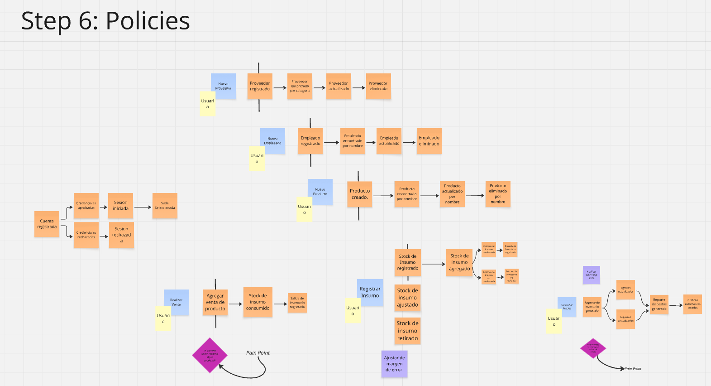

# Informe del Trabajo Final

**Universidad Peruana de Ciencias Aplicadas**

**Ingeniería de software**

**Aplicaciones para Dispositivos Móviles**

**Sección:** 1807

**Profesor:** Jorge Luis Mayta Guillermo

**Nombre del StartUp:* SyncCafe* 

**Nombre del Producto:* iCafe* 

| Nombre                              | Código    |
| ----------------------------------- | ---------- |
| Ruben Velasquez Chambi | u202117342 |
| Christian Fabrizio Inga Orihuela | U20231C111 |
| Hallasi Saravia, Miguel Angel | u202312391 |
| Urrutia Peña, Jasmin Adriana | u202310008 |
| Sebastian Alexander Ramos Calagua | u202222846 |

**Ciclo 2025-01**

## Project Report Collaboration Insights

## Registro de Versiones del Informe

<table style="border-collapse:collapse;border-spacing:0" class="tg">
  <thead>
    <tr>
      <th style="border-color:black;border-style:solid;border-width:1px;font-family:Arial, sans-serif;font-size:14px;font-weight:normal;overflow:hidden;padding:10px 5px;text-align:left;vertical-align:top;word-break:normal">Versión</th>
      <th style="border-color:black;border-style:solid;border-width:1px;font-family:Arial, sans-serif;font-size:14px;font-weight:normal;overflow:hidden;padding:10px 5px;text-align:left;vertical-align:top;word-break:normal">Fecha</th>
      <th style="border-color:black;border-style:solid;border-width:1px;font-family:Arial, sans-serif;font-size:14px;font-weight:normal;overflow:hidden;padding:10px 5px;text-align:left;vertical-align:top;word-break:normal">Autor</th>
      <th style="border-color:black;border-style:solid;border-width:1px;font-family:Arial, sans-serif;font-size:14px;font-weight:normal;overflow:hidden;padding:10px 5px;text-align:left;vertical-align:top;word-break:normal">Descripción de modificación</th>
    </tr>
  </thead>
  <tbody>
    <tr>
      <td style="border-color:black;border-style:solid;border-width:1px;font-family:Arial, sans-serif;font-size:14px;overflow:hidden;padding:10px 5px;text-align:left;vertical-align:top;word-break:normal">TB1</td>
      <td style="border-color:black;border-style:solid;border-width:1px;font-family:Arial, sans-serif;font-size:14px;overflow:hidden;padding:10px 5px;text-align:left;vertical-align:top;word-break:normal">-/-/2025</td>
      <td style="border-color:black;border-style:solid;border-width:1px;font-family:Arial, sans-serif;font-size:14px;overflow:hidden;padding:10px 5px;text-align:left;vertical-align:top;word-break:normal">
        Ruben Velasquez Chambi  
        Christian Fabrizio Inga Orihuela  
        Hallasi Saravia, Miguel Angel 
        Urrutia Peña, Jasmin Adriana  
        Sebastian Alexander Ramos Calagua
      </td>
      <td style="border-color:black;border-style:solid;border-width:1px;font-family:Arial, sans-serif;font-size:14px;overflow:hidden;padding:10px 5px;text-align:left;vertical-align:top;word-break:normal">
        -
      </td>
    </tr>
    <tr>
      <td style="border-color:black;border-style:solid;border-width:1px;font-family:Arial, sans-serif;font-size:14px;overflow:hidden;padding:10px 5px;text-align:left;vertical-align:top;word-break:normal">TP1</td>
      <td style="border-color:black;border-style:solid;border-width:1px;font-family:Arial, sans-serif;font-size:14px;overflow:hidden;padding:10px 5px;text-align:left;vertical-align:top;word-break:normal">-/-/2025</td>
      <td style="border-color:black;border-style:solid;border-width:1px;font-family:Arial, sans-serif;font-size:14px;overflow:hidden;padding:10px 5px;text-align:left;vertical-align:top;word-break:normal">
        Ruben Velasquez Chambi  
        Christian Fabrizio Inga Orihuela  
        Hallasi Saravia, Miguel Angel 
        Urrutia Peña, Jasmin Adriana  
        Sebastian Alexander Ramos Calagua
      </td>
      <td style="border-color:black;border-style:solid;border-width:1px;font-family:Arial, sans-serif;font-size:14px;overflow:hidden;padding:10px 5px;text-align:left;vertical-align:top;word-break:normal">
        -
      </td>
    </tr>
    <tr>
      <td style="border-color:black;border-style:solid;border-width:1px;font-family:Arial, sans-serif;font-size:14px;overflow:hidden;padding:10px 5px;text-align:left;vertical-align:top;word-break:normal">TB2</td>
      <td style="border-color:black;border-style:solid;border-width:1px;font-family:Arial, sans-serif;font-size:14px;overflow:hidden;padding:10px 5px;text-align:left;vertical-align:top;word-break:normal">-/-/2025</td>
      <td style="border-color:black;border-style:solid;border-width:1px;font-family:Arial, sans-serif;font-size:14px;overflow:hidden;padding:10px 5px;text-align:left;vertical-align:top;word-break:normal">
        Ruben Velasquez Chambi  
        Christian Fabrizio Inga Orihuela  
        Hallasi Saravia, Miguel Angel 
        Urrutia Peña, Jasmin Adriana  
        Sebastian Alexander Ramos Calagua
      </td>
      <td style="border-color:black;border-style:solid;border-width:1px;font-family:Arial, sans-serif;font-size:14px;overflow:hidden;padding:10px 5px;text-align:left;vertical-align:top;word-break:normal">
        -
      </td>
    </tr>
	      <tr>
      <td style="border-color:black;border-style:solid;border-width:1px;font-family:Arial, sans-serif;font-size:14px;overflow:hidden;padding:10px 5px;text-align:left;vertical-align:top;word-break:normal">TF</td>
      <td style="border-color:black;border-style:solid;border-width:1px;font-family:Arial, sans-serif;font-size:14px;overflow:hidden;padding:10px 5px;text-align:left;vertical-align:top;word-break:normal">-/-/2025</td>
      <td style="border-color:black;border-style:solid;border-width:1px;font-family:Arial, sans-serif;font-size:14px;overflow:hidden;padding:10px 5px;text-align:left;vertical-align:top;word-break:normal">
        Ruben Velasquez Chambi  
        Christian Fabrizio Inga Orihuela  
        Hallasi Saravia, Miguel Angel 
        Urrutia Peña, Jasmin Adriana  
        Sebastian Alexander Ramos Calagua
      </td>
      <td style="border-color:black;border-style:solid;border-width:1px;font-family:Arial, sans-serif;font-size:14px;overflow:hidden;padding:10px 5px;text-align:left;vertical-align:top;word-break:normal">
        -
      </td>
    </tr>
  </tbody>
</table>

## Contenido
- [Student Outcome](#student-outcome)
- [Objetivos SMART](#objetivos-smart)
- [Capítulo I: Presentación](#capítulo-i-presentación)
  - [1.1. Startup Profile](#11-startup-profile)
    - [1.1.1. Descripción de la Startup](#111-descripción-de-la-startup)
    - [1.1.2. Perfiles de integrantes del equipo](#112-perfiles-de-integrantes-del-equipo)
  - [1.2. Solution Profile](#12-solution-profile)
    - [1.2.1. Antecedentes y problemática](#121-antecedentes-y-problemática)
    - [1.2.2. Lean UX Process](#122-lean-ux-process)
      - [1.2.2.1. Lean UX Problem Statements](#1221-lean-ux-problem-statements)
      - [1.2.2.2. Lean UX Assumptions](#1222-lean-ux-assumptions)
      - [1.2.2.3. Lean UX Hypothesis Statements](#1223-lean-ux-hypothesis-statements)
      - [1.2.2.4. Lean UX Canvas](#1224-lean-ux-canvas)
  - [1.3. Segmentos objetivo](#13-segmentos-objetivo)
- [Capítulo II: Requirements Development and Software Solution Design](#capítulo-ii-requirements-development-and-software-solution-design)
  - [2.1. Competidores](#21-competidores)
    - [2.1.1. Análisis competitivo](#211-análisis-competitivo)
    - [2.1.2. Estrategias y tácticas frente a competidores](#212-estrategias-y-tácticas-frente-a-competidores)
  - [2.2. Entrevistas](#22-entrevistas)
    - [2.2.1. Diseño de entrevistas](#221-diseño-de-entrevistas)
    - [2.2.2. Registro de entrevistas](#222-registro-de-entrevistas)
    - [2.2.3. Análisis de entrevistas](#223-análisis-de-entrevistas)
  - [2.3. Needfinding](#23-needfinding)
    - [2.3.1. User Personas](#231-user-personas)
    - [2.3.2. User Task Matrix](#232-user-task-matrix)
    - [2.3.3. User Journey Mapping](#233-user-journey-mapping)
    - [2.3.4. Empathy Mapping](#234-empathy-mapping)
    - [2.3.5. Ubiquitous Language](#235-ubiquitous-language)
  - [2.4. Requirements specification](#24-requirements-specification)
    - [2.4.1. User Stories](#241-user-stories)
    - [2.4.2. Impact Mapping](#242-impact-mapping)
    - [2.4.3. Product Backlog](#243-product-backlog)
  - [2.5. Strategic-Level Domain-Driven Design](#25-strategic-level-domain-driven-design)
    - [2.5.1. EventStorming](#251-eventstorming)
      - [2.5.1.1. Candidate Context Discovery](#2511-candidate-context-discovery)
      - [2.5.1.2. Domain Message Flows Modeling](#2512-domain-message-flows-modeling)
      - [2.5.1.3. Bounded Context Canvases](#2513-bounded-context-canvases)
    - [2.5.2. Context Mapping](#252-context-mapping)
    - [2.5.3. Software Architecture](#253-software-architecture)
      - [2.5.3.1. Software Architecture Context Level Diagrams](#2531-software-architecture-context-level-diagrams)
      - [2.5.3.2. Software Architecture Container Level Diagrams](#2532-software-architecture-container-level-diagrams)
      - [2.5.3.3. Software Architecture Deployment Diagrams](#2533-software-architecture-deployment-diagrams)
  - [2.6. Tactical-Level Domain-Driven Design](#26-tactical-level-domain-driven-design)
        - [2.6.1. Bounded Context: Contacts](#26x-bounded-context-bounded-context-name)
      - [2.6.1.1. Domain Layer](#26x1-domain-layer)
      - [2.6.1.2. Interface Layer](#26x2-interface-layer)
      - [2.6.1.3. Application Layer](#26x3-application-layer)
      - [2.6.1.4. Infrastructure Layer](#26x4-infrastructure-layer)
      - [2.6.1.5. Bounded Context Software Architecture Component Level Diagrams](#26x5-bounded-context-software-architecture-component-level-diagrams)
      - [2.6.1.6. Bounded Context Software Architecture Code Level Diagrams](#26x6-bounded-context-software-architecture-code-level-diagrams)
        - [2.6.1.6.1. Bounded Context Domain Layer Class Diagrams](#26x61-bounded-context-domain-layer-class-diagrams)
        - [2.6.1.6.2. Bounded Context Database Design Diagram](#26x62-bounded-context-database-design-diagram)
    - [2.6.2. Bounded Context: Product](#26x-bounded-context-bounded-context-name)
      - [2.6.2.1. Domain Layer](#26x1-domain-layer)
      - [2.6.2.2. Interface Layer](#26x2-interface-layer)
      - [2.6.2.3. Application Layer](#26x3-application-layer)
      - [2.6.2.4. Infrastructure Layer](#26x4-infrastructure-layer)
      - [2.6.2.5. Bounded Context Software Architecture Component Level Diagrams](#26x5-bounded-context-software-architecture-component-level-diagrams)
      - [2.6.2.6. Bounded Context Software Architecture Code Level Diagrams](#26x6-bounded-context-software-architecture-code-level-diagrams)
        - [2.6.2.6.1. Bounded Context Domain Layer Class Diagrams](#26x61-bounded-context-domain-layer-class-diagrams)
        - [2.6.2.6.2. Bounded Context Database Design Diagram](#26x62-bounded-context-database-design-diagram)
    - [2.6.3. Bounded Context: Inventory](#26x-bounded-context-bounded-context-name)
      - [2.6.3.1. Domain Layer](#26x1-domain-layer)
      - [2.6.3.2. Interface Layer](#26x2-interface-layer)
      - [2.6.3.3. Application Layer](#26x3-application-layer)
      - [2.6.3.4. Infrastructure Layer](#26x4-infrastructure-layer)
      - [2.6.3.5. Bounded Context Software Architecture Component Level Diagrams](#26x5-bounded-context-software-architecture-component-level-diagrams)
      - [2.6.3.6. Bounded Context Software Architecture Code Level Diagrams](#26x6-bounded-context-software-architecture-code-level-diagrams)
        - [2.6.3.6.1. Bounded Context Domain Layer Class Diagrams](#26x61-bounded-context-domain-layer-class-diagrams)
        - [2.6.3.6.2. Bounded Context Database Design Diagram](#26x62-bounded-context-database-design-diagram)
    - [2.6.4. Bounded Context: Sales](#26x-bounded-context-bounded-context-name)
      - [2.6.4.1. Domain Layer](#26x1-domain-layer)
      - [2.6.4.2. Interface Layer](#26x2-interface-layer)
      - [2.6.4.3. Application Layer](#26x3-application-layer)
      - [2.6.4.4. Infrastructure Layer](#26x4-infrastructure-layer)
      - [2.6.4.5. Bounded Context Software Architecture Component Level Diagrams](#26x5-bounded-context-software-architecture-component-level-diagrams)
      - [2.6.4.6. Bounded Context Software Architecture Code Level Diagrams](#26x6-bounded-context-software-architecture-code-level-diagrams)
        - [2.6.4.6.1. Bounded Context Domain Layer Class Diagrams](#26x61-bounded-context-domain-layer-class-diagrams)
        - [2.6.4.6.2. Bounded Context Database Design Diagram](#26x62-bounded-context-database-design-diagram)
    - [2.6.5. Bounded Context: Finances](#26x-bounded-context-bounded-context-name)
      - [2.6.5.1. Domain Layer](#26x1-domain-layer)
      - [2.6.5.2. Interface Layer](#26x2-interface-layer)
      - [2.6.5.3. Application Layer](#26x3-application-layer)
      - [2.6.5.4. Infrastructure Layer](#26x4-infrastructure-layer)
      - [2.6.5.5. Bounded Context Software Architecture Component Level Diagrams](#26x5-bounded-context-software-architecture-component-level-diagrams)
      - [2.6.5.6. Bounded Context Software Architecture Code Level Diagrams](#26x6-bounded-context-software-architecture-code-level-diagrams)
        - [2.6.5.6.1. Bounded Context Domain Layer Class Diagrams](#26x61-bounded-context-domain-layer-class-diagrams)
        - [2.6.5.6.2. Bounded Context Database Design Diagram](#26x62-bounded-context-database-design-diagram)
- [Capítulo III: Solution UI/UX Design](#capítulo-iii-solution-uiux-design)
  - [3.1. Product design](#31-product-design)
    - [3.1.1. Style Guidelines](#311-style-guidelines)
      - [3.1.1.1. General Style Guidelines](#3111-general-style-guidelines)
    - [3.1.2. Information Architecture](#312-information-architecture)
      - [3.1.2.1. Organization Systems](#3121-organization-systems)
      - [3.1.2.2. Labelling Systems](#3122-labelling-systems)
      - [3.1.2.3. SEO Tags and Meta Tags](#3123-seo-tags-and-meta-tags)
      - [3.1.2.4. Searching Systems](#3124-searching-systems)
      - [3.1.2.5. Navigation Systems](#3125-navigation-systems)
    - [3.1.3. Landing Page UI Design](#313-landing-page-ui-design)
      - [3.1.3.1. Landing Page Wireframe](#3131-landing-page-wireframe)
      - [3.1.3.2. Landing Page Mock-up](#3132-landing-page-mock-up)
    - [3.1.4. Mobile Applications UX/UI Design](#314-mobile-applications-uxui-design)
      - [3.1.4.1. Mobile Applications Wireframes](#3141-mobile-applications-wireframes)
      - [3.1.4.2. Mobile Applications Wireflow Diagrams](#3142-mobile-applications-wireflow-diagrams)
      - [3.1.4.3. Mobile Applications Mock-ups](#3143-mobile-applications-mock-ups)
      - [3.1.4.4. Mobile Applications User Flow Diagrams](#3144-mobile-applications-user-flow-diagrams)
      - [3.1.4.5. Mobile Applications Prototyping](#3145-mobile-applications-prototyping)
- [Capítulo IV: Product Implementation & Validation](#capítulo-iv-product-implementation--validation)
  - [4.1. Software Configuration Management](#41-software-configuration-management)
    - [4.1.1. Software Development Environment Configuration](#411-software-development-environment-configuration)
    - [4.1.2. Source Code Management](#412-source-code-management)
    - [4.1.3. Source Code Style Guide & Conventions](#413-source-code-style-guide--conventions)
    - [4.1.4. Software Deployment Configuration](#414-software-deployment-configuration)
  - [4.2. Landing Page & Mobile Application Implementation](#42-landing-page--mobile-application-implementation)
    - [4.2.1. Sprint n](#421-sprint-n)
      - [4.2.1.1. Sprint Planning n](#4211-sprint-planning-n)
      - [4.2.1.2. Sprint Backlog n](#4212-sprint-backlog-n)
      - [4.2.1.3. Development Evidence for Sprint Review](#4213-development-evidence-for-sprint-review)
      - [4.2.1.4. Testing Suite Evidence for Sprint Review](#4214-testing-suite-evidence-for-sprint-review)
      - [4.2.1.5. Execution Evidence for Sprint Review](#4215-execution-evidence-for-sprint-review)
      - [4.2.1.6. Services Documentation Evidence for Sprint Review](#4216-services-documentation-evidence-for-sprint-review)
      - [4.2.1.7. Software Deployment Evidence for Sprint Review](#4217-software-deployment-evidence-for-sprint-review)
      - [4.2.1.8. Team Collaboration Insights during Sprint](#4218-team-collaboration-insights-during-sprint)
  - [4.3. Validation Interviews](#43-validation-interviews)
    - [4.3.1. Diseño de Entrevistas](#431-diseño-de-entrevistas)
    - [4.3.2. Registro de Entrevistas](#432-registro-de-entrevistas)
    - [4.3.3. Evaluaciones según heurísticas](#433-evaluaciones-según-heurísticas)
- [Conclusiones](#conclusiones)
  - [Conclusiones y recomendaciones](#conclusiones-y-recomendaciones)
- [Video App Validation](#video-app-validation)
- [Video About the product](#video-about-the-product)
- [Video About the team](#video-about-the-team)
- [Glosario](#glosario)
- [Bibliografía](#bibliografía)
- [Anexos](#anexos)

## Student Outcome
| Criterio especifico                       | Acciones realizadas | Conclusiones |
|-------------------------------------------|---------------------|--------------|
| Actualizan conceptos y conocimientos necesarios para su desarrollo profesional y en especial para su proyecto en soluciones de software. |                     |              |
| Reconocen la necesidad del aprendizaje permanente profesional y el desarrollo de proyectos en soluciones de software. |                     |              |

## Objetivos SMART
| Miembro del Equipo         | Objetivo SMART 1                          | Objetivo SMART 2                          |
|----------------------------|-------------------------------------------|-------------------------------------------|
|Ruben Velasquez Chambi     |  |  |
|Christian Fabrizio Inga Orihuela |  |  |
|Hallasi Saravia, Miguel Angel  |  |  |
|Urrutia Peña, Jasmin Adriana |  |  |
|Sebastian Alexander Ramos Calagua |  |  |

# Capítulo I: Presentación
## 1.1. Startup Profile
### 1.1.1. Descripción de la Startup

### 1.1.2. Perfiles de integrantes del equipo

## 1.2. Solution Profile
### 1.2.1. Antecedentes y problemática

### 1.2.2. Lean UX Process
#### 1.2.2.1. Lean UX Problem Statements

#### 1.2.2.2. Lean UX Assumptions

#### 1.2.2.3. Lean UX Hypothesis Statements

#### 1.2.2.4. Lean UX Canvas

## 1.3. Segmentos objetivo

# Capítulo II: Requirements Development and Software Solution Design
## 2.1. Competidores

**MarketMan**  
Plataforma SaaS enfocada en control de inventarios y costos (COGS) con gestión de proveedores y reportes avanzados. Es robusta y escalable, ideal para negocios con mayor complejidad operativa. Para el segmento de cafeterías de 1–3 locales puede resultar costosa/excesiva, pero marca el estándar en costeo y control.

**Stock & Inventory Simple**  
App Android de control de stock ligera: alta/baja de productos, cantidades, costos básicos, alertas y exportaciones. Su propuesta es la simplicidad y la rápida adopción, pero sin profundidad en métricas de costos ni analítica para la toma de decisiones del dueño.

**Cafe Manager**  
App móvil orientada a operaciones diarias (ventas/pedidos) con inventario simple. Es rápida y accesible, pero no prioriza la gestión interna (métricas de desperdicio, análisis de costos, precios sugeridos), por lo que se alinea parcialmente con el enfoque “solo dueño”.

### 2.1.1. Análisis competitivo

<table border="1" cellpadding="8" cellspacing="0" style="border-collapse: collapse; width: 100%;">
  <!-- Título -->
  <tr>
    <th colspan="6" style="text-align:center; border: 1px solid #000;">
      Competitive Analysis Landscape
    </th>
  </tr>

  <!-- Justificación -->
  <tr>
    <th style="text-align:center; border: 1px solid #000;">¿Por qué llevar a cabo este análisis?</th>
    <td colspan="5" style="border: 1px solid #000;">
      Identificar el posicionamiento de iCafe frente a software cloud/móvil que resuelve (total o parcialmente)
      la gestión interna de cafeterías: inventario, costos y métricas. Este análisis permite definir foco de valor
      (simplicidad móvil, costo bajo, enfoque cafeterías de 1–3 locales, decisiones rápidas con datos) y tácticas de entrada.
    </td>
  </tr>

  <!-- Encabezados -->
  <tr>
    <th style="border: 1px solid #000;"></th>
    <th style="border: 1px solid #000;"></th>
    <th style="text-align:center; border: 1px solid #000;">
      iCafe (SyncCafe) 
      
    </th>
    <th style="text-align:center; border: 1px solid #000;">
      MarketMan 
      
    </th>
    <th style="text-align:center; border: 1px solid #000;">
      Stock &amp; Inventory Simple 
      
    </th>
    <th style="text-align:center; border: 1px solid #000;">
      Cafe Manager 
      
    </th>
  </tr>

  <!-- PERFIL -->
  <tr>
    <th rowspan="3" style="text-align:center; border: 1px solid #000;">Perfil</th>
    <td style="border: 1px solid #000;"><strong>Overview</strong></td>
    <td style="border: 1px solid #000;">App móvil (Android → Flutter) centrada en el dueño: recetas, inventario, métricas de desperdicio y gestor de costos con reportes PDF.</td>
    <td style="border: 1px solid #000;">Plataforma cloud para inventarios, costos y proveedores, con módulos avanzados de control (más robusta y premium).</td>
    <td style="border: 1px solid #000;">App Android genérica de control de stock y costos básicos; muy ligera y simple.</td>
    <td style="border: 1px solid #000;">App móvil enfocada en operaciones básicas (ventas/pedidos) con inventario simple; menos alineada a gestión interna pura.</td>
  </tr>
  <tr>
    <td style="border: 1px solid #000;"><strong>Ventaja competitiva</strong></td>
    <td style="border: 1px solid #000;">Mobile-first, simplicidad, enfoque cafetero, métricas de desperdicio, precios sugeridos y PDF listo para compartir.</td>
    <td style="border: 1px solid #000;">Costeo/COGS sólido, gestión de proveedores, analítica avanzada y escalabilidad.</td>
    <td style="border: 1px solid #000;">Curva de aprendizaje mínima, exportaciones simples, alertas de stock; muy accesible.</td>
    <td style="border: 1px solid #000;">Interfaz simple y rápida para operaciones diarias.</td>
  </tr>
  <tr>
    <td style="border: 1px solid #000;"><strong>Clientes</strong></td>
    <td style="border: 1px solid #000;">Dueños de cafeterías 1–3 locales en zonas urbanas/semiurbanas.</td>
    <td style="border: 1px solid #000;">Restaurantes/cafeterías con foco fuerte en control de costos e inventario.</td>
    <td style="border: 1px solid #000;">Emprendedores y micro-negocios que requieren control básico de stock.</td>
    <td style="border: 1px solid #000;">Dueños que priorizan rapidez operativa y registro de ventas simples.</td>
  </tr>

  <!-- MARKETING -->
  <tr>
    <th rowspan="2" style="text-align:center; border: 1px solid #000;">Perfil de Marketing</th>
    <td style="border: 1px solid #000;"><strong>Mercado objetivo</strong></td>
    <td style="border: 1px solid #000;">Cafeterías independientes y micro-cadenas en latinoamérica.</td>
    <td style="border: 1px solid #000;">F&amp;B global que prioriza COGS, inventario y compliance.</td>
    <td style="border: 1px solid #000;">Negocios pequeños que buscan control básico de inventario en móvil.</td>
    <td style="border: 1px solid #000;">Micro-negocios que requieren operar rápido desde el teléfono.</td>
  </tr>
  <tr>
    <td style="border: 1px solid #000;"><strong>Estrategias de marketing</strong></td>
    <td style="border: 1px solid #000;">Contenido educativo, demos rápidas, alianzas con proveedores de café.</td>
    <td style="border: 1px solid #000;">Casos de éxito, integraciones y ROI explícito en costos/mermas.</td>
    <td style="border: 1px solid #000;">ASO/Play Store, reseñas, simplicidad como propuesta de valor.</td>
    <td style="border: 1px solid #000;">Visibilidad en tiendas de apps y marketing de boca a boca.</td>
  </tr>

  <!-- PRODUCTO -->
  <tr>
    <th rowspan="3" style="text-align:center; border: 1px solid #000;">Perfil de Producto</th>
    <td style="border: 1px solid #000;"><strong>Productos y Servicios</strong></td>
    <td style="border: 1px solid #000;">Productos, inventario, métricas de desperdicio, gestor de costos, precios sugeridos y PDF.</td>
    <td style="border: 1px solid #000;">Inventario, costos, proveedores, reportes avanzados.</td>
    <td style="border: 1px solid #000;">Inventario básico, movimientos, costos simples, exportaciones.</td>
    <td style="border: 1px solid #000;">Ventas/pedidos e inventario simple (menos foco en métricas/costos).</td>
  </tr>
  <tr>
    <td style="border: 1px solid #000;"><strong>Precios y Costos</strong></td>
    <td style="border: 1px solid #000;">Aplicación Gratuita</td>
    <td style="border: 1px solid #000;">Planes por sede/usuario; inversión mayor que iCafe.</td>
    <td style="border: 1px solid #000;">Gratuito o muy bajo costo; funciones limitadas.</td>
    <td style="border: 1px solid #000;">Muy accesible; alcance funcional reducido.</td>
  </tr>
  <tr>
    <td style="border: 1px solid #000;"><strong>Canales de distribución</strong></td>
    <td style="border: 1px solid #000;">App Android (Kotlin) y luego Flutter; API REST propia; landing.</td>
    <td style="border: 1px solid #000;">Web + app móvil (SaaS).</td>
    <td style="border: 1px solid #000;">App móvil Android.</td>
    <td style="border: 1px solid #000;">App móvil Android.</td>
  </tr>

  <!-- SWOT -->
  <tr>
    <th rowspan="4" style="text-align:center; border: 1px solid #000;">ANÁLISIS SWOT</th>
    <td style="border: 1px solid #000;"><strong>Fortalezas</strong></td>
    <td style="border: 1px solid #000;">UX sencilla, mobile-first, enfoque cafeterías, métricas visuales y PDF compartible.</td>
    <td style="border: 1px solid #000;">Costeo/COGS sólido, gestión de proveedores, analítica y escalabilidad.</td>
    <td style="border: 1px solid #000;">Simplicidad extrema, curva de aprendizaje baja, exportaciones rápidas.</td>
    <td style="border: 1px solid #000;">Rapidez operativa para ventas simples; fácil de usar.</td>
  </tr>
  <tr>
    <td style="border: 1px solid #000;"><strong>Debilidades</strong></td>
    <td style="border: 1px solid #000;">Marca nueva, menos integraciones; sin historial de mercado.</td>
    <td style="border: 1px solid #000;">Curva de adopción y costo para micro-negocios.</td>
    <td style="border: 1px solid #000;">Limitado en métricas de costos y sin módulos de decisiones.</td>
    <td style="border: 1px solid #000;">Menor foco en métricas y costos; menos alineada a gestión interna pura.</td>
  </tr>
  <tr>
    <td style="border: 1px solid #000;"><strong>Oportunidades</strong></td>
    <td style="border: 1px solid #000;">Digitalización de cafeterías; nicho LATAM poco atendido con mobile simple.</td>
    <td style="border: 1px solid #000;">Planes para SMBs y verticalización por segmentos.</td>
    <td style="border: 1px solid #000;">Evolucionar a métricas/costos para F&amp;B pequeños.</td>
    <td style="border: 1px solid #000;">Añadir módulo de costos para mayor valor al dueño.</td>
  </tr>
  <tr>
    <td style="border: 1px solid #000;"><strong>Amenazas</strong></td>
    <td style="border: 1px solid #000;">Entrada de suites consolidadas al nicho cafetero; inercia de Excel.</td>
    <td style="border: 1px solid #000;">Competencia de apps móviles más baratas y simples.</td>
    <td style="border: 1px solid #000;">Desplazamiento por soluciones más completas del sector.</td>
    <td style="border: 1px solid #000;">Ser reemplazada por apps con mejor gestión interna.</td>
  </tr>
</table>

### 2.1.2. Estrategias y tácticas frente a competidores

**Disponibilidad 100 % gratuita y sin registros extensos:** acceso inmediato solo con nombre de negocio.

**Interfaz minimalista y clara:** colores acorde al tema, pocas pantallas, iconografía directa, prioriza velocidad sobre densidad de funciones.

**Visualización de métricas inmediatas:** gráficos de stock, consumo, desperdicio y costos en el inicio para dar valor apenas se usan los datos.

**Alertas automáticas de gestión:** avisos de stock bajo, altos niveles de desperdicio y sobrecostos detectados.

**Generación de reportes PDF simples:** exportación directa de inventario, costos y recetas para respaldar decisiones administrativas.

**Optimización offline:** permitir funcionamiento sin conexión para que los dueños puedan registrar datos desde el local sin depender de internet.

## 2.2. Entrevistas
### 2.2.1. Diseño de entrevistas
En esta seccion se plantearan las preguntas para validad nuestra aplicación y conoces las necesidades de nuestro segmento objetivo.

Preguntas Generales:  
¿Cómo te llamas y a que te dedicas? 

Preguntas Especificas: 
¿Cómo anotas lo que entra y sale de tus ingredientes en la cafetería? 
¿Cada cuánto miras o actualizas tu lista de productos en stock? 
¿Te ha pasado quedarte sin algo o tener de más? ¿O tirar comida? ¿Cómo lo arreglas? 
¿Te gustaría una app que te muestre si usas bien los ingredientes y cuánto tiras? 
¿Sabes cuánto te cuesta de verdad hacer un café? ¿Cómo pones el precio para venderlo? 
¿Piensas en gastos como sueldos o renta al poner precios? ¿Cada cuánto chequeas tus gastos totales? 
¿Qué usas ahora para organizar tu cafetería? ¿Como Excel, cuadernos o alguna app? 
¿Qué usas más para manejar tu negocio: celular, computadora u otro? ¿Del 1 al 5, qué tan fácil te resulta usar apps en el celular? 
¿Si tuvieras una pantalla rápida con números clave, qué querrías ver primero? ¿Y qué opción nueva te haría usar una app todos los días? 

### 2.2.2. Registro de entrevistas

**Entrevista 3:**
Datos del entrevistador:
- Nombre: Urrutia Peña, Jasmin Adriana
  
Datos del entrevistado:
- Nombre: Melanie Espinoza
- Edad: 34 años
- Residencia: Huancayo
- Enlace: https://youtu.be/i0tlp6LbB0A
  

**Resumen de la entrevista:**
La entrevista con Melanie Espinoza, dueña de la cafetería Fryhna, revela que su principal problema es la falta de organización en la gestión de inventario y costos, ya que actualmente depende de libretas y hojas de Excel que resultan tediosas, poco confiables y propensas a errores u olvidos por parte del personal. Esta situación genera pérdidas económicas debido a la caducidad de productos perecibles como la leche y a la escasez de insumos clave como el café. Además, no cuentan con un control estructurado de gastos fijos ni sueldos, lo que dificulta la planificación financiera. Frente a ello, la aplicación propuesta representa una oportunidad clara al ofrecer una solución móvil, accesible y automatizada que permitiría centralizar la información, generar alertas de stock y vencimiento, facilitar el control de costos y mejorar la rentabilidad y eficiencia del negocio.

### 2.2.3. Análisis de entrevistas

Análisis del Primer Segmento Objetivo: Dueños de Cafeterias. 

Los dueños de cafeterías suelen enfrentar problemas comunes relacionados con la gestión de inventario, ya que muchos todavía dependen de métodos manuales como libretas o archivos de Excel. Esto genera errores, olvidos y pérdidas económicas por productos perecibles o desbalance entre insumos. Asimismo, existe una falta de control financiero estructurado, pues no registran de manera organizada gastos como sueldos, alquileres o costos de insumos. A esto se suma la limitada digitalización, ya que suelen contar con una laptop básica en la tienda, pero no sistemas especializados que faciliten el registro en tiempo real. Pese a ello, muestran alta disposición a adoptar soluciones móviles porque valoran la accesibilidad y simplicidad, especialmente desde sus teléfonos. En resumen, el segmento tiene una necesidad latente de herramientas digitales accesibles que integren inventario, costos y proveedores, con recordatorios y reportes que optimicen su rentabilidad y reduzcan pérdidas.

## 2.3. Needfinding
### 2.3.1. User Personas

### 2.3.2. User Task Matrix

| Tarea (Task)                                  | Frecuencia | Importancia |
|-----------------------------------------------|------------|-------------|
| Gestionar el inventario de insumos            | Alta       | Alta        |
| Realizar pedidos a proveedores                | Media      | Alta        |
| Controlar la calidad de los insumos recibidos | Media      | Alta        |
| Gestionar el personal (horarios, turnos)      | Alta       | Alta        |
| Capacitar a nuevos empleados                  | Baja       | Media       |
| Supervisar la preparación de recetas          | Alta       | Alta        |
| Asegurar la estandarización de recetas        | Alta       | Alta        |
| Realizar el cuadre de caja diario             | Alta       | Alta        |
| Analizar las ventas y el rendimiento          | Media      | Alta        |
| Gestionar la atención al cliente y quejas     | Alta       | Alta        |
| Mantener la limpieza y orden del local        | Alta       | Media       |

### 2.3.3. User Journey Mapping

### 2.3.4. Empathy Mapping

### 2.3.5. Ubiquitous Language

| Término | Definición |
| :--- | :--- |
| **Inventory** | Stock de todos los insumos y productos disponibles en la cafetería. |
| **Provider** | empresa que abastece de insumos a la cafetería. |
| **Recipe** | Instrucciones estandarizadas para la preparación de un producto, garantizando consistencia y calidad. |
| **Product** | Artículo final que se ofrece a la venta al cliente. |
| **Employer** | Empleado de la cafetería responsable de las operaciones diarias y atención al cliente. |
| **Purchase** | Proceso de adquisición de insumos y materiales necesarios para el funcionamiento de la cafetería. |
| **Sales** | Transacciones comerciales realizadas con los clientes para la venta de productos y servicios. |

## 2.4. Requirements specification
### 2.4.1. User Stories

### Epics 

| Epic ID | Título                         | Descripción                                                                                                |
| ------- | ------------------------------ | ---------------------------------------------------------------------------------------------------------- |
| EP001   | Autenticación y Roles          | Permite el acceso seguro al sistema diferenciando dueños y empleados con permisos específicos.             |
| EP002   | Gestión de Empleados           | Permite a los dueños crear, editar, eliminar y asignar credenciales a empleados por sucursal.              |
| EP003   | Gestión de Proveedores         | Administración de proveedores: creación, edición, búsqueda y eliminación.                                  |
| EP004   | Gestión de Recetas y Productos | Administración de recetas, insumos, preparación y vinculación con inventario.                              |
| EP005   | Gestión de Costos              | Registro y clasificación de costos (fijos, variables, directos, indirectos) para calcular la rentabilidad. |
| EP006   | Gestión de Inventario          | Control de entradas, salidas, categorías de insumos y búsqueda de inventario en tiempo real.               |
| EP007   | Gestión de Precios de Venta    | Definición de precios de venta basados en costos e insumos de cada producto.                               |
| EP008   | Búsquedas Optimizada           | Búsqueda rápida de empleados, proveedores e inventario.                                           |
| EP009   | Reportes y Estadísticas        | Reportes de costos, ventas, rentabilidad y gráficos                            |
| EP010   | Funcionalidades para Empleados | Acceso simplificado a recetas, precios y búsqueda de productos.                                            |
| EP011   | Landing Page | Proporcionar un sitio web estático con información clara sobre el producto  |
| EP012| Spike Story | historias de usuario de investigacion de recursos para el proyecto |

### User Story
| Story ID | Título                       | Descripción                                                                                             | Criterios de aceptación                                                                                                                                                                                                                                                                                                                                                                                                                                                                 | Relación con (Epic ID) |
| -------- | ---------------------------- | ------------------------------------------------------------------------------------------------------- | --------------------------------------------------------------------------------------------------------------------------------------------------------------------------------------------------------------------------------------------------------------------------------------------------------------------------------------------------------------------------------------------------------------------------------------------------------------------------------------- | ---------------------- |
| US001    | Registro de dueño            | Como dueño, quiero registrarme en la aplicación para administrar mi cafetería.                          | **Escenario 1 – Registro exitoso** **Given** que el dueño ingresa datos válidos **When** confirma el registro **Then** el sistema crea su cuenta. **Escenario 2 – Email duplicado** **Given** que el email ya existe **When** intenta registrarse **Then** el sistema muestra un error. **Escenario 3 – Campos faltantes** **Given** que no llena todos los campos **When** intenta registrarse **Then** el sistema muestra validaciones obligatorias. | EP001                  |
| US002    | Login seguro                 | Como usuario, quiero iniciar sesión con mis credenciales para acceder según mi rol.    | **Escenario 1 – Login exitoso** **Given** credenciales correctas **When** hace login **Then** accede al sistema según rol. **Escenario 2 – Contraseña incorrecta** **Given** credenciales inválidas **When** hace login **Then** el sistema rechaza acceso. **Escenario 3 – Bloqueo por intentos fallidos** **Given** múltiples intentos fallidos **When** excede límite **Then** la cuenta queda bloqueada temporalmente.                             | EP001                  |
| US003    | Listar empleados      | Como dueño, quiero ver la lista de empleados para gestionarlos fácilmente.           | **Escenario 1 – Lista con datos** **Given** empleados existentes **When** abro listado **Then** muestra empleados. **Escenario 2 – Lista vacía** **Given** no hay empleados **When** abro listado **Then** muestra mensaje vacío.                      | EP002                  |
| US004    | Actualizar empleado   | Como dueño, quiero actualizar datos de empleados para mantener información al día.   | **Escenario 1 – Actualización exitosa** **Given** datos válidos **When** actualizo **Then** se guardan cambios. **Escenario 2 – Campos inválidos** **Given** datos inválidos **When** actualizo **Then** muestra error.                                | EP002                  |
| US005    | Eliminar empleado     | Como dueño, quiero eliminar empleados en caso de despido o renuncia.                 | **Escenario 1 – Eliminación exitosa** **Given** empleado válido **When** elimino **Then** se elimina de la lista. **Escenario 2 – Empleado con registros asociados** **Given** empleado vinculado **When** elimino **Then** sistema pide confirmación. | EP002                  |
| US006    | Crear proveedor              | Como dueño, quiero registrar proveedores para gestionar insumos y compras.                              | **Escenario 1 – Registro exitoso** **Given** datos completos **When** guardo proveedor **Then** se almacena correctamente. **Escenario 2 – Duplicado** **Given** proveedor ya existe **When** registro **Then** muestra error. **Escenario 3 – Campos obligatorios** **Given** datos incompletos **When** registro **Then** muestra validación.                                                                                                        | EP003                  |
| US007    | Listar proveedores    | Como dueño, quiero listar proveedores para ver a quién comprar.                      | **Escenario 1 – Lista con datos** **Given** proveedores existen **When** abro listado **Then** muestra proveedores. **Escenario 2 – Lista vacía** **Given** no hay proveedores **When** abro listado **Then** muestra mensaje vacío.                   | EP003                  |
| US008    | Actualizar proveedor  | Como dueño, quiero actualizar datos de proveedores para mantener información al día. | **Escenario 1 – Actualización exitosa** **Given** datos válidos **When** actualizo **Then** se guardan cambios. **Escenario 2 – Campos inválidos** **Given** datos inválidos **When** actualizo **Then** muestra error.                                | EP003                  |
| US09    | Crear receta                 | Como dueño, quiero registrar recetas con ingredientes para estandarizar preparación.                    | **Escenario 1 – Registro exitoso** **Given** ingredientes válidos **When** guardo receta **Then** se registra correctamente. **Escenario 2 – Ingrediente inexistente** **Given** ingrediente no registrado **When** intento usarlo **Then** muestra error. **Escenario 3 – Sin nombre de receta** **Given** falta nombre **When** registro **Then** muestra validación.                                                                                | EP004                  |
| US010    | Actualizar receta     | Como dueño, quiero actualizar recetas para modificar ingredientes o cantidades.      | **Escenario 1 – Actualización exitosa** **Given** datos válidos **When** actualizo receta **Then** se guardan cambios. **Escenario 2 – Campos inválidos** **Given** datos incompletos **When** actualizo **Then** muestra error.                       | EP004                  |
| US011    | Registrar costos             | Como dueño, quiero registrar costos fijos, variables, directos e indirectos para calcular rentabilidad. | **Escenario 1 – Registro exitoso** **Given** datos completos **When** guardo costo **Then** se registra. **Escenario 2 – Tipo inválido** **Given** tipo no válido **When** guardo **Then** muestra error. **Escenario 3 – Falta monto** **Given** monto vacío **When** guardo **Then** muestra validación.                                                                                                                                             | EP005                  |
| US012    | Registrar entrada inventario | Como dueño, quiero registrar entradas de inventario para tener control de insumos.                      | **Escenario 1 – Registro exitoso** **Given** insumo válido **When** ingreso cantidad **Then** se actualiza stock. **Escenario 2 – Cantidad inválida** **Given** cantidad negativa **When** ingreso **Then** sistema rechaza. **Escenario 3 – Insumo inexistente** **Given** insumo no registrado **When** ingreso **Then** muestra error. **Escenario 4 – Insumo duplicado** **Given** insumo ya existe **When** registro **Then** muestra error.                                                                                                              | EP006                  |
| US013    | Actualizar inventario | Como dueño, quiero actualizar inventario para reflejar entradas y salidas.           | **Escenario 1 – Actualización exitosa** **Given** datos válidos **When** actualizo **Then** se guardan cambios.                                                                                                                                        | EP006                  |
| US014    | Definir precio de venta      | Como dueño, quiero definir precios de venta basados en costos para maximizar rentabilidad.              | **Escenario 1 – Precio calculado** **Given** receta registrada **When** defino precio **Then** sistema sugiere precio con margen. **Escenario 2 – Precio manual** **Given** quiero definir precio **When** ingreso manual **Then** sistema lo acepta.                                                                                       | EP007                  |
| US015    | Búsqueda de empleados        | Como dueño, quiero buscar empleados por nombre o correo para localizarlos rápidamente.                  | **Escenario 1 – Coincidencia exacta** **Given** nombre válido **When** busco **Then** muestra resultados. **Escenario 2 – Parcial** **Given** letras parciales **When** busco **Then** lista posibles coincidencias. **Escenario 3 – Sin resultados** **Given** no existe **When** busco **Then** muestra mensaje vacío.                                                                                                                               | EP008                  |
| US016    | Buscar proveedores    | Como dueño, quiero buscar proveedores rápidamente para encontrarlos fácilmente.      | **Escenario 1 – Búsqueda por nombre** **Given** proveedores existen **When** busco por nombre **Then** muestra coincidencias. **Escenario 2 – Sin resultados** **Given** no hay coincidencias **When** busco **Then** muestra mensaje vacío.           | EP008                  |
| US017    | Buscar inventario     | Como dueño, quiero buscar inventario por nombre o categoría para localizar insumos.  | **Escenario 1 – Búsqueda exitosa** **Given** insumos existen **When** busco por categoría **Then** muestra coincidencias. **Escenario 2 – Sin resultados** **Given** no hay coincidencias **When** busco **Then** muestra mensaje vacío.               | EP008                  |
| US018    | Reporte de costos            | Como dueño, quiero generar reportes de costos por sucursal para analizar rentabilidad.                  | **Escenario 1 – Reporte exitoso** **Given** costos registrados **When** genero reporte **Then** sistema muestra tabla. **Escenario 2 – Sin datos** **Given** no hay costos **When** genero **Then** muestra mensaje vacío. **Escenario 3 – Multisucursal** **Given** dueño con varias sucursales **When** selecciona **Then** genera reporte específico.                                                                                               | EP009                  |
| US019    | Ver recetas                  | Como empleado, quiero consultar recetas estandarizadas para preparar correctamente.                     | **Escenario 1 – Receta existente** **Given** receta válida **When** consulto **Then** muestra ingredientes y pasos. **Escenario 2 – Filtrar recetas** **Given** múltiples recetas **When** busco por nombre **Then** lista filtrada. **Escenario 3 – Receta no encontrada** **Given** receta no existe **When** consulto **Then** muestra error.                                                                                                              | EP010                  |
| US020    | Ver sección Home           | Como **visitante (dueño de cafetería)**, quiero ver una introducción clara con imagen destacada y texto breve.       | **Escenario 1 – Carga exitosa** **Given** que ingreso a la página **When** se carga el sitio **Then** visualizo logo, imagen principal y mensaje de bienvenida.  **Escenario 2 – Fallo de carga** **Given** error **When** cargo sitio **Then** muestra mensaje de error.         | EP011                  |
| US021    | Ver sección About          | Como **visitante**, quiero ver una explicación sobre la aplicación y su propósito, para entender su valor.           | **Escenario 1 – Visualización exitosa** **Given** que estoy en la landing **When** hago scroll **Then** veo la sección "Sobre la aplicación" con texto e imágenes.  **Escenario 2 – Sección vacía** **Given** falta contenido **When** ingreso **Then** muestra mensaje temporal. | EP011                  |
| US022    | Ver sección Features       | Como **visitante**, quiero conocer las funcionalidades principales de la app, para evaluar si cubre mis necesidades. | **Escenario 1 – Lista de funcionalidades** **Given** que estoy en landing **When** navego a “Features” **Then** visualizo lista de funcionalidades.  **Escenario 2 – Sin funcionalidades** **Given** no cargan **When** ingreso **Then** muestra mensaje temporal.                | EP011                  |
| US023    | Botón Call to Action (CTA) | Como **visitante**, quiero un botón visible para descargar la app móvil, para obtener acceso fácilmente.             | **Escenario 1 – Botón visible** **Given** que estoy en landing **When** veo CTA **Then** aparece botón “Descargar App”.  **Escenario 2 – Click CTA** **Given** que hago click **When** interactúo **Then** me redirige a Google Play/App Store.                                   | EP011                  |
| US024    | Ver sección Contact        | Como **visitante**, quiero ver información de contacto, para poder comunicarme con soporte o ventas.                 | **Escenario 1 – Información visible** **Given** que estoy en landing **When** voy a “Contact” **Then** visualizo email, teléfono o formulario.  **Escenario 2 – Envío de formulario vacío** **Given** no ingreso datos **When** envío **Then** muestra validación.                | EP011                  |
| TS001    | API de registro de dueño       | Como **Developer**, quiero implementar un endpoint REST para registrar dueños de cafetería, para que el sistema guarde la información. | **Escenario 1 – Registro exitoso** **Given** request con datos válidos **When** POST `/owners` **Then** responde 201 con el ID del dueño.  **Escenario 2 – Email duplicado** **Given** request con email existente **When** POST `/owners` **Then** responde 400 con mensaje de error.                    | EP001                  |
| TS002    | API de login de dueño          | Como **Developer**, quiero implementar un endpoint REST para el login de dueños, validando credenciales contra la base de datos.       | **Escenario 1 – Login exitoso** **Given** request con credenciales correctas **When** POST `/auth/login` **Then** responde 200 con token JWT.  **Escenario 2 – Credenciales inválidas** **Given** request con email o password incorrecto **When** POST `/auth/login` **Then** responde 401 Unauthorized. | EP001                  |
| TS003    | API de gestión de empleados    | Como **Developer**, quiero implementar endpoints REST para CRUD de empleados, de forma que se almacenen sus datos.                     | **Escenario 1 – Alta de empleado** **Given** request válido **When** POST `/employees` **Then** responde 201 con ID generado.  **Escenario 2 – Consulta** **Given** GET `/employees/{id}` existente **When** envío request **Then** responde 200 con datos del empleado.                                  | EP002                  |
| TS004    | API de eliminación de empleado | Como **Developer**, quiero implementar un endpoint REST para eliminar empleados por renuncia o despido.                                | **Escenario 1 – Eliminación exitosa** **Given** DELETE `/employees/{id}` existente **When** envío request **Then** responde 200 con confirmación.  **Escenario 2 – Empleado inexistente** **Given** DELETE con ID no existente **When** envío request **Then** responde 404 Not Found.                    | EP002                  |
| TS005    | API de proveedores             | Como **Developer**, quiero implementar endpoints REST para CRUD de proveedores, de forma que se administren los datos en el sistema.   | **Escenario 1 – Registro proveedor** **Given** request válido **When** POST `/providers` **Then** responde 201 con ID del proveedor.  **Escenario 2 – Actualización proveedor** **Given** request con datos correctos **When** PUT `/providers/{id}` **Then** responde 200 con proveedor actualizado.     | EP003                  |
| TS006    | API de inventario              | Como **Developer**, quiero exponer endpoints REST para CRUD de insumos y productos, para que el inventario esté actualizado.           | **Escenario 1 – Registro producto** **Given** request válido **When** POST `/products` **Then** responde 201 con ID del producto.  **Escenario 2 – Consulta inventario** **Given** GET `/products` **When** envío request **Then** responde 200 con listado de productos.                                 | EP006                  |
| TS007    | API de recetas                 | Como **Developer**, quiero exponer endpoints REST para CRUD de recetas, para mantener actualizadas las preparaciones de los productos. | **Escenario 1 – Creación receta** **Given** request válido **When** POST `/recipes` **Then** responde 201 con ID de receta.  **Escenario 2 – Actualización receta** **Given** request válido **When** PUT `/recipes/{id}` **Then** responde 200 con receta actualizada.                                   | EP004                  |
| TS008    | API de reportes financieros    | Como **Developer**, quiero implementar un endpoint REST para generar reportes financieros, de forma que se obtengan métricas clave.    | **Escenario 1 – Reporte generado** **Given** parámetros válidos **When** GET `/reports/financial?from=2025-01-01&to=2025-01-31` **Then** responde 200 con JSON del reporte.  **Escenario 2 – Rango inválido** **Given** parámetros con fechas incorrectas **When** envío request **Then** responde 400.   | EP009                  |
| TS009    | API de seguridad (JWT)         | Como **Developer**, quiero implementar autenticación con JWT en los endpoints, para proteger el acceso a datos sensibles.              | **Escenario 1 – Token válido** **Given** request con token válido **When** accedo a `/employees` **Then** responde 200 con datos.  **Escenario 2 – Token inválido** **Given** request con token incorrecto **When** envío request **Then** responde 401 Unauthorized.                                     | EP001                  |
| TS010    | API de registro de costos      | Como **Developer**, quiero implementar un endpoint REST para registrar costos (fijos, variables, directos, indirectos) por sucursal.   | **Escenario 1 – Registro exitoso** **Given** request válido **When** POST `/costs` **Then** responde 201 con ID del costo.  **Escenario 2 – Datos incompletos** **Given** request sin categoría o monto **When** POST `/costs` **Then** responde 400 con mensaje de validación.                           | EP005                  |
| TS011    | API de clasificación de costos | Como **Developer**, quiero implementar lógica en el backend para clasificar automáticamente costos según su tipo y sucursal.           | **Escenario 1 – Clasificación exitosa** **Given** request con tipo válido (fijo, variable, directo, indirecto) **When** POST `/costs` **Then** se guarda en la categoría correspondiente.  **Escenario 2 – Tipo inválido** **Given** request con tipo no reconocido **When** POST **Then** responde 400.  | EP005                  |
| TS012    | API de consulta de costos      | Como **Developer**, quiero implementar un endpoint REST para consultar los costos de una sucursal en un periodo de tiempo.             | **Escenario 1 – Consulta exitosa** **Given** GET `/costs?sucursal=1&from=2025-01-01&to=2025-01-31` **When** envío request **Then** responde 200 con listado de costos.  **Escenario 2 – Fechas inválidas** **Given** parámetros con rango inválido **When** GET `/costs` **Then** responde 400 con error. | EP005                  |
| SS001    | Investigación sobre librería Charts.kt | Como equipo de desarrollo, quiero investigar y prototipar la librería **Charts.kt** para la generación de gráficos en aplicaciones Kotlin/Android, para evaluar si es viable mostrar dashboards de costos, ventas y rentabilidad. | **Escenario 1 – Revisión de documentación** **Given** que la librería Charts.kt ofrece distintas opciones **When** el desarrollador revisa su documentación oficial y ejemplos **Then** identifica y documenta qué tipos de gráficos soporta.  **Escenario 2 – Prototipo funcional** **Given** la necesidad de validación técnica **When** se construye un prototipo con al menos 2 gráficos (ej. barras y líneas) **Then** se documenta su facilidad de integración y limitaciones. | EP012                  |
| SS002 | Investigación de servicios externos para autenticación y autorización | Como equipo de desarrollo, quiero investigar la viabilidad de usar un servicio externo como **Firebase Authentication** o **Supabase Auth** para el manejo de autenticación y autorización de usuarios, para decidir si es conveniente delegar estas funciones críticas en lugar de desarrollarlas internamente. | **Escenario 1 – Revisión de documentación** **Given** que Firebase y Supabase ofrecen servicios de autenticación **When** el desarrollador revisa su documentación oficial **Then** identifica los flujos de login soportados (email/password, OAuth, proveedores sociales).  **Escenario 2 – Análisis de costos** **Given** que cada servicio tiene planes gratuitos y de pago **When** se comparan los modelos de precios **Then** se documenta cuál se ajusta mejor al presupuesto y escalabilidad del proyecto.  **Escenario 3 – Validación técnica con prototipo** **Given** la necesidad de evaluar integración **When** se implementa un prototipo de registro/login de usuarios **Then** se documenta la facilidad de integración, tiempo de configuración y limitaciones. | EP012 |
| SS003 | Investigación de servicios externos para almacenamiento de imágenes | Como equipo de desarrollo, quiero investigar la viabilidad de usar un servicio externo como **Firebase Storage** o **AWS S3** para el almacenamiento de imágenes, para decidir si conviene delegar esta funcionalidad en lugar de implementarla en infraestructura propia. | **Escenario 1 – Revisión de documentación** **Given** que Firebase Storage y AWS S3 ofrecen APIs para manejo de archivos **When** el desarrollador revisa la documentación oficial **Then** identifica opciones de subida, descarga, escalabilidad y permisos de acceso.  **Escenario 2 – Análisis de costos** **Given** que cada servicio maneja un modelo de precios distinto (ej. GB almacenados, transferencias) **When** se comparan los costos de Firebase Storage y AWS S3 **Then** se documenta cuál es más conveniente según el volumen esperado de imágenes.  **Escenario 3 – Validación técnica con prototipo** **Given** la necesidad de probar integración real **When** se implementa un prototipo que suba y recupere al menos una imagen desde el servicio **Then** se documenta la facilidad de integración, rendimiento y limitaciones encontradas.  | EP012 |

### 2.4.2. Impact Mapping

### 2.4.3. Product Backlog
Esta seccion servirá como guía para organizar el trabajo del equipo, asegurando que siempre avancemos lo más importante del proyecto.

| # Orden | User Story Id | Título                       | Story Points (1/2/3/5/8) |
| ------- | ------------- | ---------------------------- | ------------------------ |
|1        | SS001         | Investigación sobre librería Charts.kt| 3|
|2        |  SS002          | Investigación de servicios externos para autenticación y autorización|3|
|3        |  SS003         |Investigación de servicios externos para almacenamiento de imágenes|3|
| 4       | US020         | Ver sección Home             | 1                        |
| 5       | US021         | Ver sección About            | 1                        |
| 6       | US022         | Ver sección Features         | 1                        |
| 7       | US023         | Botón Call to Action (CTA)   | 1                        |
| 8       | US024         | Ver sección Contact          | 2                        |
| 9       | US011         | Registrar costos             | 5                        |
| 10       | US012         | Registrar entrada inventario | 5                        |
| 11       | US013         | Actualizar inventario        | 3                        |
| 12      | US014         | Definir precio de venta      | 5                        |
| 13      | US018         | Reporte de costos            | 8                        |
| 14     | US009         | Crear receta                 | 3                        |
| 15      | US010         | Actualizar receta            | 3                        |
| 16      | US006         | Crear proveedor              | 5                        |
| 17      | US008         | Actualizar proveedor         | 5                        |
| 18      | US004         | Actualizar empleado          | 5                        |
| 19      | US005         | Eliminar empleado            | 2                        |
| 20      | US003         | Listar empleados             | 3                        |
| 21      | US007         | Listar proveedores           | 3                        |
| 22      | US015         | Búsqueda de empleados        | 3                        |
| 23      | US016         | Buscar proveedores           | 3                        |
| 24      | US017         | Buscar inventario            | 3                        |
| 25      | US019         | Ver recetas                  | 5                        |
| 26      | US001         | Registro de dueño            | 3                        |
| 27      | US002         | Login seguro                 | 5                        |

## 2.5. Strategic-Level Domain-Driven Design
### 2.5.1. EventStorming
En esta sección se mostrará la aplicación del Domain-Driven Design (DDD) a nivel estratégico dentro del proyecto. El objetivo es identificar los distintos bounded context que intervienen en el dominio, así como las relaciones entre ellos, con el fin de establecer una arquitectura clara que permita escalar la solución y adaptarla a las necesidades del negocio.
#### 2.5.1.1. Candidate Context Discovery

Link: https://miro.com/welcomeonboard/TzdJdEdvSWJQa2pYS2FIdU5DWE9ZV2w5MjkycmZRZzB2OUFQWkhOemVGUTd6ekE4R0tlVW11TmNMMVIrd1lnWHRQbk5IWHN2VEs3M0ttajJ5TG1LUXZ6SVhjZ255RHJzTjZ5eEZRSXFkZisvOVo3VjhaRmdSL0s4T0tBMmhQd1F3VHhHVHd5UWtSM1BidUtUYmxycDRnPT0hdjE=?share_link_id=804149752797
#### 2.5.1.2. Domain Message Flows Modeling

Link: [Domain Message Flows Modeling](https://miro.com/welcomeonboard/MERVd3QrN05xUEQ0TU8wK3F5U0pTTWVMNHpNUTV2b3FZbHltdHhvbkpvWUVQTG1KZkgrRVpzcE5uQ0R3emYzOEJ3Zk5ocWZGTDZ1VlFSYzlRSjBnMnZwbHZGRzYwVVRTSHhVQzhyYjJJSnZjUFNGR0xndk40RFZ0cXdwQTdGTm5hWWluRVAxeXRuUUgwWDl3Mk1qRGVRPT0hdjE=?share_link_id=573543137048)

#### 2.5.1.3. Bounded Context Canvases

### Contacts Bounded Context Canvas

**Name:** Contacts  
**Purpose:** Gestionar el registro y administración de proveedores y empleados.  
**Strategic Classification:** Core  
**Business Model:** Compliance, Cost reduction  
**Domain Roles:** Proveedor, Empleado, Categoría  

**Inbound Communication:**
| Collaborator | Messages |
|--------------|----------|
| HR           | NewEmployeeHired (Command) |
| PROCUREMENT  | NewSupplierAdded (Command) |
| Contacto     | EmployeeValidationRequest (Query) |

**Outbound Communication:**
| Messages                | Collaborator |
|------------------------|--------------|
| SupplierUpdated         | INVENTORY (Command) |
| ContactValidationResult | ALL CONTEXTS (Event) |

**Ubiquitous Language:** contacto, proveedor, empleado, categoría  
**Assumptions:** Todos los contactos deben estar registrados antes de operar.  
**Verification Metrics:** 100% de contactos registrados, 0% errores en validación.  
**Open Questions:** ¿Cómo manejar actualizaciones masivas de contactos?

---

### Sales Bounded Context Canvas

**Name:** Sales  
**Purpose:** Gestionar órdenes de venta, pagos y actualización de inventario.  
**Strategic Classification:** Core  
**Business Model:** Revenue, Cost reduction  
**Domain Roles:** Orden, Item, Pago, Empleado  

**Inbound Communication:**
| Collaborator | Messages |
|--------------|----------|
| Interface    | CreateOrder (Command) |
| Interface    | ProcessPayment (Command) |

**Outbound Communication:**
| Messages         | Collaborator |
|------------------|--------------|
| InventoryUpdated | INVENTORY (Event) |
| PaymentConfirmed | FINANCES (Event) |

**Ubiquitous Language:** orden, item, pago, estado, método de pago  
**Assumptions:** Cada orden debe tener al menos un producto. El pago debe estar asociado a una orden válida.  
**Verification Metrics:** 100% de órdenes registradas, tiempo de respuesta <500ms, 0% errores en pagos.  
**Open Questions:** ¿Cómo validar productos omitidos en la orden?

---

### Inventory Bounded Context Canvas

**Name:** Inventory  
**Purpose:** Controlar insumos, salidas, ajustes y consolidación de stock.  
**Strategic Classification:** Supporting  
**Business Model:** Cost reduction  
**Domain Roles:** Insumo, Stock, Ajuste, Salida  

**Inbound Communication:**
| Collaborator | Messages |
|--------------|----------|
| Sales        | InventoryUpdated (Event) |
| Purchases    | StockConsolidated (Command) |

**Outbound Communication:**
| Messages     | Collaborator |
|--------------|--------------|
| StockAlert   | FINANCES (Event) |

**Ubiquitous Language:** insumo, stock, ajuste, salida, consolidación  
**Assumptions:** No se permite stock negativo. Las salidas deben estar justificadas.  
**Verification Metrics:** 100% de movimientos registrados, 0% inconsistencias de stock.  
**Open Questions:** ¿Cómo auditar ajustes manuales de inventario?

---

### Finances Bounded Context Canvas

**Name:** Finances  
**Purpose:** Gestionar precios, reportes financieros y análisis de ingresos/gastos.  
**Strategic Classification:** Supporting  
**Business Model:** Revenue, Cost reduction  
**Domain Roles:** Precio, Ingreso, Gasto, Reporte  

**Inbound Communication:**
| Collaborator | Messages |
|--------------|----------|
| Sales        | PaymentConfirmed (Event) |
| Inventory    | StockAlert (Event) |

**Outbound Communication:**
| Messages                | Collaborator |
|------------------------|--------------|
| FinancialReportGenerated | ADMIN (Event) |

**Ubiquitous Language:** precio, ingreso, gasto, reporte, gráfico  
**Assumptions:** Los precios deben reflejar el costo real. Los reportes deben ser consistentes.  
**Verification Metrics:** 100% de reportes generados, 0% errores en cálculos.  
**Open Questions:** ¿Cómo manejar diferencias entre conteo físico y sistema?

---

### Product Bounded Context Canvas

**Name:** Product  
**Purpose:** Gestionar productos, validación de componentes y ciclo de vida.  
**Strategic Classification:** Core  
**Business Model:** Revenue  
**Domain Roles:** Producto, Componente, Receta  

**Inbound Communication:**
| Collaborator | Messages |
|--------------|----------|
| Inventory    | ComponentAvailability (Query) |

**Outbound Communication:**
| Messages       | Collaborator |
|----------------|--------------|
| ProductCreated | SALES (Event) |

**Ubiquitous Language:** producto, componente, receta, stock  
**Assumptions:** Un producto debe tener componentes disponibles en stock.  
**Verification Metrics:** 100% de productos validados, 0% duplicados por nombre.  
**Open Questions:** ¿Cómo manejar eliminación de productos en uso?

### 2.5.2. Context Mapping

### 2.5.3. Software Architecture
#### 2.5.3.1. Software Architecture Context Level Diagrams

#### 2.5.3.2. Software Architecture Container Level Diagrams

#### 2.5.3.3. Software Architecture Deployment Diagrams

## 2.6. Tactical-Level Domain-Driven Design
### 2.6.1. Bounded Context: Contacts
El bounded context Contacts se encarga de la gestión de proveedores y empleados de la cafetería. Su objetivo es registrar, actualizar y eliminar estos contactos, permitiendo al dueño listar todos los registros para una administración eficiente y centralizada de las relaciones externas e internas.
#### 2.6.1.1. Domain Layer
En esta capa se definen los elementos principales del dominio de contactos. Se modelan los agregados, entidades, value objects y servicios de dominio que representan la lógica central de cómo se gestionan los proveedores y empleados. El objetivo es mantener la consistencia del negocio y las reglas que garantizan el control y la validación de los datos de contactos.

| Tipo          | Clase / Nombre          | Descripción                                                                 | Atributos / Valores                  |
|---------------|-------------------------|-----------------------------------------------------------------------------|--------------------------------------|
| Aggregate     | ContactManagement       | Gestión de contactos como una unidad de consistencia                        | suppliers, employees                 |
| Root          | Supplier                | Representa un proveedor del inventario                                      | id, name, contactInfo, category      |
| Entity        | Employee                | Representa un empleado de la cafetería                                      | id, name, position, contactInfo      |
| Value Object  | Address                 | Representa una dirección física o de contacto                               | street, city, zipCode, country       |
| Value Object  | PhoneNumber             | Representa un número de teléfono con tipo                                   | number, type (MOBILE, OFFICE)        |
| Domain Service| ContactValidationService| Valida la unicidad y consistencia de datos de contactos                     | validateSupplier(), validateEmployee()|
| Enum          | ContactType             | Define los tipos de contactos disponibles                                   | SUPPLIER, EMPLOYEE                   |
#### 2.6.1.2. Interface Layer

En esta capa se encuentran los controladores y objetos de transferencia (DTOs) que sirven como punto de comunicación entre el sistema y los usuarios o clientes externos. Su función principal es exponer endpoints REST para la gestión de proveedores y empleados, facilitando la interacción con la aplicación de una forma clara y estructurada.

| Tipo       | Clase / Nombre              | Descripción                                                                 | Métodos / Endpoints principales                  |
|------------|-----------------------------|-----------------------------------------------------------------------------|--------------------------------------------------|
| Controller | ContactController           | Expone endpoints REST para la gestión general de contactos. Llama a la capa de aplicación. | - GET /contacts — listar todos los contactos - GET /contacts/{id} — obtener detalle |
| Controller | SupplierController          | Maneja operaciones relacionadas con proveedores (registrar, actualizar, eliminar). | - POST /suppliers — registrar nuevo proveedor - PUT /suppliers/{id} — actualizar datos - DELETE /suppliers/{id} — eliminar proveedor |
| Controller | EmployeeController          | Maneja operaciones relacionadas con empleados (registrar, actualizar, eliminar). | - POST /employees — registrar nuevo empleado - PUT /employees/{id} — actualizar datos - DELETE /employees/{id} — eliminar empleado |
| DTO        | SupplierResource            | Objeto de transferencia que devuelve datos de proveedores.                  | id, name, contactInfo, category                  |
| DTO        | EmployeeResource            | Objeto de transferencia que devuelve datos de empleados.                    | id, name, position, contactInfo                  |
| DTO        | ContactCommandResource      | Objeto de transferencia para recibir comandos de creación/actualización.    | type, name, contactInfo                          |

#### 2.6.1.3. Application Layer

Esta capa maneja los flujos de procesos de contactos mediante el uso de command handlers y event handlers. Su rol es coordinar las operaciones del negocio, orquestando las acciones que se solicitan desde la interfaz y delegando la lógica al dominio. Así se asegura que cada comando o evento dispare el proceso adecuado dentro del contexto de contactos.

| Tipo          | Clase / Nombre                  | Descripción                                                                 | Método / Comandos manejados                  |
|---------------|---------------------------------|-----------------------------------------------------------------------------|----------------------------------------------|
| Command Handler | RegisterSupplierHandler         | Maneja el proceso de registrar un nuevo proveedor en el sistema.            | - handle(RegisterSupplierCommand)            |
| Command Handler | UpdateSupplierHandler           | Maneja la actualización de datos de un proveedor existente.                 | - handle(UpdateSupplierCommand)              |
| Command Handler | RemoveSupplierHandler           | Maneja la eliminación de un proveedor.                                      | - handle(RemoveSupplierCommand)              |
| Command Handler | RegisterEmployeeHandler         | Maneja el proceso de registrar un nuevo empleado.                           | - handle(RegisterEmployeeCommand)            |
| Command Handler | UpdateEmployeeHandler           | Maneja la actualización de datos de un empleado existente.                  | - handle(UpdateEmployeeCommand)              |
| Command Handler | RemoveEmployeeHandler           | Maneja la eliminación de un empleado.                                       | - handle(RemoveEmployeeCommand)              |
| Event Handler | ContactUpdatedHandler           | Escucha eventos de dominio de actualización de contactos y dispara notificaciones o auditoría. | - on(ContactUpdatedEvent)                    |

#### 2.6.1.4. Infrastructure Layer

En esta capa se implementa la conexión con servicios externos, principalmente la base de datos. Incluye los repositorios que persisten la información de proveedores y empleados utilizando JPA/Hibernate. De esta manera, el dominio se mantiene independiente de la tecnología, mientras la infraestructura garantiza el acceso confiable a los datos.

| Tipo       | Clase / Nombre              | Descripción                                                                 | Notas Técnicas                              |
|------------|-----------------------------|-----------------------------------------------------------------------------|---------------------------------------------|
| Repository | SupplierRepository          | Implementación JPA/Hibernate para persistir proveedores.                    | Mapa Supplier a tabla suppliers.            |
| Repository | EmployeeRepository          | Implementación JPA/Hibernate para persistir empleados.                      | Mapa Employee a tabla employees.            |

#### 2.6.1.5. Bounded Context Software Architecture Component Level Diagrams

#### 2.6.1.6. Bounded Context Software Architecture Code Level Diagrams
##### 2.6.1.6.1. Bounded Context Domain Layer Class Diagrams

##### 2.6.1.6.2. Bounded Context Database Design Diagram

### 2.6.2. Bounded Context: Product
#### 2.6.2.1. Domain Layer

El bounded context Product se encarga de definir el estándar del dueño para cada producto del menú. Su objetivo es crear, actualizar, archivar o eliminar productos garantizando consistencia: nombre único por sucursal, componentes válidos y control de versionado para que otros contextos (p. ej., Sales) calculen consumos con el producto correcto.

| Tipo           | Clase / Nombre            | Descripción                                                                                                  | Atributos / Valores clave                                                                                                                                                                               |
| -------------- | ------------------------- | ------------------------------------------------------------------------------------------------------------ | ------------------------------------------------------------------------------------------------------------------------------------------------------------------------------------------------------- |
| Aggregate      | Product                   | Agregado raíz que modela un producto del menú, soportando modalidad SIMPLE o COMPOSED con control de versión | id, ownerId, sucursalId, name, category, type (SIMPLE, COMPOSED), portions, steps, version, directItem (DirectItemSpec?), components: List<RecipeItem>, createdAt, updatedAt |
| Root           | Product                   | Root del agregado; garantiza invariantes y emite eventos                                                     | —                                                                                                                                                                                                       |
| Value Object   | RecipeItem                | Ítem de la receta COMPOSED: insumo y cantidad por porción                                                    | itemId, qtyPerPortion (> 0), unit (g, ml, unidad)                                                                                                                                                       |
| Value Object   | DirectItemSpec            | Especificación para producto SIMPLE: vínculo al insumo de inventario y conversión a porción                  | itemId, portionFactor (> 0), unit (unidad por porción)                                                                                                                                                  |
| Domain Service | ProductPolicy             | Reglas transversales: unicidad de nombre, normalización de unidades, validación de referencias a Inventory   | ensureUniqueName(), normalizeUnits(), validateItemsExist()                                                                                                                                              |
| Domain Event   | ProductCreated            | Producto creado con receta inicial o referencia directa                                                      | productId, name, type, version, components\[]?, directItem?                                                                                                                                             |
| Domain Event   | ProductUpdated            | Cambios en datos generales y/o receta; si cambia COMPOSED o portions, version++                              | productId, changedFields, version, components\[]?, directItem?                                                                                                                                          |
| Domain Event   | ProductArchived           | Producto archivado                                                                                           | productId                                                                                                                                                                                               |
| Domain Event   | ProductActivated          | Producto reactivado                                                                                          | productId                                                                                                                                                                                               |
| Domain Event   | ProductDeleted (opcional) | Eliminación lógica/física según política                                                                     | productId                                                                                                                                                                                               |

#### 2.6.2.2. Interface Layer

En esta capa se modela el agregado Product (root) y sus value objects, junto con reglas de negocio e invariantes.

| Tipo       | Clase / Nombre                    | Descripción                                                     | Métodos / Endpoints principales                                                                                                                                 |
| ---------- | --------------------------------- | --------------------------------------------------------------- | --------------------------------------------------------------------------------------------------------------------------------------------------------------- |
| Controller | ProductController                 | CRUD de productos y lectura de receta vigente                   | POST /products · PUT /products/{id} · PATCH /products/{id}/archive · PATCH /products/{id}/activate · DELETE /products/{id} · GET /products/{id} · GET /products |
| Controller | RecipeExportController (opcional) | Solicita exportación de recetario PDF (delegado a Documents)    | POST /products/exports/recipes-pdf                                                                                                                              |
| DTO (in)   | ProductCommandResource            | Payload de creación/actualización con soporte SIMPLE o COMPOSED | name, category, type, portions, steps, directItem: {itemId, portionFactor, unit}?, components: \[{itemId, qtyPerPortion, unit}]?                                |
| DTO (out)  | ProductResource                   | Respuesta de producto normalizada                               | id, name, category, type, portions, steps, status, version, directItem?, components\[], createdAt, updatedAt                                                    |
| DTO (out)  | RecipeItemResource                | Ítem de receta para COMPOSED                                    | itemId, name, qtyPerPortion, unit                                                                                                                               |
| DTO (out)  | DirectItemResource                | Especificación de producto SIMPLE                               | itemId, name, portionFactor, unit                                                                                                                               |

#### 2.6.2.3. Application Layer

| Tipo            | Clase / Nombre                  | Descripción                                                                                                           | Métodos / Comandos manejados                                          |
| --------------- | ------------------------------- | --------------------------------------------------------------------------------------------------------------------- | --------------------------------------------------------------------- |
| Command Handler | CreateProductHandler            | Crea producto. Valida unicidad, existencia de itemId en Inventory (ACL) y coherencia entre type/directItem/components | handle(CreateProductCommand)                                          |
| Command Handler | UpdateProductHandler            | Actualiza datos; si cambia components o portions ⇒ version++                                                          | handle(UpdateProductCommand)                                          |
| Command Handler | ArchiveProductHandler           | Marca producto como ARCHIVED                                                                                          | handle(ArchiveProductCommand)                                         |
| Command Handler | ActivateProductHandler          | Reactiva producto                                                                                                     | handle(ActivateProductCommand)                                        |
| Command Handler | DeleteProductHandler (opcional) | Elimina o soft-delete según política                                                                                  | handle(DeleteProductCommand)                                          |
| Event Handler   | ProductChangedProjection        | Actualiza read models para listados y exportación                                                                     | on(ProductCreated, ProductUpdated, ProductArchived, ProductActivated) |
| Event Handler   | ProductChangedPublisher         | Publica cambios para invalidar cachés o actualizar catálogos en Sales                                                 | on(ProductCreated, ProductUpdated)                                    |

#### 2.6.2.4. Infrastructure Layer

| Tipo        | Clase / Nombre             | Descripción                                                      | Notas Técnicas                                                                                                                                |
| ----------- | -------------------------- | ---------------------------------------------------------------- | --------------------------------------------------------------------------------------------------------------------------------------------- |
| Repository  | ProductRepository          | Persistencia del agregado Product                                | JPA/Hibernate o equivalente; tablas products y product\_components; para SIMPLE, tabla product\_direct\_item; índices por owner+sucursal+name |
| Mapper      | ProductJpaMapper           | Mapear entidades JPA a dominio (VOs RecipeItem y DirectItemSpec) | Conversión de unidades consistente; collections embebidas versionadas                                                                         |
| Messaging   | DomainEventOutbox          | Publicación transaccional de eventos de dominio                  | Tabla outbox\_events + publicador asíncrono                                                                                                   |
| Integration | InventoryACLClient         | Validar existencia de itemId contra Inventory                    | REST/gRPC GET /inventory/items/{id} con timeout/retry/circuit breaker                                                                         |
| Projection  | ProductReadModelRepository | Proyección denormalizada para listados y exportación PDF         | Vistas materializadas con name, type, version, components/directItem                                                                          |

#### 2.6.2.5. Bounded Context Software Architecture Component Level Diagrams

#### 2.6.2.6. Bounded Context Software Architecture Code Level Diagrams
##### 2.6.2.6.1. Bounded Context Domain Layer Class Diagrams

##### 2.6.2.6.2. Bounded Context Database Design Diagram

### 2.6.3. Bounded Context: Inventory
El bounded context Inventory se encarga de la gestión de los insumos de la cafetería, como café, azúcar o leche. Su objetivo es registrar cada insumo disponible y controlar el flujo de entradas y salidas del stock, ya sea por compras, consumo en pedidos, desperdicio o ajustes de inventario. Además, permite generar alertas cuando un insumo alcanza niveles bajos para garantizar la continuidad en la preparación de productos.

#### 2.6.3.1. Domain Layer
En esta capa se definen los elementos principales del dominio del inventario. Aquí se modelan los agregados, entidades, value objects y servicios de dominio que representan la lógica central de cómo se gestionan los insumos y sus movimientos. El objetivo es mantener la consistencia del negocio y las reglas que garantizan el control del stock.

| Tipo            | Clase / Nombre             | Descripción                                                                 | Atributos / Valores                                         |
|-----------------|----------------------------|-----------------------------------------------------------------------------|-------------------------------------------------------------|
| Aggregate       | SupplyManagement           | Gestiona el inventario de insumos como una unidad de consistencia.           | supplyItems, transactions                                   |
| Aggregate Root  | SupplyItem                 | Representa cada insumo dentro del inventario.                               | id, nombre, unidadMedida, cantidadActual, puntoDeReorden    |
| Entity          | InventoryTransaction       | Registra un movimiento de inventario.                                       | id, tipoMovimiento, cantidad, fecha, referencia             |
| Value Object    | Quantity                   | Representa una cantidad con su medida, garantiza consistencia.               | valor, unidadMedida                                         |
| Value Object    | UnitOfMeasure              | Define la unidad de medida utilizada.                                       | gramos, kilogramos, litros, unidades, etc.                  |
| Value Object    | ReorderPoint               | Valor mínimo que dispara la alerta de reabastecimiento.                      | cantidadMinima                                              |
| Domain Service  | StockConsumptionService    | Encapsula la lógica de reducción de stock cuando se consumen insumos.       | consumirInsumo(supplyItem, quantity)                        |
| Domain Service  | StockReplenishmentService  | Encapsula la lógica de reabastecimiento al registrar nuevas entradas.       | reabastecer(supplyItem, quantity)                           |
| Enum            | TransactionType            | Define los tipos de movimientos en el inventario.                           | ENTRADA, SALIDA, AJUSTE                                     |
| Enum            | UnitMeasureType            | Define los tipos de unidades disponibles para medir insumos.                | GRAMOS, KILOGRAMOS, LITROS, UNIDADES                        |

#### 2.6.3.2. Interface Layer
En esta capa se encuentran los controladores y objetos de transferencia (DTOs) que sirven como punto de comunicación entre el sistema y los usuarios o clientes externos. Su función principal es exponer endpoints REST para la gestión de insumos y movimientos, facilitando la interacción con la aplicación de una forma clara y estructurada.

| Tipo        | Clase / Nombre            | Descripción                                                                 | Métodos / Endpoints principales                         |
|-------------|---------------------------|-----------------------------------------------------------------------------|---------------------------------------------------------|
| Controller  | InventoryController       | Expone endpoints REST para la gestión del inventario. Llama a la capa Application. | - GET /inventory/items → listar insumos   - GET /inventory/items/{id} → obtener detalle de un insumo   - POST /inventory/items → registrar un nuevo insumo   - PUT /inventory/items/{id} → actualizar datos de un insumo   - DELETE /inventory/items/{id} → eliminar insumo |
| Controller  | StockMovementController   | Maneja operaciones relacionadas con entradas y salidas de inventario.       | - POST /inventory/movements → registrar un movimiento (entrada, salida, ajuste)   - GET /inventory/movements → listar movimientos   - GET /inventory/movements/{id} → detalle de un movimiento |
| DTO         | InventoryTransactionResource | Objeto de transferencia para recibir datos de movimientos de inventario.    | tipoMovimiento, cantidad, referencia                     |
| DTO         | SupplyItemResource        | Objeto de transferencia que devuelve datos de insumos            | id, nombre, unidadMedida, cantidadActual, puntoDeReorden |

#### 2.6.3.3. Application Layer
Esta capa maneja los flujos de procesos del inventario mediante el uso de command handlers y event handlers. Su rol es coordinar las operaciones del negocio, orquestando las acciones que se solicitan desde la interfaz y delegando la lógica al dominio. Aquí se asegura que cada comando o evento dispare el proceso adecuado dentro del contexto de inventario.

| Tipo             | Clase / Nombre                   | Descripción                                                                 | Métodos / Comandos manejados                        |
|------------------|----------------------------------|-----------------------------------------------------------------------------|-----------------------------------------------------|
| Command Handler  | RegisterSupplyItemHandler        | Maneja el proceso de registrar un nuevo insumo en el inventario.            | - handle(RegisterSupplyItemCommand)                 |
| Command Handler  | UpdateSupplyItemHandler          | Maneja la actualización de datos de un insumo existente.                    | - handle(UpdateSupplyItemCommand)                   |
| Command Handler  | RemoveSupplyItemHandler          | Maneja la eliminación de un insumo del inventario.                          | - handle(RemoveSupplyItemCommand)                   |
| Command Handler  | RegisterInventoryTransactionHandler | Maneja el registro de movimientos de inventario (entrada, salida, ajuste).  | - handle(RegisterInventoryTransactionCommand)       |
| Event Handler    | LowStockEventHandler             | Escucha el evento de dominio `StockBajoDetectado` y dispara acciones como notificación o reabastecimiento. | - on(StockBajoDetectado) |
#### 2.6.3.4. Infrastructure Layer
En esta capa se implementa la conexión con servicios externos, principalmente la base de datos. Incluye los repositorios que persisten la información de los insumos y transacciones de inventario utilizando JPA/Hibernate. De esta manera, el dominio se mantiene independiente de la tecnología, mientras la infraestructura garantiza el acceso confiable a los datos.

| Tipo             | Clase / Nombre                         | Descripción                                                                 | Notas Técnicas |
|------------------|----------------------------------------|-----------------------------------------------------------------------------|----------------|
| Repository Impl  | SupplyItemRepository                | Implementación de `SupplyItemRepository` usando JPA/Hibernate para persistir insumos. | Mapea `SupplyItem` a tabla `supply_items`. |
| Repository Impl  | InventoryTransactionRepository      | Implementación de `InventoryTransactionRepository` usando JPA/Hibernate.    | Mapea `InventoryTransaction` a tabla `inventory_transactions`. |
#### 2.6.3.5. Bounded Context Software Architecture Component Level Diagrams

#### 2.6.3.6. Bounded Context Software Architecture Code Level Diagrams
##### 2.6.3.6.1. Bounded Context Domain Layer Class Diagrams
El diagrama de clases del bounded context Inventory representa los principales elementos del Domain Layer, incluyendo agregados, entidades, value objects, servicios de dominio, enumeraciones e interfaces de repositorios. Su objetivo es mostrar las relaciones y responsabilidades de cada componente dentro de la gestión de insumos y movimientos de inventario en la cafetería. Para su elaboración se utilizó PlantUML.

##### 2.6.3.6.2. Bounded Context Database Design Diagram 
En esta sección se diseño el diagrama de base de datos relacional de el bounded context inventory.
* **Category** : agrupa los insumos en familias o tipos
* **supplyItems**: insumo gestionado en el inventario
* **stocks**: disponibilidad de insumos
* **inventory_movements**: el moviento dentro del inventario.

### 2.6.4. Bounded Context: Sales

#### 2.6.4.1. Domain Layer
En esta capa se definen los elementos principales del dominio de ventas. Aquí se modelan los agregados, entidades, value objects y servicios de dominio que representan la lógica central de cómo se gestionan las órdenes, pagos y transacciones comerciales.

| Tipo            | Clase / Nombre             | Descripción                                                                 | Atributos / Valores                                         |
|-----------------|----------------------------|-----------------------------------------------------------------------------|-------------------------------------------------------------|
| Aggregate       | OrderManagement            | Gestiona el ciclo de vida completo de una orden como unidad de consistencia. | orders, payments                                           |
| Aggregate Root  | Order                      | Representa una orden de venta con todos sus items.                         | id, fecha, estado, total, empleadoId, items                |
| Entity          | OrderItem                  | Representa un item dentro de una orden.                                    | id, productoId, cantidad, precioUnitario, subtotal         |
| Entity          | Payment                    | Registra el pago asociado a una orden.                                     | id, ordenId, monto, metodoPago, fecha, estado              |
| Value Object    | Money                      | Representa valores monetarios con currency.                                | monto, currency                                            |
| Value Object    | OrderStatus                | Define los estados posibles de una orden.                                  | CREADA, PAGADA, EN_PROCESO, COMPLETADA, CANCELADA          |
| Value Object    | PaymentMethod              | Define los métodos de pago aceptados.                                      | EFECTIVO, TARJETA, TRANSFERENCIA                           |
| Domain Service  | OrderCalculationService    | Calcula totales, impuestos y descuentos de una orden.                      | calcularTotal(order)                                       |
| Domain Service  | PaymentProcessingService   | Gestiona el procesamiento de pagos.                                        | procesarPago(order, paymentMethod)                         |
| Domain Event    | OrderCreatedEvent          | Evento disparado cuando se crea una nueva orden.                           | orderId, fecha, total                                      |
| Domain Event    | PaymentReceivedEvent       | Evento disparado cuando se recibe un pago.                                 | orderId, monto, metodoPago                                 |
| Enum            | OrderStatusType            | Define los tipos de estado de orden.                                       | CREATED, PAID, PROCESSING, COMPLETED, CANCELLED            |
| Enum            | PaymentMethodType          | Define los tipos de métodos de pago.                                       | CASH, CARD, TRANSFER                                       |

#### 2.6.4.2. Interface Layer
En esta capa se encuentran los controladores y DTOs que sirven como interfaz entre el sistema y los usuarios/clientes externos.

| Tipo        | Clase / Nombre            | Descripción                                                                 | Métodos / Endpoints principales                         |
|-------------|---------------------------|-----------------------------------------------------------------------------|---------------------------------------------------------|
| Controller  | SalesController           | Expone endpoints REST para la gestión de ventas.                           | - POST /sales/orders → crear nueva orden - GET /sales/orders → listar órdenes - GET /sales/orders/{id} → obtener orden específica - PUT /sales/orders/{id} → actualizar orden - DELETE /sales/orders/{id} → cancelar orden |
| Controller  | PaymentController         | Maneja operaciones relacionadas con pagos.                                 | - POST /sales/payments → procesar pago - GET /sales/payments → listar pagos - GET /sales/payments/{id} → detalle de pago |
| DTO         | OrderRequest              | Objeto para recibir datos de creación de orden.                            | items, empleadoId, metodoPago                           |
| DTO         | OrderResponse             | Objeto para devolver datos de orden.                                       | id, fecha, estado, total, items                         |
| DTO         | PaymentRequest            | Objeto para recibir datos de pago.                                         | ordenId, monto, metodoPago                              |
| DTO         | PaymentResponse           | Objeto para devolver datos de pago.                                        | id, ordenId, monto, estado, fecha                       |

#### 2.6.4.3. Application Layer
Esta capa maneja los flujos de procesos de ventas mediante command handlers y event handlers.

| Tipo             | Clase / Nombre                   | Descripción                                                                 | Métodos / Comandos manejados                        |
|------------------|----------------------------------|-----------------------------------------------------------------------------|-----------------------------------------------------|
| Command Handler  | CreateOrderHandler               | Maneja la creación de una nueva orden.                                     | - handle(CreateOrderCommand)                        |
| Command Handler  | ProcessPaymentHandler            | Maneja el procesamiento de pagos.                                          | - handle(ProcessPaymentCommand)                     |
| Command Handler  | UpdateOrderStatusHandler         | Maneja la actualización del estado de una orden.                           | - handle(UpdateOrderStatusCommand)                  |
| Command Handler  | CancelOrderHandler               | Maneja la cancelación de órdenes.                                          | - handle(CancelOrderCommand)                        |
| Event Handler    | InventoryUpdateEventHandler      | Escucha eventos de actualización de inventario.                            | - on(InventoryUpdatedEvent)                         |
| Event Handler    | PaymentConfirmedEventHandler     | Escucha eventos de confirmación de pago.                                   | - on(PaymentConfirmedEvent)                         |

#### 2.6.4.4. Infrastructure Layer
En esta capa se implementa la conexión con servicios externos y la persistencia de datos.

| Tipo             | Clase / Nombre                         | Descripción                                                                 | Notas Técnicas |
|------------------|----------------------------------------|-----------------------------------------------------------------------------|----------------|
| Repository Impl  | OrderRepositoryImpl                    | Implementación de OrderRepository usando JPA/Hibernate.                    | Mapea Order a tabla orders |
| Repository Impl  | PaymentRepositoryImpl                  | Implementación de PaymentRepository usando JPA/Hibernate.                  | Mapea Payment a tabla payments |
| External Service | InventoryServiceClient                 | Cliente para comunicación con servicio de inventario.                      | REST client para Inventory API |
| External Service | PaymentGatewayClient                   | Cliente para comunicación con pasarela de pagos.                           | Integración con Stripe/PayPal |

#### 2.6.4.5. Bounded Context Software Architecture Component Level Diagrams

#### 2.6.4.6. Bounded Context Software Architecture Code Level Diagrams
##### 2.6.4.6.1. Bounded Context Domain Layer Class Diagrams
El diagrama de clases del bounded context Sales representa los principales elementos del Domain Layer, mostrando las relaciones entre órdenes, items de orden, pagos y servicios de dominio. El diagrama fue elaborado usando PlantUML.

##### 2.6.4.6.2. Bounded Context Database Design Diagram
En esta sección se diseña el diagrama de base de datos relacional para el bounded context Sales.

* **orders**: almacena las órdenes de venta
* **order_items**: almacena los items de cada orden
* **payments**: registra los pagos asociados a las órdenes
* **employees**: información de empleados que realizan ventas

### 2.6.5. Bounded Context: Finances
El bounded context Finances se encarga de la gestión financiera de la cafetería, incluyendo el registro de ingresos, gastos, control de costos, generación de reportes financieros y análisis de rentabilidad.
#### 2.6.5.1. Domain Layer
En esta capa se definen los elementos principales del dominio financiero. Aquí se modelan los agregados, entidades, value objects y servicios de dominio que representan la lógica central.

| Tipo            | Clase / Nombre             | Descripción                                                                 | Atributos / Valores                                         |
|-----------------|----------------------------|-----------------------------------------------------------------------------|-------------------------------------------------------------|
| Aggregate       | FinancialManagement        | Gestiona las operaciones financieras como una unidad de consistencia.       | transactions, budgets, reports                              |
| Aggregate Root  | Transaction                | Representa una transacción financiera (ingreso o gasto).                    | id, tipo, monto, fecha, categoría, descripción, referencia  |
| Entity          | Budget                     | Define un presupuesto para un período y categoría específicos.              | id, categoría, montoAsignado, montoUtilizado, período       |
| Entity          | FinancialReport            | Representa un informe financiero generado para un período.                  | id, tipo, período, fechaGeneración, datos                   |
| Value Object    | Money                      | Representa valores monetarios con su moneda.                                | valor, moneda                                               |
| Value Object    | Period                     | Define un período de tiempo para análisis financiero.                       | fechaInicio, fechaFin                                       |
| Value Object    | Category                   | Categoría para clasificar transacciones financieras.                        | id, nombre, tipo                                            |
| Domain Service  | ProfitCalculationService   | Calcula la rentabilidad basada en ingresos y gastos.                        | calcularRentabilidad(period)                                |
| Domain Service  | BudgetAnalysisService      | Analiza el cumplimiento de presupuestos y desviaciones.                     | analizarPresupuesto(budget, period)                         |
| Domain Event    | TransactionRegisteredEvent | Evento disparado cuando se registra una nueva transacción.                  | transactionId, tipo, monto, fecha                           |
| Domain Event    | BudgetExceededEvent        | Evento disparado cuando un gasto supera el presupuesto asignado.            | budgetId, categoría, montoExcedido                          |
| Enum            | TransactionType            | Define los tipos de transacciones financieras.                              | INGRESO, GASTO                                              |
| Enum            | ReportType                 | Define los tipos de informes financieros disponibles.                       | BALANCE, FLUJO_CAJA, RENTABILIDAD, PRESUPUESTO              |

#### 2.6.5.2. Interface Layer

En esta capa se encuentran los controladores y DTOs que sirven como interfaz entre el sistema y los usuarios o clientes externos.

| Tipo        | Clase / Nombre            | Descripción                                                                 | Métodos / Endpoints principales                         |
|-------------|---------------------------|-----------------------------------------------------------------------------|---------------------------------------------------------|
| Controller  | TransactionController     | Expone endpoints REST para la gestión de transacciones financieras.         | - POST /finances/transactions → registrar transacción - GET /finances/transactions → listar transacciones - GET /finances/transactions/{id} → obtener detalle - PUT /finances/transactions/{id} → actualizar transacción - DELETE /finances/transactions/{id} → eliminar transacción |
| Controller  | BudgetController          | Maneja operaciones relacionadas con presupuestos.                           | - POST /finances/budgets → crear presupuesto - GET /finances/budgets → listar presupuestos - GET /finances/budgets/{id} → detalle de presupuesto - PUT /finances/budgets/{id} → actualizar presupuesto |
| Controller  | ReportController          | Gestiona la generación y consulta de informes financieros.                  | - POST /finances/reports → generar informe - GET /finances/reports → listar informes - GET /finances/reports/{id} → obtener informe específico |
| DTO         | TransactionRequest        | Objeto para recibir datos de creación de transacción.                       | tipo, monto, categoría, descripción, referencia         |
| DTO         | TransactionResponse       | Objeto para devolver datos de transacción.                                  | id, tipo, monto, fecha, categoría, descripción          |
| DTO         | BudgetRequest             | Objeto para recibir datos de creación de presupuesto.                       | categoría, montoAsignado, fechaInicio, fechaFin         |
| DTO         | ReportRequest             | Objeto para solicitar generación de informes.                               | tipo, fechaInicio, fechaFin                             |

#### 2.6.5.3. Application Layer

Esta capa maneja los flujos de procesos financieros mediante command handlers y event handlers.

| Tipo             | Clase / Nombre                   | Descripción                                                                 | Métodos / Comandos manejados                        |
|------------------|----------------------------------|-----------------------------------------------------------------------------|-----------------------------------------------------|
| Command Handler  | RegisterTransactionHandler       | Maneja el registro de nuevas transacciones financieras.                     | - handle(RegisterTransactionCommand)                |
| Command Handler  | CreateBudgetHandler              | Maneja la creación de nuevos presupuestos.                                  | - handle(CreateBudgetCommand)                       |
| Command Handler  | GenerateFinancialReportHandler   | Maneja la generación de informes financieros.                               | - handle(GenerateFinancialReportCommand)            |
| Command Handler  | UpdateBudgetHandler              | Maneja la actualización de presupuestos existentes.                         | - handle(UpdateBudgetCommand)                       |
| Event Handler    | SaleCompletedEventHandler        | Escucha eventos de ventas completadas para registrar ingresos.              | - on(SaleCompletedEvent)                            |
| Event Handler    | InventoryPurchaseEventHandler    | Escucha eventos de compras de inventario para registrar gastos.             | - on(InventoryPurchaseEvent)                        |
| Event Handler    | BudgetExceededEventHandler       | Maneja acciones cuando se excede un presupuesto.                            | - on(BudgetExceededEvent)                           |

#### 2.6.5.4. Infrastructure Layer

En esta capa se implementa la conexión con servicios externos, principalmente la base de datos. Incluye los repositorios que persisten la información financiera utilizando JPA/Hibernate.

| Tipo             | Clase / Nombre                         | Descripción                                                                 | Notas Técnicas |
|------------------|----------------------------------------|-----------------------------------------------------------------------------|----------------|
| Repository Impl  | TransactionRepositoryImpl              | Implementación de TransactionRepository usando JPA/Hibernate.               | Mapea Transaction a tabla transactions |
| Repository Impl  | BudgetRepositoryImpl                   | Implementación de BudgetRepository usando JPA/Hibernate.                    | Mapea Budget a tabla budgets |
| Repository Impl  | FinancialReportRepositoryImpl          | Implementación de FinancialReportRepository usando JPA/Hibernate.           | Mapea FinancialReport a tabla financial_reports |
| External Service | SalesServiceClient                     | Cliente para comunicación con servicio de ventas.                           | REST client para Sales API |
| External Service | InventoryServiceClient                 | Cliente para comunicación con servicio de inventario.                       | REST client para Inventory API |
| External Service | ReportGenerationService                | Servicio para generación de reportes en diferentes formatos (PDF, Excel).   | Utiliza bibliotecas como Apache POI, iText |

#### 2.6.5.5. Bounded Context Software Architecture Component Level Diagrams

#### 2.6.5.6. Bounded Context Software Architecture Code Level Diagrams
##### 2.6.5.6.1. Bounded Context Domain Layer Class Diagrams

##### 2.6.5.6.2. Bounded Context Database Design Diagram
* **transactions**: almacena todas las transacciones financieras (ingresos y gastos)
* **categories**: categorías para clasificar transacciones
* **budgets**: presupuestos asignados por categoría y período
* **financial_reports**: informes financieros generados
* **report_data**: datos específicos incluidos en cada informe

# Capítulo III: Solution UI/UX Design
## 3.1. Product design
### 3.1.1. Style Guidelines
#### 3.1.1.1. General Style Guidelines

### 3.1.2. Information Architecture
#### 3.1.2.1. Organization Systems

#### 3.1.2.2. Labelling Systems

#### 3.1.2.3. SEO Tags and Meta Tags

#### 3.1.2.4. Searching Systems

#### 3.1.2.5. Navigation Systems

### 3.1.3. Landing Page UI Design
#### 3.1.3.1. Landing Page Wireframe

#### 3.1.3.2. Landing Page Mock-up

### 3.1.4. Mobile Applications UX/UI Design
#### 3.1.4.1. Mobile Applications Wireframes

#### 3.1.4.2. Mobile Applications Wireflow Diagrams

#### 3.1.4.3. Mobile Applications Mock-ups

#### 3.1.4.4. Mobile Applications User Flow Diagrams

#### 3.1.4.5. Mobile Applications Prototyping

# Capítulo IV: Product Implementation & Validation
## 4.1. Software Configuration Management
### 4.1.1. Software Development Environment Configuration

### 4.1.2. Source Code Management

### 4.1.3. Source Code Style Guide & Conventions

### 4.1.4. Software Deployment Configuration

## 4.2. Landing Page & Mobile Application Implementation
### 4.2.1. Sprint n
#### 4.2.1.1. Sprint Planning n

#### 4.2.1.2. Sprint Backlog n

#### 4.2.1.3. Development Evidence for Sprint Review

#### 4.2.1.4. Testing Suite Evidence for Sprint Review

#### 4.2.1.5. Execution Evidence for Sprint Review

#### 4.2.1.6. Services Documentation Evidence for Sprint Review

#### 4.2.1.7. Software Deployment Evidence for Sprint Review

#### 4.2.1.8. Team Collaboration Insights during Sprint

## 4.3. Validation Interviews
### 4.3.1. Diseño de Entrevistas

### 4.3.2. Registro de Entrevistas

### 4.3.3. Evaluaciones según heurísticas

# Conclusiones
## Conclusiones y recomendaciones

# Video App Validation

# Video About the product

# Video About the team

# Glosario

# Bibliografía

# Anexos

# Anexos
