

# Informe del Trabajo Final

**Universidad Peruana de Ciencias Aplicadas**

**Ingeniería de software**

**Aplicaciones para Dispositivos Móviles**

**Sección:** 1807

**Profesor:** Jorge Luis Mayta Guillermo

**Nombre del StartUp:* SyncCafe* 

**Nombre del Producto:* iCafe* 

| Nombre                              | Código    |
| ----------------------------------- | ---------- |
| Ruben Velasquez Chambi | u202117342 |
| Christian Fabrizio Inga Orihuela | U20231C111 |
| Hallasi Saravia, Miguel Angel | u202312391 |
| Urrutia Peña, Jasmin Adriana | u202310008 |
| Sebastian Alexander Ramos Calagua | u202222846 |

**Ciclo 2025-01**

## Project Report Collaboration Insights

Enlace de la organización para el reporte del proyecto: https://github.com/orgs/1ACC0238-2520-1807/dashboard 

**TB1**

Para el desarrollo del informe correspondiente a la entrega TB1, se estableció la implementación de secciones de la siguiente manera para cada integrante del equipo:

|Integrante|Tareas Asignadas|
|-|-|
| Ruben Velasquez Chambi | User Stories, Impact Mapping, Product Backlog, Software Architecture Context Level Diagrams, Software Architecture Container Level Diagrams, Bounded Context: Inventory |
| Christian Fabrizio Inga Orihuela |Análisis competitivo, Estrategias y tácticas frente a competidores, Diseño de entrevistas, Registro de entrevistas, Análisis de entrevistas, Domain Message Flows Modeling, y  Bounded Context: Product  |
| Hallasi Saravia, Miguel Angel |User Personas, User Task Matrix, User Journey Mapping, Empathy Mapping, Ubiquitous Language, Context Mapping, Software Architecture Deployment Diagrams, Bounded Context: Finances   |
| Urrutia Peña, Jasmin Adriana |Descripción de la Startup, Solution Profile, Antecedentes y problemática,  Diseño de entrevistas, Registro de entrevistas, Análisis de entrevistas, EventStorming, Candidate Context Discovery y Bounded Context: Contacts    |
| Sebastian Alexander Ramos Calagua |Lean UX Process, Bounded Context Canvases, Bounded Context: Sales |

**TP**

Para el desarrollo del informe correspondiente a la entrega TP, cada integrante realizo la siguiente parte:

|Integrante|Tareas Asignadas|
|-|-|
| Ruben Velasquez Chambi |Sprint 1 y Creacion del boundent Iam y Contacts en el backend |
| Christian Fabrizio Inga Orihuela | Implementacion de boundent Products en el frontend   |
| Hallasi Saravia, Miguel Angel | Sprint 1 Y Creacion del boundent Inventory y Products en el backend   |
| Urrutia Peña, Jasmin Adriana | Capítulo III: Solution UI/UX Design e implementación del boundent Iam , Contacts e Inventory en el frontend   |
| Sebastian Alexander Ramos Calagua | Correcciones TB1 y Software Configuration Management   |

## Registro de Versiones del Informe

<table style="border-collapse:collapse;border-spacing:0" class="tg">
  <thead>
    <tr>
      <th style="border-color:black;border-style:solid;border-width:1px;font-family:Arial, sans-serif;font-size:14px;font-weight:normal;overflow:hidden;padding:10px 5px;text-align:left;vertical-align:top;word-break:normal">Versión</th>
      <th style="border-color:black;border-style:solid;border-width:1px;font-family:Arial, sans-serif;font-size:14px;font-weight:normal;overflow:hidden;padding:10px 5px;text-align:left;vertical-align:top;word-break:normal">Fecha</th>
      <th style="border-color:black;border-style:solid;border-width:1px;font-family:Arial, sans-serif;font-size:14px;font-weight:normal;overflow:hidden;padding:10px 5px;text-align:left;vertical-align:top;word-break:normal">Autor</th>
      <th style="border-color:black;border-style:solid;border-width:1px;font-family:Arial, sans-serif;font-size:14px;font-weight:normal;overflow:hidden;padding:10px 5px;text-align:left;vertical-align:top;word-break:normal">Descripción de modificación</th>
    </tr>
  </thead>
  <tbody>
    <tr>
      <td style="border-color:black;border-style:solid;border-width:1px;font-family:Arial, sans-serif;font-size:14px;overflow:hidden;padding:10px 5px;text-align:left;vertical-align:top;word-break:normal">TB1</td>
      <td style="border-color:black;border-style:solid;border-width:1px;font-family:Arial, sans-serif;font-size:14px;overflow:hidden;padding:10px 5px;text-align:left;vertical-align:top;word-break:normal">17/09/25</td>
      <td style="border-color:black;border-style:solid;border-width:1px;font-family:Arial, sans-serif;font-size:14px;overflow:hidden;padding:10px 5px;text-align:left;vertical-align:top;word-break:normal">
        Ruben Velasquez Chambi  
        Christian Fabrizio Inga Orihuela  
        Hallasi Saravia, Miguel Angel 
        Urrutia Peña, Jasmin Adriana  
        Sebastian Alexander Ramos Calagua
      </td>
      <td style="border-color:black;border-style:solid;border-width:1px;font-family:Arial, sans-serif;font-size:14px;overflow:hidden;padding:10px 5px;text-align:left;vertical-align:top;word-break:normal">
        Se completaron el Capítulo I y Capítulo II, incluyendo análisis de problemática, entrevistas y arquitectura inicial.
      </td>
    </tr>
    <tr>
      <td style="border-color:black;border-style:solid;border-width:1px;font-family:Arial, sans-serif;font-size:14px;overflow:hidden;padding:10px 5px;text-align:left;vertical-align:top;word-break:normal">TP1</td>
      <td style="border-color:black;border-style:solid;border-width:1px;font-family:Arial, sans-serif;font-size:14px;overflow:hidden;padding:10px 5px;text-align:left;vertical-align:top;word-break:normal">08/10/2025</td>
      <td style="border-color:black;border-style:solid;border-width:1px;font-family:Arial, sans-serif;font-size:14px;overflow:hidden;padding:10px 5px;text-align:left;vertical-align:top;word-break:normal">
        Ruben Velasquez Chambi  
        Christian Fabrizio Inga Orihuela  
        Hallasi Saravia, Miguel Angel 
        Urrutia Peña, Jasmin Adriana  
        Sebastian Alexander Ramos Calagua
      </td>
      <td style="border-color:black;border-style:solid;border-width:1px;font-family:Arial, sans-serif;font-size:14px;overflow:hidden;padding:10px 5px;text-align:left;vertical-align:top;word-break:normal">
        Se integraron los resultados de entrevistas, análisis competitivo y se definieron los primeros Bounded Contexts.
      </td>
    </tr>
    <tr>
      <td style="border-color:black;border-style:solid;border-width:1px;font-family:Arial, sans-serif;font-size:14px;overflow:hidden;padding:10px 5px;text-align:left;vertical-align:top;word-break:normal">TB2</td>
      <td style="border-color:black;border-style:solid;border-width:1px;font-family:Arial, sans-serif;font-size:14px;overflow:hidden;padding:10px 5px;text-align:left;vertical-align:top;word-break:normal">--/--/--</td>
      <td style="border-color:black;border-style:solid;border-width:1px;font-family:Arial, sans-serif;font-size:14px;overflow:hidden;padding:10px 5px;text-align:left;vertical-align:top;word-break:normal">
        Ruben Velasquez Chambi  
        Christian Fabrizio Inga Orihuela  
        Hallasi Saravia, Miguel Angel 
        Urrutia Peña, Jasmin Adriana  
        Sebastian Alexander Ramos Calagua
      </td>
      <td style="border-color:black;border-style:solid;border-width:1px;font-family:Arial, sans-serif;font-size:14px;overflow:hidden;padding:10px 5px;text-align:left;vertical-align:top;word-break:normal">
        --.
      </td>
    </tr>
    <tr>
      <td style="border-color:black;border-style:solid;border-width:1px;font-family:Arial, sans-serif;font-size:14px;overflow:hidden;padding:10px 5px;text-align:left;vertical-align:top;word-break:normal">TF</td>
      <td style="border-color:black;border-style:solid;border-width:1px;font-family:Arial, sans-serif;font-size:14px;overflow:hidden;padding:10px 5px;text-align:left;vertical-align:top;word-break:normal">--/--/--</td>
      <td style="border-color:black;border-style:solid;border-width:1px;font-family:Arial, sans-serif;font-size:14px;overflow:hidden;padding:10px 5px;text-align:left;vertical-align:top;word-break:normal">
        Ruben Velasquez Chambi  
        Christian Fabrizio Inga Orihuela  
        Hallasi Saravia, Miguel Angel 
        Urrutia Peña, Jasmin Adriana  
        Sebastian Alexander Ramos Calagua
      </td>
      <td style="border-color:black;border-style:solid;border-width:1px;font-family:Arial, sans-serif;font-size:14px;overflow:hidden;padding:10px 5px;text-align:left;vertical-align:top;word-break:normal">
        --.
      </td>
    </tr>
  </tbody>
</table>

## Contenido
- [Student Outcome](#student-outcome)
- [Objetivos SMART](#objetivos-smart)
- [Capítulo I: Presentación](#capítulo-i-presentación)
  - [1.1. Startup Profile](#11-startup-profile)
    - [1.1.1. Descripción de la Startup](#111-descripción-de-la-startup)
    - [1.1.2. Perfiles de integrantes del equipo](#112-perfiles-de-integrantes-del-equipo)
  - [1.2. Solution Profile](#12-solution-profile)
    - [1.2.1. Antecedentes y problemática](#121-antecedentes-y-problemática)
    - [1.2.2. Lean UX Process](#122-lean-ux-process)
      - [1.2.2.1. Lean UX Problem Statements](#1221-lean-ux-problem-statements)
      - [1.2.2.2. Lean UX Assumptions](#1222-lean-ux-assumptions)
      - [1.2.2.3. Lean UX Hypothesis Statements](#1223-lean-ux-hypothesis-statements)
      - [1.2.2.4. Lean UX Canvas](#1224-lean-ux-canvas)
  - [1.3. Segmentos objetivo](#13-segmentos-objetivo)
- [Capítulo II: Requirements Development and Software Solution Design](#capítulo-ii-requirements-development-and-software-solution-design)
  - [2.1. Competidores](#21-competidores)
    - [2.1.1. Análisis competitivo](#211-análisis-competitivo)
    - [2.1.2. Estrategias y tácticas frente a competidores](#212-estrategias-y-tácticas-frente-a-competidores)
  - [2.2. Entrevistas](#22-entrevistas)
    - [2.2.1. Diseño de entrevistas](#221-diseño-de-entrevistas)
    - [2.2.2. Registro de entrevistas](#222-registro-de-entrevistas)
    - [2.2.3. Análisis de entrevistas](#223-análisis-de-entrevistas)
  - [2.3. Needfinding](#23-needfinding)
    - [2.3.1. User Personas](#231-user-personas)
    - [2.3.2. User Task Matrix](#232-user-task-matrix)
    - [2.3.3. User Journey Mapping](#233-user-journey-mapping)
    - [2.3.4. Empathy Mapping](#234-empathy-mapping)
    - [2.3.5. Ubiquitous Language](#235-ubiquitous-language)
  - [2.4. Requirements specification](#24-requirements-specification)
    - [2.4.1. User Stories](#241-user-stories)
    - [2.4.2. Impact Mapping](#242-impact-mapping)
    - [2.4.3. Product Backlog](#243-product-backlog)
  - [2.5. Strategic-Level Domain-Driven Design](#25-strategic-level-domain-driven-design)
    - [2.5.1. EventStorming](#251-eventstorming)
      - [2.5.1.1. Candidate Context Discovery](#2511-candidate-context-discovery)
      - [2.5.1.2. Domain Message Flows Modeling](#2512-domain-message-flows-modeling)
      - [2.5.1.3. Bounded Context Canvases](#2513-bounded-context-canvases)
    - [2.5.2. Context Mapping](#252-context-mapping)
    - [2.5.3. Software Architecture](#253-software-architecture)
      - [2.5.3.1. Software Architecture Context Level Diagrams](#2531-software-architecture-context-level-diagrams)
      - [2.5.3.2. Software Architecture Container Level Diagrams](#2532-software-architecture-container-level-diagrams)
      - [2.5.3.3. Software Architecture Deployment Diagrams](#2533-software-architecture-deployment-diagrams)
  - [2.6. Tactical-Level Domain-Driven Design](#26-tactical-level-domain-driven-design)
        - [2.6.1. Bounded Context: Contacts](#26x-bounded-context-bounded-context-name)
      - [2.6.1.1. Domain Layer](#26x1-domain-layer)
      - [2.6.1.2. Interface Layer](#26x2-interface-layer)
      - [2.6.1.3. Application Layer](#26x3-application-layer)
      - [2.6.1.4. Infrastructure Layer](#26x4-infrastructure-layer)
      - [2.6.1.5. Bounded Context Software Architecture Component Level Diagrams](#26x5-bounded-context-software-architecture-component-level-diagrams)
      - [2.6.1.6. Bounded Context Software Architecture Code Level Diagrams](#26x6-bounded-context-software-architecture-code-level-diagrams)
        - [2.6.1.6.1. Bounded Context Domain Layer Class Diagrams](#26x61-bounded-context-domain-layer-class-diagrams)
        - [2.6.1.6.2. Bounded Context Database Design Diagram](#26x62-bounded-context-database-design-diagram)
    - [2.6.2. Bounded Context: Product](#26x-bounded-context-bounded-context-name)
      - [2.6.2.1. Domain Layer](#26x1-domain-layer)
      - [2.6.2.2. Interface Layer](#26x2-interface-layer)
      - [2.6.2.3. Application Layer](#26x3-application-layer)
      - [2.6.2.4. Infrastructure Layer](#26x4-infrastructure-layer)
      - [2.6.2.5. Bounded Context Software Architecture Component Level Diagrams](#26x5-bounded-context-software-architecture-component-level-diagrams)
      - [2.6.2.6. Bounded Context Software Architecture Code Level Diagrams](#26x6-bounded-context-software-architecture-code-level-diagrams)
        - [2.6.2.6.1. Bounded Context Domain Layer Class Diagrams](#26x61-bounded-context-domain-layer-class-diagrams)
        - [2.6.2.6.2. Bounded Context Database Design Diagram](#26x62-bounded-context-database-design-diagram)
    - [2.6.3. Bounded Context: Inventory](#26x-bounded-context-bounded-context-name)
      - [2.6.3.1. Domain Layer](#26x1-domain-layer)
      - [2.6.3.2. Interface Layer](#26x2-interface-layer)
      - [2.6.3.3. Application Layer](#26x3-application-layer)
      - [2.6.3.4. Infrastructure Layer](#26x4-infrastructure-layer)
      - [2.6.3.5. Bounded Context Software Architecture Component Level Diagrams](#26x5-bounded-context-software-architecture-component-level-diagrams)
      - [2.6.3.6. Bounded Context Software Architecture Code Level Diagrams](#26x6-bounded-context-software-architecture-code-level-diagrams)
        - [2.6.3.6.1. Bounded Context Domain Layer Class Diagrams](#26x61-bounded-context-domain-layer-class-diagrams)
        - [2.6.3.6.2. Bounded Context Database Design Diagram](#26x62-bounded-context-database-design-diagram)
    - [2.6.4. Bounded Context: Sales](#26x-bounded-context-bounded-context-name)
      - [2.6.4.1. Domain Layer](#26x1-domain-layer)
      - [2.6.4.2. Interface Layer](#26x2-interface-layer)
      - [2.6.4.3. Application Layer](#26x3-application-layer)
      - [2.6.4.4. Infrastructure Layer](#26x4-infrastructure-layer)
      - [2.6.4.5. Bounded Context Software Architecture Component Level Diagrams](#26x5-bounded-context-software-architecture-component-level-diagrams)
      - [2.6.4.6. Bounded Context Software Architecture Code Level Diagrams](#26x6-bounded-context-software-architecture-code-level-diagrams)
        - [2.6.4.6.1. Bounded Context Domain Layer Class Diagrams](#26x61-bounded-context-domain-layer-class-diagrams)
        - [2.6.4.6.2. Bounded Context Database Design Diagram](#26x62-bounded-context-database-design-diagram)
    - [2.6.5. Bounded Context: Finances](#26x-bounded-context-bounded-context-name)
      - [2.6.5.1. Domain Layer](#26x1-domain-layer)
      - [2.6.5.2. Interface Layer](#26x2-interface-layer)
      - [2.6.5.3. Application Layer](#26x3-application-layer)
      - [2.6.5.4. Infrastructure Layer](#26x4-infrastructure-layer)
      - [2.6.5.5. Bounded Context Software Architecture Component Level Diagrams](#26x5-bounded-context-software-architecture-component-level-diagrams)
      - [2.6.5.6. Bounded Context Software Architecture Code Level Diagrams](#26x6-bounded-context-software-architecture-code-level-diagrams)
        - [2.6.5.6.1. Bounded Context Domain Layer Class Diagrams](#26x61-bounded-context-domain-layer-class-diagrams)
        - [2.6.5.6.2. Bounded Context Database Design Diagram](#26x62-bounded-context-database-design-diagram)
- [Capítulo III: Solution UI/UX Design](#capítulo-iii-solution-uiux-design)
  - [3.1. Product design](#31-product-design)
    - [3.1.1. Style Guidelines](#311-style-guidelines)
      - [3.1.1.1. General Style Guidelines](#3111-general-style-guidelines)
    - [3.1.2. Information Architecture](#312-information-architecture)
      - [3.1.2.1. Organization Systems](#3121-organization-systems)
      - [3.1.2.2. Labelling Systems](#3122-labelling-systems)
      - [3.1.2.3. SEO Tags and Meta Tags](#3123-seo-tags-and-meta-tags)
      - [3.1.2.4. Searching Systems](#3124-searching-systems)
      - [3.1.2.5. Navigation Systems](#3125-navigation-systems)
    - [3.1.3. Landing Page UI Design](#313-landing-page-ui-design)
      - [3.1.3.1. Landing Page Wireframe](#3131-landing-page-wireframe)
      - [3.1.3.2. Landing Page Mock-up](#3132-landing-page-mock-up)
    - [3.1.4. Mobile Applications UX/UI Design](#314-mobile-applications-uxui-design)
      - [3.1.4.1. Mobile Applications Wireframes](#3141-mobile-applications-wireframes)
      - [3.1.4.2. Mobile Applications Wireflow Diagrams](#3142-mobile-applications-wireflow-diagrams)
      - [3.1.4.3. Mobile Applications Mock-ups](#3143-mobile-applications-mock-ups)
      - [3.1.4.4. Mobile Applications User Flow Diagrams](#3144-mobile-applications-user-flow-diagrams)
      - [3.1.4.5. Mobile Applications Prototyping](#3145-mobile-applications-prototyping)
- [Capítulo IV: Product Implementation & Validation](#capítulo-iv-product-implementation--validation)
  - [4.1. Software Configuration Management](#41-software-configuration-management)
    - [4.1.1. Software Development Environment Configuration](#411-software-development-environment-configuration)
    - [4.1.2. Source Code Management](#412-source-code-management)
    - [4.1.3. Source Code Style Guide & Conventions](#413-source-code-style-guide--conventions)
    - [4.1.4. Software Deployment Configuration](#414-software-deployment-configuration)
  - [4.2. Landing Page & Mobile Application Implementation](#42-landing-page--mobile-application-implementation)
    - [4.2.1. Sprint n](#421-sprint-n)
      - [4.2.1.1. Sprint Planning n](#4211-sprint-planning-n)
      - [4.2.1.2. Sprint Backlog n](#4212-sprint-backlog-n)
      - [4.2.1.3. Development Evidence for Sprint Review](#4213-development-evidence-for-sprint-review)
      - [4.2.1.4. Testing Suite Evidence for Sprint Review](#4214-testing-suite-evidence-for-sprint-review)
      - [4.2.1.5. Execution Evidence for Sprint Review](#4215-execution-evidence-for-sprint-review)
      - [4.2.1.6. Services Documentation Evidence for Sprint Review](#4216-services-documentation-evidence-for-sprint-review)
      - [4.2.1.7. Software Deployment Evidence for Sprint Review](#4217-software-deployment-evidence-for-sprint-review)
      - [4.2.1.8. Team Collaboration Insights during Sprint](#4218-team-collaboration-insights-during-sprint)
  - [4.3. Validation Interviews](#43-validation-interviews)
    - [4.3.1. Diseño de Entrevistas](#431-diseño-de-entrevistas)
    - [4.3.2. Registro de Entrevistas](#432-registro-de-entrevistas)
    - [4.3.3. Evaluaciones según heurísticas](#433-evaluaciones-según-heurísticas)
- [Conclusiones](#conclusiones)
  - [Conclusiones y recomendaciones](#conclusiones-y-recomendaciones)
- [Video App Validation](#video-app-validation)
- [Video About the product](#video-about-the-product)
- [Video About the team](#video-about-the-team)
- [Glosario](#glosario)
- [Bibliografía](#bibliografía)
- [Anexos](#anexos)

## Student Outcome 

Este apartado presenta cómo cada integrante del equipo ha aplicado conocimientos técnicos, metodologías ágiles y herramientas de diseño y arquitectura de software en el desarrollo del proyecto iCafe. Se evalúa el impacto en su formación profesional y el aprendizaje continuo. 

| Criterio especifico | Acciones realizadas | Conclusiones | 
|---------------------|---------------------|--------------| 
| Actualizan conceptos y conocimientos necesarios para su desarrollo profesional y en especial para su proyecto en soluciones de software. | **Ruben Genaro Velasquez Chambi** **TB1** Me encargué de la elaboración de los **User Stories**, así como de las **Spike Stories** para investigar las bibliotecas y tecnologías que se podrían utilizar en el proyecto. Además, estructuré el **ProductBacklog** y participé en la creación del **diagrama C4** para definir los niveles de arquitectura del sistema.  **TP**  En esta entrega me encargué de registrar el Sprint Planning correspondiente al Sprint 1, definiendo las tareas, prioridades y objetivos a cumplir dentro del equipo. Además, realicé correcciones en el diagrama C4, mejorando la claridad en la estructura de los componentes. También desarrollé la configuración inicial del proyecto backend y móvil, asegurando la correcta integración de dependencias y estructura base del proyecto   **Jasmin Adriana Urrutia Peña** **TB1** Para esta entrega, completé tareas como el perfil de la startup, antecedentes, problemática y segmento objetivo, lo que me permitió obtener una visión más clara y estructurada del proyecto. **TP**  Para esta entrega realice capitulo 4 de UX design lo cual nos permitio a tener una vision clara al momento de realizar el frontend   **Sebastian Alexander Ramos Calagua** **TB1** Investigué y definí los **Bounded Contexts** clave del sistema. Colaboré en el diseño del **Context Map** para visualizar las relaciones entre los subsistemas. **TP** Durante esta entrega trabajé en la configuración y documentación técnica del entorno de desarrollo para iCafe, asegurando consistencia entre el backend en Java/Docker y la app móvil en Kotlin. Además, revisé la estructura de gestión de código fuente, convenciones de estilo y configuración de despliegue. Documenté la evidencia de pruebas realizadas mediante Swagger, validando los endpoints desarrollados y alineándolos con los criterios de aceptación definidos.  **Christian Fabrizio Inga Orihueka** **TB1**  En esta entrega entrevisté a una persona de nuestro segmento objetivo, de esta forma entendiendo sus necesidades. Por otro lado, el realizar los**Domain Message Flows Modeling** me ayudó a comprender mejor la forma en que nuestra app funcionará, esto también ayudándome en mi desarrollo profesional. **TP** En esta entrega desarrollé la parte del frontend de Products, detectando algunos errores de comunicación con el backend, pero que finalmente fueron arreglados con ayuda del grupo y así comprendiendo los errores que pueden haber en el desarrollo de software.  **Miguel Hallasi Saravia** **TB1** Participé activamente en la elaboración de los artefactos **User Personas**, **User Task Matrix**, **User Journey Mapping** y **Empathy Mapping**. Esta experiencia me permitió reforzar conocimientos clave sobre diseño centrado en el usuario, análisis de necesidades y comportamiento, y estructuración de flujos de interacción. Estos conceptos son fundamentales para el desarrollo de soluciones de software efectivas y orientadas al usuario. | La elaboración de user stories y spike stories nos permitió**actualizar y reforzar nuestros conocimientos sobre metodologías ágiles** y la forma en que estas ayudan a definir los requerimientos y las tecnologías adecuadas para el desarrollo de software. Asimismo, trabajar en el product backlog y el diagrama C4 nos ayudó a comprender mejor la**importancia de la planificación y la arquitectura** en el ciclo de vida del software. La identificación de Bounded Contexts fue fundamental para dividir el sistema en componentes manejables y cohesionados. | 
| Reconocen la necesidad del aprendizaje permanente profesional y el desarrollo de proyectos en soluciones de software. |**Ruben Genaro Velasquez Chambi** **TB1** En este proyecto aprendí que al momento de investigar tecnologías mediante las **Spike Stories**, es fundamental estar en constante actualización para seleccionar las bibliotecas más adecuadas. También reconocí la importancia de aplicar herramientas de análisis y diseño como el**C4 Model**, que requieren un aprendizaje continuo para mejorar las habilidades de diseño arquitectónico. **TP**  Durante esta entrega reconocí la importancia del aprendizaje continuo al trabajar en la configuración y desarrollo del bounded context “Contacts” en el backend. Implementar este módulo me permitió profundizar en conceptos de arquitectura orientada al dominio (DDD), entendiendo cómo estructurar entidades, servicios y repositorios de forma coherente con los principios de diseño de software. Asimismo, el registro del sprint 1 me ayudo a comprender la importancia de la documentacion y la mejora en el proceso de desarrollo   **Jasmin Adriana Urrutia Peña** **TB1** Realicé el **Event Storming** lo que me ayudó a darme cuenta de la importancia que tiene saber reconocer los bounded context ya que es importante para un buen inicio de trabajo. **TP** Para esta entrega ayude a implementar el registro de provedores empleados e insumos en el frontend lo que me ayudo a practicar.  **Sebastian Alexander Ramos Calagua** **TB1** Analicé las interacciones entre Bounded Contexts para garantizar la consistencia y escalabilidad del sistema. Estudié patrones de diseño DDD (Domain-Driven Design) para aplicar en la arquitectura del proyecto. **TP** La configuración del entorno de desarrollo y la documentación técnica me permitieron consolidar conocimientos sobre control de versiones, despliegue y buenas prácticas de arquitectura. La integración de Swagger como herramienta de validación fortaleció mi comprensión sobre pruebas de integración y documentación de APIs. Estas tareas evidencian la importancia de mantener una estructura clara, trazable y alineada con los estándares técnicos en proyectos colaborativos.  **Christian Fabrizio Inga Orihuela** **TB1**  Participé en el diseño de las entrevistas y en la realización de una de ellas, lo que me permitió comprender mejor las necesidades reales de los usuarios finales. Además, colaboré en el Domain Message Flows Modeling y en la elaboración de diagramas arquitectónicos del sistema, fortaleciendo mis conocimientos en DDD. Estas experiencias me hicieron reconocer la importancia del aprendizaje continuo para aplicar correctamente técnicas de análisis y diseño en proyectos de software. **TP** El desarrollar el bounded context de Products en el frontend me hizo comprender diferentes aspectos del desarrollo de aplicaciones, así como aplicar conocimientos aprendidos en clase, lo cual a su vez me ayudará en mi futuro profesional.  **Miguel Hallasi Saravia** **TB1** Colaboré en el desarrollo del **Bounded Context: Finances**, aplicando principios de Domain-Driven Design (DDD) para delimitar responsabilidades y cohesión dentro del sistema. Esta actividad me permitió comprender la importancia de mantener una evolución constante en mis habilidades técnicas, así como la necesidad de integrar buenas prácticas arquitectónicas en proyectos reales. **TP** Para esta entrega implementé los **Bounded Contexts** en el backend utilizando **Java**, lo cual me permitió aplicar de manera práctica los conceptos de DDD aprendidos anteriormente. Esta implementación reforzó mi comprensión sobre la separación de responsabilidades y la importancia de mantener una arquitectura limpia y escalable en proyectos de software. | La experiencia con la investigación de bibliotecas y el diseño arquitectónico refuerza la idea de que un profesional debe**mantenerse actualizado** y ser capaz de aplicar nuevas técnicas y herramientas en el desarrollo de soluciones de software. El Event Storming evidenció la relevancia de dominar conceptos como Bounded Contexts para una planificación efectiva. El análisis de interacciones y el estudio de DDD destacaron la importancia de diseñar sistemas modulares y bien estructurados. |
                  

| Miembro del Equipo         | Objetivo SMART 1                          | Objetivo SMART 2                          |
|----------------------------|-------------------------------------------|-------------------------------------------|
|Ruben Velasquez Chambi     | En los proximos 12 meses, conseguir una posición de practicante  en una empresa de software que utilice tecnologías móviles (Kotlin,java, Flutter o Jetpack Compose). Para lograrlo, construire un portafolio con al menos 3 aplicaciones móviles publicadas en GitHub | En los 18 meses posteriores a mi graduación, completar una certificación en pruebas de software (como ISTQB Foundation Level) dedicando al menos 5 horas semanales de estudio y práctica en plataformas de testing. Con ello, fortaleceré mis conocimientos en aseguramiento de calidad y aumentaré mis oportunidades para aplicar a puestos QA dentro del área de desarrollo de software. |
|Christian Fabrizio Inga Orihuela | En los próximos 12 meses, desarrollar al menos 3 módulos funcionales para aplicaciones móviles utilizando Flutter y Kotlin, publicando el código en GitHub y aplicando principios de arquitectura limpia, para fortalecer mi portafolio como desarrollador móvil. | Para la finalización del presente ciclo e inicios de verano, conseguir una posición de prácticas preprofesionales como desarrollador móvil en una empresa tecnológica, enviando al menos 15 postulaciones y asistiendo a 3 eventos de networking, mientras dedico 8 horas semanales a reforzar mis conocimientos técnicos. |
|Hallasi Saravia, Miguel Angel  | Durante este ciclo me comprometo a dominar los fundamentos del desarrollo móvil utilizando Flutter y Kotlin | Para finales del ciclo 2025-2, implementaré un proyecto móvil completo que integre autenticación, base de datos y al menos 3 funcionalidades principales, documentando el proceso. |
|Urrutia Peña, Jasmin Adriana |En el próximo año, quiero comenzar mis prácticas por lo que obtendré una posición de practicante en una empresa de desarrollo frontend que utilice tecnologías como React.js o JavaScript avanzado.  | Conseguir un puesto de trabajo como desarrollador frontend junior en una empresa tecnológica, aplicando a al menos 20 vacantes y asistiendo a 5 eventos de networking en los primeros 9 meses tras mi graduación en diciembre de 2026.  |
|Sebastian Alexander Ramos Calagua |Desarrollar y publicar el módulo de gestión de inventario de iCafe en 6 meses, permitiendo el registro y tracking de insumos en tiempo real, con al menos 3 cafeterías piloto usando la funcionalidad.  |Obtener la certificación AWS Cloud Practitioner en los próximos 4 meses, dedicando 6 horas semanales al estudio, para mejorar la infraestructura técnica de SyncCafe con soluciones escalables en la nube.  |

# Capítulo I: Presentación

## 1.1. Startup Profile

### 1.1.1. Descripción de la Startup

Nuestra startup se llama SyncCafe y surge con el propósito de transformar la manera en que las cafeterías administran sus operaciones diarias. Actualmente, muchos de estos negocios todavía dependen de registros manuales o herramientas dispersas como libretas, hojas de cálculo o aplicaciones poco integradas, lo que genera desorganización, pérdida de información y costos innecesarios que afectan directamente la rentabilidad y el crecimiento. Para responder a esta problemática, desarrollamos iCafe, una plataforma digital diseñada para que los dueños y administradores de cafeterías puedan centralizar sus procesos en un solo lugar, controlando costos de manera más precisa, registrando proveedores y empleados y gestionando inventarios. Nuestro objetivo es simplificar la gestión sin necesidad de conocimientos técnicos avanzados, ofreciendo una solución clara, eficiente y accesible que permita a los propietarios enfocarse en lo más importante: brindar una mejor experiencia a sus clientes, asegurar la calidad de sus productos y hacer crecer su negocio.

### 1.1.2. Perfiles de integrantes del equipo

A continuación se presentan los perfiles de los integrantes del equipo de desarrollo de SyncCafe. Cada miembro aporta habilidades complementarias en diseño, desarrollo, análisis y arquitectura de software, fortaleciendo el enfoque multidisciplinario del proyecto iCafe.

| Foto | Información |
|------|-------------|
|  | **Nombres y apellidos:** Christian Inga Orihuela  **Código:** 20231C111 **Carrera:** Ingeniería de Software  **Descripción:** Estudiante del sexto ciclo con conocimientos en C++, Python y JavaScript. Poseo capacidad de adaptación a distintos entornos de trabajo y me considero una persona responsable y confiable. |
|  | **Nombres y apellidos:** Miguel Hallasi Saravia **Código:** U202312391 **Carrera:** Ingeniería de Software **Descripción:** Estudiante del sexto ciclo, motivado por el aprendizaje continuo y la adquisición de nuevas experiencias en desarrollo móvil, diseño de interfaces y trabajo colaborativo. |
|  | **Nombres y apellidos:** Rubén Genaro Velásquez Chambi  **Código:** U202117342 **Carrera:** Ingeniería de Software  **Descripción:** Estudiante del séptimo ciclo con experiencia en C++, Node.js, TypeScript, Java, Angular y Vue.js. Me especializo en eficiencia de equipo, arquitectura limpia y desarrollo bajo principios SOLID. |
|  | **Nombres y apellidos:** Jasmin Adriana Urrutia Peña **Código:** U202310008 **Carrera:** Ingeniería de Software **Descripción:** Estudiante con enfoque en frontend y diseño UX. Me considero responsable, creativa y empática, con conocimientos en C++, HTML y CSS. Valoro el trabajo en equipo y el aprendizaje compartido. |
|  | **Nombres y apellidos:** Sebastian Alexander Ramos Calagua **Código:** U202222846 **Carrera:** Ingeniería de Software **Descripción:** Desarrollador full-stack con experiencia en arquitectura modular. Me apasiona aplicar tecnología para resolver desafíos sociales en educación, salud y justicia, priorizando claridad, escalabilidad y utilidad. |

### 1.2.1. Antecedentes y problemática

En esta sección se analiza el contexto actual de las cafeterías en relación con la gestión operativa, identificando las principales dificultades que enfrentan y justificando la necesidad de una solución tecnológica adaptada a sus características. Este análisis fundamenta el desarrollo del producto iCafe como respuesta a una problemática concreta del sector.

**Descripción de la problemática**

Actualmente, muchas cafeterías gestionan sus operaciones de forma manual o mediante herramientas poco integradas, como hojas de cálculo, libretas físicas o aplicaciones aisladas. Este enfoque genera desorganización, errores humanos, falta de trazabilidad y escaso control sobre los costos e insumos. Los administradores enfrentan dificultades para acceder a información clara y en tiempo real, lo que se traduce en pérdidas económicas, sobrecarga de trabajo y baja productividad.

Si bien existen sistemas de gestión empresarial en el mercado, la mayoría están orientados a grandes compañías, presentan costos elevados o requieren conocimientos técnicos avanzados. Estas soluciones no se ajustan a la dinámica de una cafetería pequeña o mediana, que demanda rapidez, simplicidad y accesibilidad.

Según el estudio de Gómez et al. (2022) publicado por IEEE, más del 65% de microempresas en el sector gastronómico en Latinoamérica aún utilizan métodos manuales para la administración de inventarios y ventas, lo que impacta directamente en su rentabilidad y capacidad de crecimiento.

En este contexto, surge la necesidad de una herramienta digital centralizada, intuitiva y económica que permita a los administradores de cafeterías gestionar sus operaciones de manera más eficiente. Una solución que simplifique el control de costos, facilite el registro de proveedores y empleados, y organice los inventarios. Con este propósito nace iCafe, un producto desarrollado por la startup SyncCafe, cuyo enfoque es brindar un sistema moderno y adaptado a las necesidades reales de cafeterías independientes y cadenas pequeñas.

**Aplicación de la metodología 5W y 2H**

-What (¿Qué?)
Las cafeterías enfrentan problemas de gestión por depender de procesos manuales y dispersos. Esto ocasiona errores en el control de costos, inventarios y personal, lo que afecta directamente la rentabilidad del negocio.

-Who (¿Quién?)
Los principales afectados son los dueños y administradores de cafeterías, así como los empleados que deben trabajar sin lineamientos claros en cuanto a recetas o insumos disponibles.

-Where (¿Dónde?)
Este problema se presenta en cafeterías independientes, cadenas pequeñas y medianas, así como en cafeterías institucionales dentro de universidades o empresas que carecen de herramientas digitales adaptadas a sus necesidades.

-When (¿Cuándo?)
La problemática se da todos los días en las actividades básicas de una cafetería: compras de insumos, registro de proveedores, control de inventarios y organización de personal.

-Why (¿Por qué?)
La falta de digitalización y de un sistema centralizado obliga a llevar los procesos manualmente. Esto no solo consume tiempo, sino que también aumenta la posibilidad de errores, genera desorden y dificulta la toma de decisiones basadas en datos.

-How (¿Cómo?)
Actualmente los administradores utilizan métodos tradicionales como libretas, hojas sueltas o documentos de Excel, lo que fragmenta la información. Esto ocasiona duplicidad de tareas, pérdida de registros y falta de visibilidad sobre los recursos disponibles.

-How much (¿Cuánto?)
Las pérdidas varían según el tamaño de la cafetería, pero en muchos casos pueden representar entre el 10% y 20% de los ingresos mensuales, ya sea por compras innecesarias, desperdicio de insumos o falta de control en costos. Una solución digital adaptada a este sector permitiría reducir significativamente estos porcentajes, generando mayor eficiencia y rentabilidad.

### 1.2.2. Lean UX Process

#### 1.2.2.1. Lean UX Problem Statements

En el contexto actual, los administradores de cafeterías enfrentan dificultades para gestionar sus operaciones de forma eficiente. La falta de herramientas digitales integradas genera desorganización, pérdida de información y errores humanos que afectan la rentabilidad del negocio.

Hemos identificado que el principal problema radica en la ausencia de una solución móvil que permita gestionar inventarios, proveedores, empleados y recetas de forma centralizada y accesible desde cualquier lugar.

**¿Cómo podemos ayudar a los administradores de cafeterías a gestionar sus operaciones diarias de forma más eficiente y ordenada, utilizando una aplicación móvil intuitiva y adaptada a sus necesidades reales?**

---

#### 1.2.2.2. Lean UX Assumptions

**¿Quiénes son nuestros usuarios?**  
Dueños y administradores de cafeterías pequeñas y medianas que buscan mejorar la gestión de sus negocios sin depender de herramientas complejas o costosas.

**¿Dónde encaja nuestro servicio en su vida?**  
iCafe se integra en la rutina diaria de los administradores, permitiéndoles registrar compras, controlar inventarios, gestionar personal y compartir recetas desde su dispositivo móvil, en tiempo real.

**¿Qué problemas podría tener nuestro producto?**
- Resistencia al cambio por parte de usuarios acostumbrados a métodos tradicionales.
- Dificultad para adaptar la interfaz a distintos niveles de experiencia tecnológica.
- Necesidad de sincronización entre dispositivos si hay más de un administrador.

**¿Cómo y cuándo se usa nuestro producto?**  
Se utiliza durante las operaciones diarias de la cafetería: al recibir insumos, registrar proveedores, actualizar inventarios, capacitar al personal y revisar recetas. El acceso móvil permite su uso en cualquier momento, incluso fuera del local.

**¿Qué características son importantes?**
- Interfaz simple y amigable.
- Registro rápido de insumos, proveedores y empleados.
- Visualización clara de costos e inventarios.
- Compartir recetas estandarizadas con el equipo.
- Seguridad y respaldo de datos.

**¿Cómo debe verse y comportarse nuestro producto?**  
Debe ser visualmente limpio, con navegación intuitiva, accesible desde dispositivos Android e iOS, y con funcionalidades que se adapten al flujo de trabajo de una cafetería.

---

#### 1.2.2.3. Lean UX Hypothesis Statements

**Business Hypothesis**  
Creemos que al ofrecer una aplicación móvil especializada en la gestión de cafeterías, podremos posicionar a SyncCafe como una solución líder en el sector gastronómico independiente.

**Sabremos que hemos logrado nuestra visión**  
Cuando observemos que iCafe sea adoptada por cafeterías en distintas regiones del país, con una base de usuarios activa y creciente.

**User Hypothesis**  
Creemos que los administradores de cafeterías valorarán una herramienta móvil que les permita gestionar sus operaciones de forma rápida, ordenada y sin necesidad de conocimientos técnicos avanzados.

**Sabremos que hemos logrado satisfacer sus necesidades**  
Cuando los usuarios reporten una mejora en la organización del negocio, reducción de errores y mayor control sobre sus costos e inventarios.

---

### 1.2.2.4. Lean UX Canvas

## 1.3. Segmentos objetivo

**Segmento 1: Dueños de Cafeterías**  

Personas que cuentan con un emprendimiento de cafeterías, en su mayoría pequeños y medianos negocios, y que administran directamente las operaciones del día a día. Se trata de propietarios que buscan mejorar la organización interna de su local y optimizar el uso de recursos, pero que aún dependen de registros manuales o herramientas poco integradas. Generalmente son emprendedores jóvenes y adultos, entre 25 y 45 años, con un nivel básico de familiaridad con soluciones digitales, interesados en reducir pérdidas, controlar costos e inventarios, y gestionar de manera más eficiente a sus proveedores y personal.

# Capítulo II: Requirements Development and Software Solution Design

## 2.1. Competidores

**MarketMan**  
Plataforma SaaS enfocada en control de inventarios y costos (COGS) con gestión de proveedores y reportes avanzados. Es robusta y escalable, ideal para negocios con mayor complejidad operativa. Para el segmento de cafeterías de 1–3 locales puede resultar costosa/excesiva, pero marca el estándar en costeo y control.

**Stock & Inventory Simple**  
App Android de control de stock ligera: alta/baja de productos, cantidades, costos básicos, alertas y exportaciones. Su propuesta es la simplicidad y la rápida adopción, pero sin profundidad en métricas de costos ni analítica para la toma de decisiones del dueño.

**Cafe Manager**  
App móvil orientada a operaciones diarias (ventas/pedidos) con inventario simple. Es rápida y accesible, pero no prioriza la gestión interna (métricas de desperdicio, análisis de costos, precios sugeridos), por lo que se alinea parcialmente con el enfoque “solo dueño”.

### 2.1.1. Análisis competitivo

<table border="1" cellpadding="8" cellspacing="0" style="border-collapse: collapse; width: 100%;">
  <!-- Título -->
  <tr>
    <th colspan="6" style="text-align:center; border: 1px solid #000;">
      Competitive Analysis Landscape
    </th>
  </tr>

  <!-- Justificación -->
  <tr>
    <th style="text-align:center; border: 1px solid #000;">¿Por qué llevar a cabo este análisis?</th>
    <td colspan="5" style="border: 1px solid #000;">
      Identificar el posicionamiento de iCafe frente a software cloud/móvil que resuelve (total o parcialmente)
      la gestión interna de cafeterías: inventario, costos y métricas. Este análisis permite definir foco de valor
      (simplicidad móvil, costo bajo, enfoque cafeterías de 1–3 locales, decisiones rápidas con datos) y tácticas de entrada.
    </td>
  </tr>

  <!-- Encabezados -->
  <tr>
    <th style="border: 1px solid #000;"></th>
    <th style="border: 1px solid #000;"></th>
    <th style="text-align:center; border: 1px solid #000;">
      iCafe (SyncCafe) 
      
    </th>
    <th style="text-align:center; border: 1px solid #000;">
      MarketMan 
      
    </th>
    <th style="text-align:center; border: 1px solid #000;">
      Stock &amp; Inventory Simple 
      
    </th>
    <th style="text-align:center; border: 1px solid #000;">
      Cafe Manager 
      
    </th>
  </tr>

  <!-- PERFIL -->
  <tr>
    <th rowspan="3" style="text-align:center; border: 1px solid #000;">Perfil</th>
    <td style="border: 1px solid #000;"><strong>Overview</strong></td>
    <td style="border: 1px solid #000;">App móvil (Android → Flutter) centrada en el dueño: recetas, inventario, métricas de desperdicio y gestor de costos con reportes PDF.</td>
    <td style="border: 1px solid #000;">Plataforma cloud para inventarios, costos y proveedores, con módulos avanzados de control (más robusta y premium).</td>
    <td style="border: 1px solid #000;">App Android genérica de control de stock y costos básicos; muy ligera y simple.</td>
    <td style="border: 1px solid #000;">App móvil enfocada en operaciones básicas (ventas/pedidos) con inventario simple; menos alineada a gestión interna pura.</td>
  </tr>
  <tr>
    <td style="border: 1px solid #000;"><strong>Ventaja competitiva</strong></td>
    <td style="border: 1px solid #000;">Mobile-first, simplicidad, enfoque cafetero, métricas de desperdicio, precios sugeridos y PDF listo para compartir.</td>
    <td style="border: 1px solid #000;">Costeo/COGS sólido, gestión de proveedores, analítica avanzada y escalabilidad.</td>
    <td style="border: 1px solid #000;">Curva de aprendizaje mínima, exportaciones simples, alertas de stock; muy accesible.</td>
    <td style="border: 1px solid #000;">Interfaz simple y rápida para operaciones diarias.</td>
  </tr>
  <tr>
    <td style="border: 1px solid #000;"><strong>Clientes</strong></td>
    <td style="border: 1px solid #000;">Dueños de cafeterías 1–3 locales en zonas urbanas/semiurbanas.</td>
    <td style="border: 1px solid #000;">Restaurantes/cafeterías con foco fuerte en control de costos e inventario.</td>
    <td style="border: 1px solid #000;">Emprendedores y micro-negocios que requieren control básico de stock.</td>
    <td style="border: 1px solid #000;">Dueños que priorizan rapidez operativa y registro de ventas simples.</td>
  </tr>

  <!-- MARKETING -->
  <tr>
    <th rowspan="2" style="text-align:center; border: 1px solid #000;">Perfil de Marketing</th>
    <td style="border: 1px solid #000;"><strong>Mercado objetivo</strong></td>
    <td style="border: 1px solid #000;">Cafeterías independientes y micro-cadenas en latinoamérica.</td>
    <td style="border: 1px solid #000;">F&amp;B global que prioriza COGS, inventario y compliance.</td>
    <td style="border: 1px solid #000;">Negocios pequeños que buscan control básico de inventario en móvil.</td>
    <td style="border: 1px solid #000;">Micro-negocios que requieren operar rápido desde el teléfono.</td>
  </tr>
  <tr>
    <td style="border: 1px solid #000;"><strong>Estrategias de marketing</strong></td>
    <td style="border: 1px solid #000;">Contenido educativo, demos rápidas, alianzas con proveedores de café.</td>
    <td style="border: 1px solid #000;">Casos de éxito, integraciones y ROI explícito en costos/mermas.</td>
    <td style="border: 1px solid #000;">ASO/Play Store, reseñas, simplicidad como propuesta de valor.</td>
    <td style="border: 1px solid #000;">Visibilidad en tiendas de apps y marketing de boca a boca.</td>
  </tr>

  <!-- PRODUCTO -->
  <tr>
    <th rowspan="3" style="text-align:center; border: 1px solid #000;">Perfil de Producto</th>
    <td style="border: 1px solid #000;"><strong>Productos y Servicios</strong></td>
    <td style="border: 1px solid #000;">Productos, inventario, métricas de desperdicio, gestor de costos, precios sugeridos y PDF.</td>
    <td style="border: 1px solid #000;">Inventario, costos, proveedores, reportes avanzados.</td>
    <td style="border: 1px solid #000;">Inventario básico, movimientos, costos simples, exportaciones.</td>
    <td style="border: 1px solid #000;">Ventas/pedidos e inventario simple (menos foco en métricas/costos).</td>
  </tr>
  <tr>
    <td style="border: 1px solid #000;"><strong>Precios y Costos</strong></td>
    <td style="border: 1px solid #000;">Aplicación Gratuita</td>
    <td style="border: 1px solid #000;">Planes por sede/usuario; inversión mayor que iCafe.</td>
    <td style="border: 1px solid #000;">Gratuito o muy bajo costo; funciones limitadas.</td>
    <td style="border: 1px solid #000;">Muy accesible; alcance funcional reducido.</td>
  </tr>
  <tr>
    <td style="border: 1px solid #000;"><strong>Canales de distribución</strong></td>
    <td style="border: 1px solid #000;">App Android (Kotlin) y luego Flutter; API REST propia; landing.</td>
    <td style="border: 1px solid #000;">Web + app móvil (SaaS).</td>
    <td style="border: 1px solid #000;">App móvil Android.</td>
    <td style="border: 1px solid #000;">App móvil Android.</td>
  </tr>

  <!-- SWOT -->
  <tr>
    <th rowspan="4" style="text-align:center; border: 1px solid #000;">ANÁLISIS SWOT</th>
    <td style="border: 1px solid #000;"><strong>Fortalezas</strong></td>
    <td style="border: 1px solid #000;">UX sencilla, mobile-first, enfoque cafeterías, métricas visuales y PDF compartible.</td>
    <td style="border: 1px solid #000;">Costeo/COGS sólido, gestión de proveedores, analítica y escalabilidad.</td>
    <td style="border: 1px solid #000;">Simplicidad extrema, curva de aprendizaje baja, exportaciones rápidas.</td>
    <td style="border: 1px solid #000;">Rapidez operativa para ventas simples; fácil de usar.</td>
  </tr>
  <tr>
    <td style="border: 1px solid #000;"><strong>Debilidades</strong></td>
    <td style="border: 1px solid #000;">Marca nueva, menos integraciones; sin historial de mercado.</td>
    <td style="border: 1px solid #000;">Curva de adopción y costo para micro-negocios.</td>
    <td style="border: 1px solid #000;">Limitado en métricas de costos y sin módulos de decisiones.</td>
    <td style="border: 1px solid #000;">Menor foco en métricas y costos; menos alineada a gestión interna pura.</td>
  </tr>
  <tr>
    <td style="border: 1px solid #000;"><strong>Oportunidades</strong></td>
    <td style="border: 1px solid #000;">Digitalización de cafeterías; nicho LATAM poco atendido con mobile simple.</td>
    <td style="border: 1px solid #000;">Planes para SMBs y verticalización por segmentos.</td>
    <td style="border: 1px solid #000;">Evolucionar a métricas/costos para F&amp;B pequeños.</td>
    <td style="border: 1px solid #000;">Añadir módulo de costos para mayor valor al dueño.</td>
  </tr>
  <tr>
    <td style="border: 1px solid #000;"><strong>Amenazas</strong></td>
    <td style="border: 1px solid #000;">Entrada de suites consolidadas al nicho cafetero; inercia de Excel.</td>
    <td style="border: 1px solid #000;">Competencia de apps móviles más baratas y simples.</td>
    <td style="border: 1px solid #000;">Desplazamiento por soluciones más completas del sector.</td>
    <td style="border: 1px solid #000;">Ser reemplazada por apps con mejor gestión interna.</td>
  </tr>
</table>

### 2.1.2. Estrategias y tácticas frente a competidores

**Disponibilidad 100 % gratuita y sin registros extensos:** acceso inmediato solo con nombre de negocio.

**Interfaz minimalista y clara:** colores acorde al tema, pocas pantallas, iconografía directa, prioriza velocidad sobre densidad de funciones.

**Visualización de métricas inmediatas:** gráficos de stock, consumo, desperdicio y costos en el inicio para dar valor apenas se usan los datos.

**Alertas automáticas de gestión:** avisos de stock bajo, altos niveles de desperdicio y sobrecostos detectados.

**Generación de reportes PDF simples:** exportación directa de inventario, costos y recetas para respaldar decisiones administrativas.

**Optimización offline:** permitir funcionamiento sin conexión para que los dueños puedan registrar datos desde el local sin depender de internet.

## 2.2. Entrevistas

### 2.2.1. Diseño de entrevistas

En esta seccion se plantearan las preguntas para validad nuestra aplicación y conoces las necesidades de nuestro segmento objetivo.

Preguntas Generales:  
¿Cómo te llamas y a que te dedicas? 

Preguntas Especificas: 
¿Cómo anotas lo que entra y sale de tus ingredientes en la cafetería? 
¿Cada cuánto miras o actualizas tu lista de productos en stock? 
¿Te ha pasado quedarte sin algo o tener de más? ¿O tirar comida? ¿Cómo lo arreglas? 
¿Te gustaría una app que te muestre si usas bien los ingredientes y cuánto tiras? 
¿Sabes cuánto te cuesta de verdad hacer un café? ¿Cómo pones el precio para venderlo? 
¿Piensas en gastos como sueldos o renta al poner precios? ¿Cada cuánto chequeas tus gastos totales? 
¿Qué usas ahora para organizar tu cafetería? ¿Como Excel, cuadernos o alguna app? 
¿Qué usas más para manejar tu negocio: celular, computadora u otro? ¿Del 1 al 5, qué tan fácil te resulta usar apps en el celular? 
¿Si tuvieras una pantalla rápida con números clave, qué querrías ver primero? ¿Y qué opción nueva te haría usar una app todos los días? 

### 2.2.2. Registro de entrevistas

**Entrevista 1:**
Datos del entrevistador:
- Nombre: Inga Orihuela, Christian Fabrizio
  
Datos del entrevistado:
- Nombre: Jazmin
- Edad: 30 años
- Residencia: Lima
- Enlace: https://youtu.be/CFkBNErNY6s
  

**Resumen de la entrevista:**

Jazmín es dueña y administradora total de su cafetería. Lleva el control de insumos en un cuaderno y a veces de memoria, revisa el stock solo cuando nota faltantes y ha tenido pérdidas por sobrecompra (frutas) y quiebres de stock (leche, pan). No calcula con exactitud los costos de sus productos, fija precios por referencia a la competencia y revisa sus gastos mensualmente. Usa más el celular que la computadora y se siente cómoda usando apps (4/5). Le gustaría una app que le muestre ventas diarias, stock bajo, alertas de gasto excesivo y uso de ingredientes.

**Entrevista 2:**
Datos del entrevistador:
- Nombre: Urrutia Peña, Jasmin Adriana
  
Datos del entrevistado:
- Nombre: Melanie Espinoza
- Edad: 34 años
- Residencia: Huancayo
- Enlace: https://youtu.be/i0tlp6LbB0A
  

**Resumen de la entrevista:**
La entrevista con Melanie Espinoza, dueña de la cafetería Fryhna, revela que su principal problema es la falta de organización en la gestión de inventario y costos, ya que actualmente depende de libretas y hojas de Excel que resultan tediosas, poco confiables y propensas a errores u olvidos por parte del personal. Esta situación genera pérdidas económicas debido a la caducidad de productos perecibles como la leche y a la escasez de insumos clave como el café. Además, no cuentan con un control estructurado de gastos fijos ni sueldos, lo que dificulta la planificación financiera. Frente a ello, la aplicación propuesta representa una oportunidad clara al ofrecer una solución móvil, accesible y automatizada que permitiría centralizar la información, generar alertas de stock y vencimiento, facilitar el control de costos y mejorar la rentabilidad y eficiencia del negocio.

### 2.2.3. Análisis de entrevistas

Análisis del Primer Segmento Objetivo: Dueños de Cafeterias. 

Los dueños de cafeterías suelen enfrentar problemas comunes relacionados con la gestión de inventario, ya que muchos todavía dependen de métodos manuales como libretas o archivos de Excel. Esto genera errores, olvidos y pérdidas económicas por productos perecibles o desbalance entre insumos. Asimismo, existe una falta de control financiero estructurado, pues no registran de manera organizada gastos como sueldos, alquileres o costos de insumos. A esto se suma la limitada digitalización, ya que suelen contar con una laptop básica en la tienda, pero no sistemas especializados que faciliten el registro en tiempo real. Pese a ello, muestran alta disposición a adoptar soluciones móviles porque valoran la accesibilidad y simplicidad, especialmente desde sus teléfonos. En resumen, el segmento tiene una necesidad latente de herramientas digitales accesibles que integren inventario, costos y proveedores, con recordatorios y reportes que optimicen su rentabilidad y reduzcan pérdidas.

## 2.3. Needfinding

### 2.3.1. User Personas

### 2.3.2. User Task Matrix

| Tarea (Task)                                  | Frecuencia | Importancia |
|-----------------------------------------------|------------|-------------|
| Gestionar el inventario de insumos            | Alta       | Alta        |
| Realizar pedidos a proveedores                | Media      | Alta        |
| Controlar la calidad de los insumos recibidos | Media      | Alta        |
| Gestionar el personal (horarios, turnos)      | Alta       | Alta        |
| Capacitar a nuevos empleados                  | Baja       | Media       |
| Supervisar la preparación de recetas          | Alta       | Alta        |
| Asegurar la estandarización de recetas        | Alta       | Alta        |
| Realizar el cuadre de caja diario             | Alta       | Alta        |
| Analizar las ventas y el rendimiento          | Media      | Alta        |
| Gestionar la atención al cliente y quejas     | Alta       | Alta        |
| Mantener la limpieza y orden del local        | Alta       | Media       |

### 2.3.3. User Journey Mapping

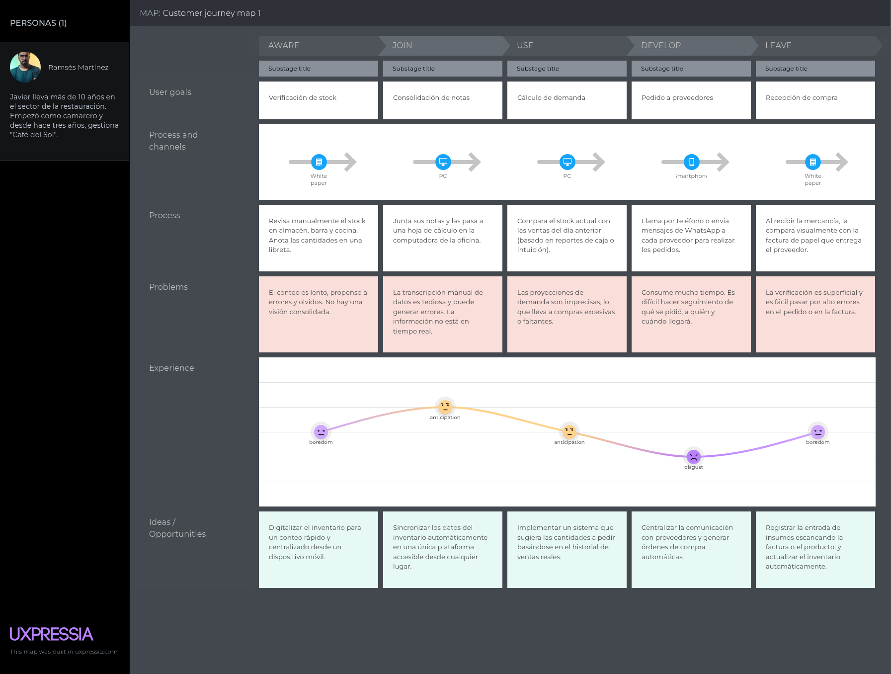

### 2.3.4. Empathy Mapping

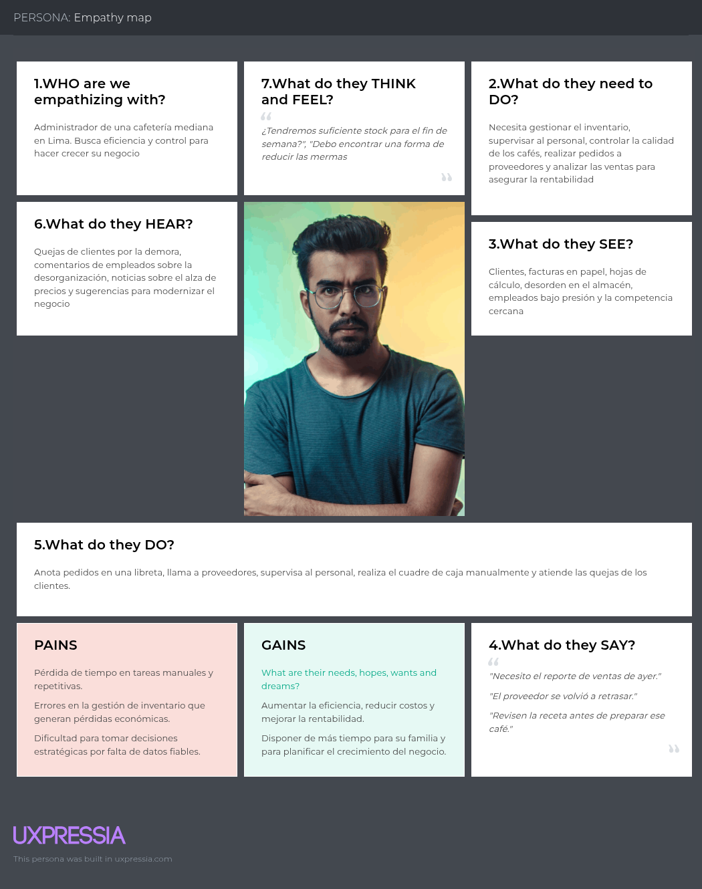

### 2.3.5. Ubiquitous Language

| Término | Definición |
| :--- | :--- |
| **Inventory** | Stock de todos los insumos y productos disponibles en la cafetería. |
| **Provider** | empresa que abastece de insumos a la cafetería. |
| **Recipe** | Instrucciones estandarizadas para la preparación de un producto, garantizando consistencia y calidad. |
| **Product** | Artículo final que se ofrece a la venta al cliente. |
| **Employer** | Empleado de la cafetería responsable de las operaciones diarias y atención al cliente. |
| **Purchase** | Proceso de adquisición de insumos y materiales necesarios para el funcionamiento de la cafetería. |
| **Sales** | Transacciones comerciales realizadas con los clientes para la venta de productos y servicios. |

## 2.4. Requirements specification

### 2.4.1. User Stories

### Epics 

| Epic ID | Título                         | Descripción                                                                                                |
| ------- | ------------------------------ | ---------------------------------------------------------------------------------------------------------- |
| EP001   | Autenticación y Roles          | Permite el acceso seguro al sistema diferenciando dueños y empleados con permisos específicos.             |
| EP002   | Gestión de Empleados           | Permite a los dueños crear, editar, eliminar y asignar credenciales a empleados por sucursal.              |
| EP003   | Gestión de Proveedores         | Administración de proveedores: creación, edición, búsqueda y eliminación.                                  |
| EP004   | Gestión de Recetas y Productos | Administración de recetas, insumos, preparación y vinculación con inventario.                              |
| EP005   | Gestión de Costos              | Registro y clasificación de costos (fijos, variables, directos, indirectos) para calcular la rentabilidad. |
| EP006   | Gestión de Inventario          | Control de entradas, salidas, categorías de insumos y búsqueda de inventario en tiempo real.               |
| EP007   | Gestión de Precios de Venta    | Definición de precios de venta basados en costos e insumos de cada producto.                               |
| EP008   | Búsquedas Optimizada           | Búsqueda rápida de empleados, proveedores e inventario.                                           |
| EP009   | Reportes y Estadísticas        | Reportes de costos, ventas, rentabilidad y gráficos                            |
| EP010   | Funcionalidades para Empleados | Acceso simplificado a recetas, precios y búsqueda de productos.                                            |
| EP011   | Landing Page | Proporcionar un sitio web estático con información clara sobre el producto  |
| EP012| Spike Story | historias de usuario de investigacion de recursos para el proyecto |

## User Stories
| Story ID | Título                       | Descripción                                                                                             | Criterios de aceptación                                                                                                                                                                                                                                                                                                                                                                                                                                                                 | Relación con (Epic ID) |
| -------- | ---------------------------- | ------------------------------------------------------------------------------------------------------- | --------------------------------------------------------------------------------------------------------------------------------------------------------------------------------------------------------------------------------------------------------------------------------------------------------------------------------------------------------------------------------------------------------------------------------------------------------------------------------------- | ---------------------- |
| US001    | Registro de dueño            | Como dueño, quiero registrarme en la aplicación para administrar mi cafetería.                          | **Escenario 1 – Registro exitoso** **Given** que el dueño ingresa datos válidos **When** confirma el registro **Then** el sistema crea su cuenta. **Escenario 2 – Email duplicado** **Given** que el email ya existe **When** intenta registrarse **Then** el sistema muestra un error. **Escenario 3 – Campos faltantes** **Given** que no llena todos los campos **When** intenta registrarse **Then** el sistema muestra validaciones obligatorias. | EP001                  |
| US002    | Login seguro                 | Como usuario, quiero iniciar sesión con mis credenciales para acceder según mi rol.    | **Escenario 1 – Login exitoso** **Given** credenciales correctas **When** hace login **Then** accede al sistema según rol. **Escenario 2 – Contraseña incorrecta** **Given** credenciales inválidas **When** hace login **Then** el sistema rechaza acceso. **Escenario 3 – Bloqueo por intentos fallidos** **Given** múltiples intentos fallidos **When** excede límite **Then** la cuenta queda bloqueada temporalmente.                             | EP001                  |
| US003    | Listar empleados      | Como dueño, quiero ver la lista de empleados para gestionarlos fácilmente.           | **Escenario 1 – Lista con datos** **Given** empleados existentes **When** abro listado **Then** muestra empleados. **Escenario 2 – Lista vacía** **Given** no hay empleados **When** abro listado **Then** muestra mensaje vacío.                      | EP002                  |
| US004    | Actualizar empleado   | Como dueño, quiero actualizar datos de empleados para mantener información al día.   | **Escenario 1 – Actualización exitosa** **Given** datos válidos **When** actualizo **Then** se guardan cambios. **Escenario 2 – Campos inválidos** **Given** datos inválidos **When** actualizo **Then** muestra error.                                | EP002                  |
| US005    | Eliminar empleado     | Como dueño, quiero eliminar empleados en caso de despido o renuncia.                 | **Escenario 1 – Eliminación exitosa** **Given** empleado válido **When** elimino **Then** se elimina de la lista. **Escenario 2 – Empleado con registros asociados** **Given** empleado vinculado **When** elimino **Then** sistema pide confirmación. | EP002                  |
| US006    | Crear proveedor              | Como dueño, quiero registrar proveedores para gestionar insumos y compras.                              | **Escenario 1 – Registro exitoso** **Given** datos completos **When** guardo proveedor **Then** se almacena correctamente. **Escenario 2 – Duplicado** **Given** proveedor ya existe **When** registro **Then** muestra error. **Escenario 3 – Campos obligatorios** **Given** datos incompletos **When** registro **Then** muestra validación.                                                                                                        | EP003                  |
| US007    | Listar proveedores    | Como dueño, quiero listar proveedores para ver a quién comprar.                      | **Escenario 1 – Lista con datos** **Given** proveedores existen **When** abro listado **Then** muestra proveedores. **Escenario 2 – Lista vacía** **Given** no hay proveedores **When** abro listado **Then** muestra mensaje vacío.                   | EP003                  |
| US008    | Actualizar proveedor  | Como dueño, quiero actualizar datos de proveedores para mantener información al día. | **Escenario 1 – Actualización exitosa** **Given** datos válidos **When** actualizo **Then** se guardan cambios. **Escenario 2 – Campos inválidos** **Given** datos inválidos **When** actualizo **Then** muestra error.                                | EP003                  |
| US09    | Crear receta                 | Como dueño, quiero registrar recetas con ingredientes para estandarizar preparación.                    | **Escenario 1 – Registro exitoso** **Given** ingredientes válidos **When** guardo receta **Then** se registra correctamente. **Escenario 2 – Ingrediente inexistente** **Given** ingrediente no registrado **When** intento usarlo **Then** muestra error. **Escenario 3 – Sin nombre de receta** **Given** falta nombre **When** registro **Then** muestra validación.                                                                                | EP004                  |
| US010    | Actualizar receta     | Como dueño, quiero actualizar recetas para modificar ingredientes o cantidades.      | **Escenario 1 – Actualización exitosa** **Given** datos válidos **When** actualizo receta **Then** se guardan cambios. **Escenario 2 – Campos inválidos** **Given** datos incompletos **When** actualizo **Then** muestra error.                       | EP004                  |
| US011    | Registrar costos             | Como dueño, quiero registrar costos fijos, variables, directos e indirectos para calcular rentabilidad. | **Escenario 1 – Registro exitoso** **Given** datos completos **When** guardo costo **Then** se registra. **Escenario 2 – Tipo inválido** **Given** tipo no válido **When** guardo **Then** muestra error. **Escenario 3 – Falta monto** **Given** monto vacío **When** guardo **Then** muestra validación.                                                                                                                                             | EP005                  |
| US012    | Registrar entrada inventario | Como dueño, quiero registrar entradas de inventario para tener control de insumos.                      | **Escenario 1 – Registro exitoso** **Given** insumo válido **When** ingreso cantidad **Then** se actualiza stock. **Escenario 2 – Cantidad inválida** **Given** cantidad negativa **When** ingreso **Then** sistema rechaza. **Escenario 3 – Insumo inexistente** **Given** insumo no registrado **When** ingreso **Then** muestra error. **Escenario 4 – Insumo duplicado** **Given** insumo ya existe **When** registro **Then** muestra error.                                                                                                              | EP006                  |
| US013    | Actualizar inventario | Como dueño, quiero actualizar inventario para reflejar entradas y salidas.           | **Escenario 1 – Actualización exitosa** **Given** datos válidos **When** actualizo **Then** se guardan cambios.                                                                                                                                        | EP006                  |
| US014    | Definir precio de venta      | Como dueño, quiero definir precios de venta basados en costos para maximizar rentabilidad.              | **Escenario 1 – Precio calculado** **Given** receta registrada **When** defino precio **Then** sistema sugiere precio con margen. **Escenario 2 – Precio manual** **Given** quiero definir precio **When** ingreso manual **Then** sistema lo acepta.                                                                                       | EP007                  |
| US015    | Búsqueda de empleados        | Como dueño, quiero buscar empleados por nombre o correo para localizarlos rápidamente.                  | **Escenario 1 – Coincidencia exacta** **Given** nombre válido **When** busco **Then** muestra resultados. **Escenario 2 – Parcial** **Given** letras parciales **When** busco **Then** lista posibles coincidencias. **Escenario 3 – Sin resultados** **Given** no existe **When** busco **Then** muestra mensaje vacío.                                                                                                                               | EP008                  |
| US016    | Buscar proveedores    | Como dueño, quiero buscar proveedores rápidamente para encontrarlos fácilmente.      | **Escenario 1 – Búsqueda por nombre** **Given** proveedores existen **When** busco por nombre **Then** muestra coincidencias. **Escenario 2 – Sin resultados** **Given** no hay coincidencias **When** busco **Then** muestra mensaje vacío.           | EP008                  |
| US017    | Buscar inventario     | Como dueño, quiero buscar inventario por nombre o categoría para localizar insumos.  | **Escenario 1 – Búsqueda exitosa** **Given** insumos existen **When** busco por categoría **Then** muestra coincidencias. **Escenario 2 – Sin resultados** **Given** no hay coincidencias **When** busco **Then** muestra mensaje vacío.               | EP008                  |
| US018    | Reporte de costos            | Como dueño, quiero generar reportes de costos por sucursal para analizar rentabilidad.                  | **Escenario 1 – Reporte exitoso** **Given** costos registrados **When** genero reporte **Then** sistema muestra tabla. **Escenario 2 – Sin datos** **Given** no hay costos **When** genero **Then** muestra mensaje vacío. **Escenario 3 – Multisucursal** **Given** dueño con varias sucursales **When** selecciona **Then** genera reporte específico.                                                                                               | EP009                  |
| US019    | Ver recetas                  | Como empleado, quiero consultar recetas estandarizadas para preparar correctamente.                     | **Escenario 1 – Receta existente** **Given** receta válida **When** consulto **Then** muestra ingredientes y pasos. **Escenario 2 – Filtrar recetas** **Given** múltiples recetas **When** busco por nombre **Then** lista filtrada. **Escenario 3 – Receta no encontrada** **Given** receta no existe **When** consulto **Then** muestra error.                                                                                                              | EP010                  |
| US020    | Ver sección Home           | Como **visitante (dueño de cafetería)**, quiero ver una introducción clara con imagen destacada y texto breve.       | **Escenario 1 – Carga exitosa** **Given** que ingreso a la página **When** se carga el sitio **Then** visualizo logo, imagen principal y mensaje de bienvenida.  **Escenario 2 – Fallo de carga** **Given** error **When** cargo sitio **Then** muestra mensaje de error.         | EP011                  |
| US021    | Ver sección About          | Como **visitante**, quiero ver una explicación sobre la aplicación y su propósito, para entender su valor.           | **Escenario 1 – Visualización exitosa** **Given** que estoy en la landing **When** hago scroll **Then** veo la sección "Sobre la aplicación" con texto e imágenes.  **Escenario 2 – Sección vacía** **Given** falta contenido **When** ingreso **Then** muestra mensaje temporal. | EP011                  |
| US022    | Ver sección Features       | Como **visitante**, quiero conocer las funcionalidades principales de la app, para evaluar si cubre mis necesidades. | **Escenario 1 – Lista de funcionalidades** **Given** que estoy en landing **When** navego a “Features” **Then** visualizo lista de funcionalidades.  **Escenario 2 – Sin funcionalidades** **Given** no cargan **When** ingreso **Then** muestra mensaje temporal.                | EP011                  |
| US023    | Botón Call to Action (CTA) | Como **visitante**, quiero un botón visible para descargar la app móvil, para obtener acceso fácilmente.             | **Escenario 1 – Botón visible** **Given** que estoy en landing **When** veo CTA **Then** aparece botón “Descargar App”.  **Escenario 2 – Click CTA** **Given** que hago click **When** interactúo **Then** me redirige a Google Play/App Store.                                   | EP011                  |
| US024    | Ver sección Contact        | Como **visitante**, quiero ver información de contacto, para poder comunicarme con soporte o ventas.                 | **Escenario 1 – Información visible** **Given** que estoy en landing **When** voy a “Contact” **Then** visualizo email, teléfono o formulario.  **Escenario 2 – Envío de formulario vacío** **Given** no ingreso datos **When** envío **Then** muestra validación.                | EP011                  |
| TS001    | API de registro de dueño       | Como **Developer**, quiero implementar un endpoint REST para registrar dueños de cafetería, para que el sistema guarde la información. | **Escenario 1 – Registro exitoso** **Given** request con datos válidos **When** POST `/owners` **Then** responde 201 con el ID del dueño.  **Escenario 2 – Email duplicado** **Given** request con email existente **When** POST `/owners` **Then** responde 400 con mensaje de error.                    | EP001                  |
| TS002    | API de login de dueño          | Como **Developer**, quiero implementar un endpoint REST para el login de dueños, validando credenciales contra la base de datos.       | **Escenario 1 – Login exitoso** **Given** request con credenciales correctas **When** POST `/auth/login` **Then** responde 200 con token JWT.  **Escenario 2 – Credenciales inválidas** **Given** request con email o password incorrecto **When** POST `/auth/login` **Then** responde 401 Unauthorized. | EP001                  |
| TS003    | API de gestión de empleados    | Como **Developer**, quiero implementar endpoints REST para CRUD de empleados, de forma que se almacenen sus datos.                     | **Escenario 1 – Alta de empleado** **Given** request válido **When** POST `/employees` **Then** responde 201 con ID generado.  **Escenario 2 – Consulta** **Given** GET `/employees/{id}` existente **When** envío request **Then** responde 200 con datos del empleado.                                  | EP002                  |
| TS004    | API de eliminación de empleado | Como **Developer**, quiero implementar un endpoint REST para eliminar empleados por renuncia o despido.                                | **Escenario 1 – Eliminación exitosa** **Given** DELETE `/employees/{id}` existente **When** envío request **Then** responde 200 con confirmación.  **Escenario 2 – Empleado inexistente** **Given** DELETE con ID no existente **When** envío request **Then** responde 404 Not Found.                    | EP002                  |
| TS005    | API de proveedores             | Como **Developer**, quiero implementar endpoints REST para CRUD de proveedores, de forma que se administren los datos en el sistema.   | **Escenario 1 – Registro proveedor** **Given** request válido **When** POST `/providers` **Then** responde 201 con ID del proveedor.  **Escenario 2 – Actualización proveedor** **Given** request con datos correctos **When** PUT `/providers/{id}` **Then** responde 200 con proveedor actualizado.     | EP003                  |
| TS006    | API de inventario              | Como **Developer**, quiero exponer endpoints REST para CRUD de insumos y productos, para que el inventario esté actualizado.           | **Escenario 1 – Registro producto** **Given** request válido **When** POST `/products` **Then** responde 201 con ID del producto.  **Escenario 2 – Consulta inventario** **Given** GET `/products` **When** envío request **Then** responde 200 con listado de productos.                                 | EP006                  |
| TS007    | API de recetas                 | Como **Developer**, quiero exponer endpoints REST para CRUD de recetas, para mantener actualizadas las preparaciones de los productos. | **Escenario 1 – Creación receta** **Given** request válido **When** POST `/recipes` **Then** responde 201 con ID de receta.  **Escenario 2 – Actualización receta** **Given** request válido **When** PUT `/recipes/{id}` **Then** responde 200 con receta actualizada.                                   | EP004                  |
| TS008    | API de reportes financieros    | Como **Developer**, quiero implementar un endpoint REST para generar reportes financieros, de forma que se obtengan métricas clave.    | **Escenario 1 – Reporte generado** **Given** parámetros válidos **When** GET `/reports/financial?from=2025-01-01&to=2025-01-31` **Then** responde 200 con JSON del reporte.  **Escenario 2 – Rango inválido** **Given** parámetros con fechas incorrectas **When** envío request **Then** responde 400.   | EP009                  |
| TS009    | API de seguridad (JWT)         | Como **Developer**, quiero implementar autenticación con JWT en los endpoints, para proteger el acceso a datos sensibles.              | **Escenario 1 – Token válido** **Given** request con token válido **When** accedo a `/employees` **Then** responde 200 con datos.  **Escenario 2 – Token inválido** **Given** request con token incorrecto **When** envío request **Then** responde 401 Unauthorized.                                     | EP001                  |
| TS010    | API de registro de costos      | Como **Developer**, quiero implementar un endpoint REST para registrar costos (fijos, variables, directos, indirectos) por sucursal.   | **Escenario 1 – Registro exitoso** **Given** request válido **When** POST `/costs` **Then** responde 201 con ID del costo.  **Escenario 2 – Datos incompletos** **Given** request sin categoría o monto **When** POST `/costs` **Then** responde 400 con mensaje de validación.                           | EP005                  |
| TS011    | API de clasificación de costos | Como **Developer**, quiero implementar lógica en el backend para clasificar automáticamente costos según su tipo y sucursal.           | **Escenario 1 – Clasificación exitosa** **Given** request con tipo válido (fijo, variable, directo, indirecto) **When** POST `/costs` **Then** se guarda en la categoría correspondiente.  **Escenario 2 – Tipo inválido** **Given** request con tipo no reconocido **When** POST **Then** responde 400.  | EP005                  |
| TS012    | API de consulta de costos      | Como **Developer**, quiero implementar un endpoint REST para consultar los costos de una sucursal en un periodo de tiempo.             | **Escenario 1 – Consulta exitosa** **Given** GET `/costs?sucursal=1&from=2025-01-01&to=2025-01-31` **When** envío request **Then** responde 200 con listado de costos.  **Escenario 2 – Fechas inválidas** **Given** parámetros con rango inválido **When** GET `/costs` **Then** responde 400 con error. | EP005                  |
| SS001    | Investigación sobre librería Charts.kt | Como equipo de desarrollo, quiero investigar y prototipar la librería **Charts.kt** para la generación de gráficos en aplicaciones Kotlin/Android, para evaluar si es viable mostrar dashboards de costos, ventas y rentabilidad. | **Escenario 1 – Revisión de documentación** **Given** que la librería Charts.kt ofrece distintas opciones **When** el desarrollador revisa su documentación oficial y ejemplos **Then** identifica y documenta qué tipos de gráficos soporta.  **Escenario 2 – Prototipo funcional** **Given** la necesidad de validación técnica **When** se construye un prototipo con al menos 2 gráficos (ej. barras y líneas) **Then** se documenta su facilidad de integración y limitaciones. | EP012                  |
| SS002 | Investigación de servicios externos para autenticación y autorización | Como equipo de desarrollo, quiero investigar la viabilidad de usar un servicio externo como **Firebase Authentication** o **Supabase Auth** para el manejo de autenticación y autorización de usuarios, para decidir si es conveniente delegar estas funciones críticas en lugar de desarrollarlas internamente. | **Escenario 1 – Revisión de documentación** **Given** que Firebase y Supabase ofrecen servicios de autenticación **When** el desarrollador revisa su documentación oficial **Then** identifica los flujos de login soportados (email/password, OAuth, proveedores sociales).  **Escenario 2 – Análisis de costos** **Given** que cada servicio tiene planes gratuitos y de pago **When** se comparan los modelos de precios **Then** se documenta cuál se ajusta mejor al presupuesto y escalabilidad del proyecto.  **Escenario 3 – Validación técnica con prototipo** **Given** la necesidad de evaluar integración **When** se implementa un prototipo de registro/login de usuarios **Then** se documenta la facilidad de integración, tiempo de configuración y limitaciones. | EP012 |
| SS003 | Investigación de servicios externos para almacenamiento de imágenes | Como equipo de desarrollo, quiero investigar la viabilidad de usar un servicio externo como **Firebase Storage** o **AWS S3** para el almacenamiento de imágenes, para decidir si conviene delegar esta funcionalidad en lugar de implementarla en infraestructura propia. | **Escenario 1 – Revisión de documentación** **Given** que Firebase Storage y AWS S3 ofrecen APIs para manejo de archivos **When** el desarrollador revisa la documentación oficial **Then** identifica opciones de subida, descarga, escalabilidad y permisos de acceso.  **Escenario 2 – Análisis de costos** **Given** que cada servicio maneja un modelo de precios distinto (ej. GB almacenados, transferencias) **When** se comparan los costos de Firebase Storage y AWS S3 **Then** se documenta cuál es más conveniente según el volumen esperado de imágenes.  **Escenario 3 – Validación técnica con prototipo** **Given** la necesidad de probar integración real **When** se implementa un prototipo que suba y recupere al menos una imagen desde el servicio **Then** se documenta la facilidad de integración, rendimiento y limitaciones encontradas.  | EP012 |

### 2.4.2. Impact Mapping

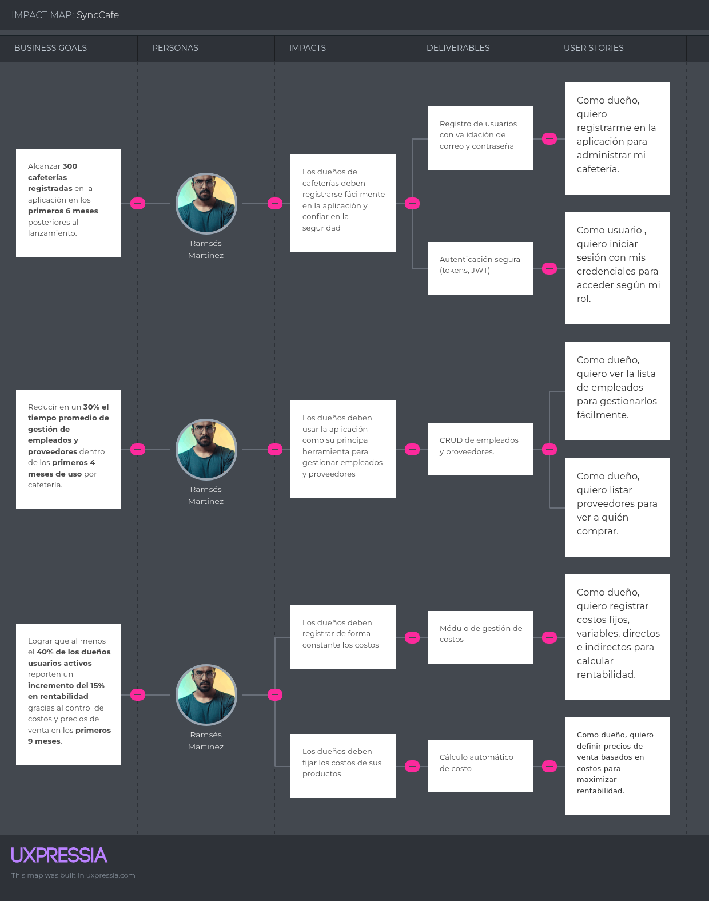

### 2.4.3. Product Backlog

Esta seccion servirá como guía para organizar el trabajo del equipo, asegurando que siempre avancemos lo más importante del proyecto.

| # Orden | User Story Id | Título                       | Story Points (1/2/3/5/8) |
| ------- | ------------- | ---------------------------- | ------------------------ |
|1        | SS001         | Investigación sobre librería Charts.kt| 3|
|2        |  SS002          | Investigación de servicios externos para autenticación y autorización|3|
|3        |  SS003         |Investigación de servicios externos para almacenamiento de imágenes|3|
| 4       | US020         | Ver sección Home             | 1                        |
| 5       | US021         | Ver sección About            | 1                        |
| 6       | US022         | Ver sección Features         | 1                        |
| 7       | US023         | Botón Call to Action (CTA)   | 1                        |
| 8       | US024         | Ver sección Contact          | 2                        |
| 9       | US011         | Registrar costos             | 5                        |
| 10       | US012         | Registrar entrada inventario | 5                        |
| 11       | US013         | Actualizar inventario        | 3                        |
| 12      | US014         | Definir precio de venta      | 5                        |
| 13      | US018         | Reporte de costos            | 8                        |
| 14     | US009         | Crear receta                 | 3                        |
| 15      | US010         | Actualizar receta            | 3                        |
| 16      | US006         | Crear proveedor              | 5                        |
| 17      | US008         | Actualizar proveedor         | 5                        |
| 18      | US004         | Actualizar empleado          | 5                        |
| 19      | US005         | Eliminar empleado            | 2                        |
| 20      | US003         | Listar empleados             | 3                        |
| 21      | US007         | Listar proveedores           | 3                        |
| 22      | US015         | Búsqueda de empleados        | 3                        |
| 23      | US016         | Buscar proveedores           | 3                        |
| 24      | US017         | Buscar inventario            | 3                        |
| 25      | US019         | Ver recetas                  | 5                        |
| 26      | US001         | Registro de dueño            | 3                        |
| 27      | US002         | Login seguro                 | 5                        |

## 2.5. Strategic-Level Domain-Driven Design

### 2.5.1. EventStorming

En esta sección se mostrará la aplicación del Domain-Driven Design (DDD) a nivel estratégico dentro del proyecto. El objetivo es identificar los distintos bounded context que intervienen en el dominio, así como las relaciones entre ellos, con el fin de establecer una arquitectura clara que permita escalar la solución y adaptarla a las necesidades del negocio.

#### 2.5.1.1. Candidate Context Discovery

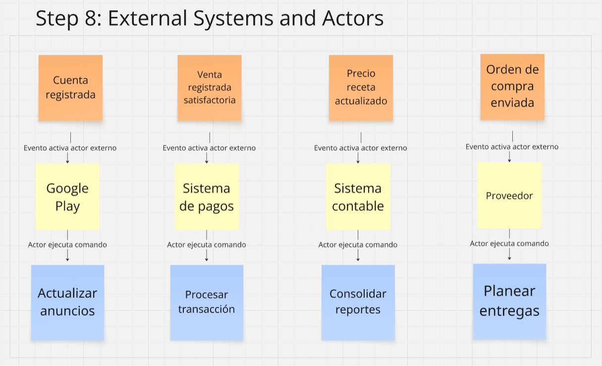

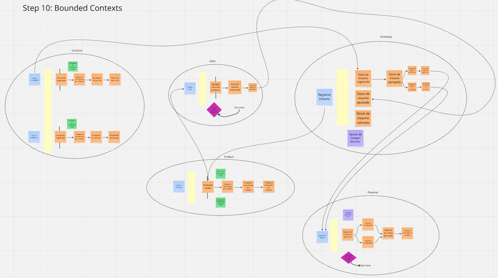

Link: https://miro.com/welcomeonboard/TzdJdEdvSWJQa2pYS2FIdU5DWE9ZV2w5MjkycmZRZzB2OUFQWkhOemVGUTd6ekE4R0tlVW11TmNMMVIrd1lnWHRQbk5IWHN2VEs3M0ttajJ5TG1LUXZ6SVhjZ255RHJzTjZ5eEZRSXFkZisvOVo3VjhaRmdSL0s4T0tBMmhQd1F3VHhHVHd5UWtSM1BidUtUYmxycDRnPT0hdjE=?share_link_id=804149752797

#### 2.5.1.2. Domain Message Flows Modeling

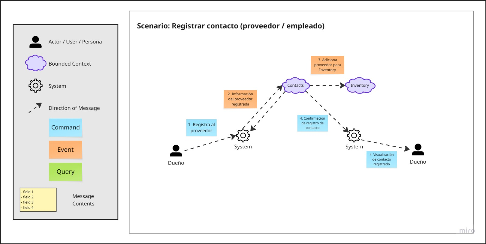

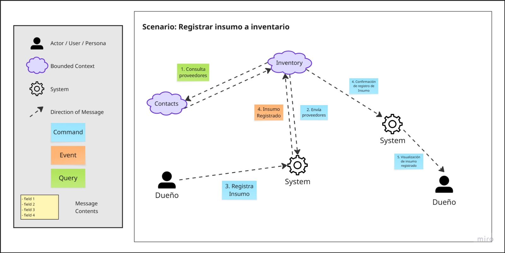

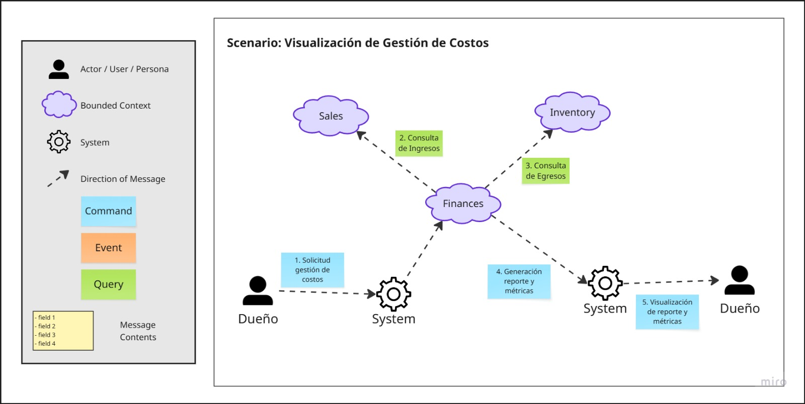

Link: [Domain Message Flows Modeling](https://miro.com/welcomeonboard/MERVd3QrN05xUEQ0TU8wK3F5U0pTTWVMNHpNUTV2b3FZbHltdHhvbkpvWUVQTG1KZkgrRVpzcE5uQ0R3emYzOEJ3Zk5ocWZGTDZ1VlFSYzlRSjBnMnZwbHZGRzYwVVRTSHhVQzhyYjJJSnZjUFNGR0xndk40RFZ0cXdwQTdGTm5hWWluRVAxeXRuUUgwWDl3Mk1qRGVRPT0hdjE=?share_link_id=573543137048)

#### 2.5.1.3. Bounded Context Canvases

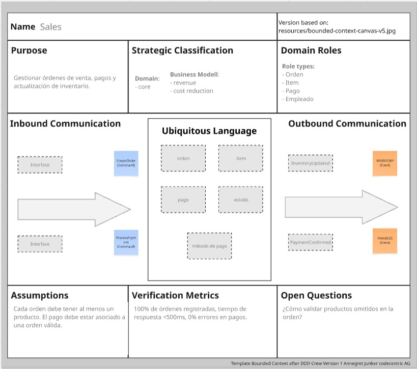

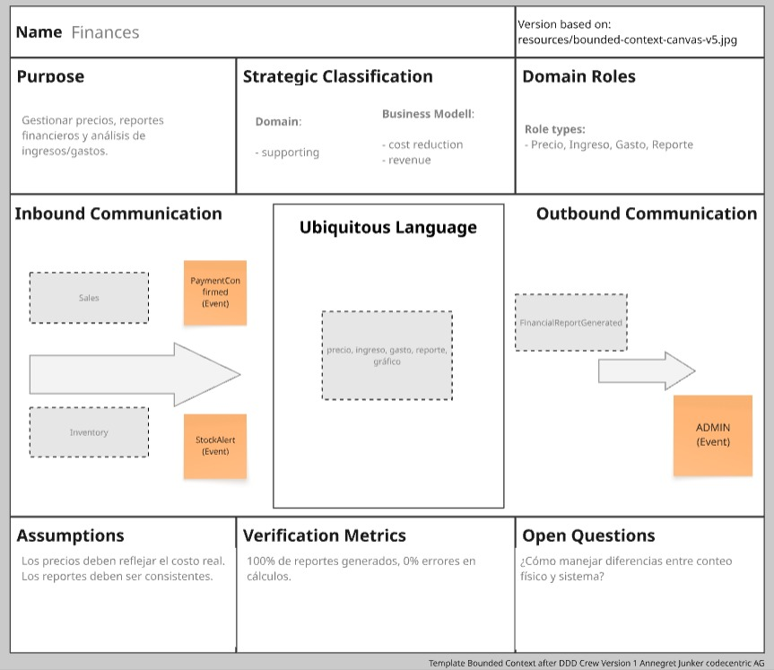

### 2.5.2. Context Mapping

Context Mapping es la práctica de definir los límites de cada Bounded Context, dispone de su propia tecnología, lenguaje y arquitectura para reflejar fielmente su parte del dominio. A través de las Context Maps se describen las relaciones entre diferentes contextos, estableciendo reglas de traducción (Translation Maps) y señalando quién expone servicios (Upstream) y quién los consume (Downstream) para mantener la coherencia e independencia de cada modelo.

#### Autenticación y autorización (IAM Context)
IAM expone verificación de identidad y emisión/validación de tokens en JSON como OHS/PL. Sales, Inventory, Product, Finances y Contacts consumen este contrato sin transformación bajo un patrón Conformist.

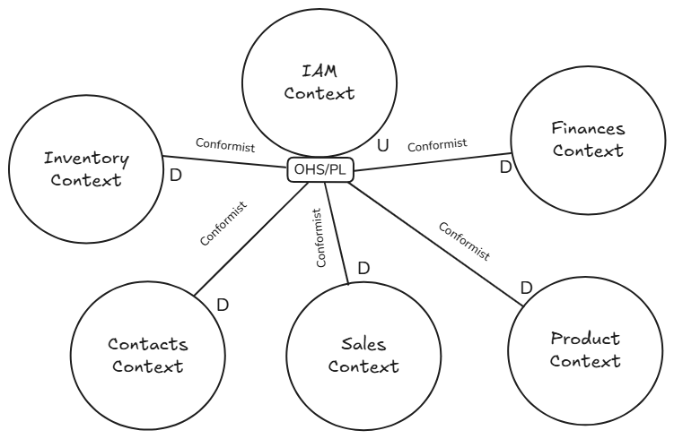

#### Catálogo y recetas (Product Context)
Product expone catálogo y recetas. Sales traduce y negocia atributos (ACL + Customer–Supplier), Inventory influye en la estructura (Customer–Supplier) y Finances consume el modelo estándar (Conformist).

#### Stock (Inventory Context)
Inventory ofrece disponibilidad. Sales y Finances consultan estos datos directamente bajo un patrón Conformist.

#### Reportes y comprobantes (Finances Context)
Finances expone generacion de reportes y comprobantes. Sales traduce requisitos fiscales y negocia formatos (ACL + Customer–Supplier), mientras Contacts consume datos contables sin adaptaciones (Conformist).

#### Contactos (Contact Context)
Contacts expone datos de los clientes/proveedores. Sales y Finances consumen esta información sin transformación bajo un patrón Conformist.

### 2.5.3. Software Architecture

#### 2.5.3.1. Software Architecture Context Level Diagrams

#### 2.5.3.2. Software Architecture Container Level Diagrams

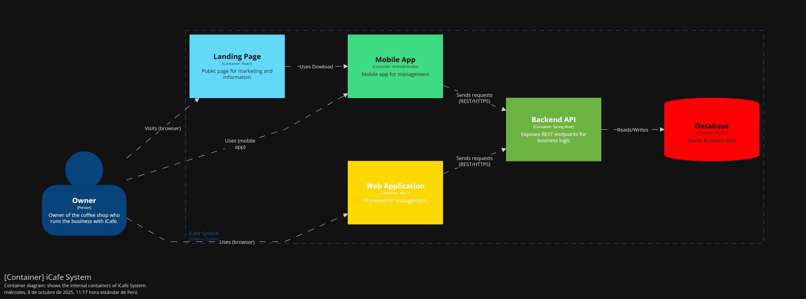
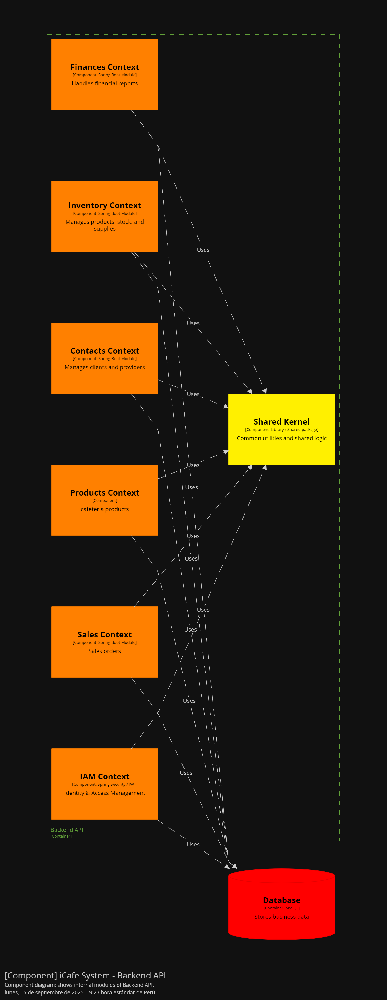

#### 2.5.3.3. Software Architecture Deployment Diagrams

## 2.6. Tactical-Level Domain-Driven Design

### 2.6.1. Bounded Context: Contacts

El bounded context Contacts se encarga de la gestión de proveedores y empleados de la cafetería. Su objetivo es registrar, actualizar y eliminar estos contactos, permitiendo al dueño listar todos los registros para una administración eficiente y centralizada de las relaciones externas e internas.

#### 2.6.1.1. Domain Layer

En esta capa se definen los elementos principales del dominio de contactos. Se modelan los agregados, entidades, value objects y servicios de dominio que representan la lógica central de cómo se gestionan los proveedores y empleados. El objetivo es mantener la consistencia del negocio y las reglas que garantizan el control y la validación de los datos de contactos.

| Tipo          | Clase / Nombre          | Descripción                                                                 | Atributos / Valores                  |
|---------------|-------------------------|-----------------------------------------------------------------------------|--------------------------------------|
| Aggregate     | ContactManagement       | Gestión de contactos como una unidad de consistencia                        | suppliers, employees                 |
| Root          | Supplier                | Representa un proveedor del inventario                                      | id, name, contactInfo, category      |
| Entity        | Employee                | Representa un empleado de la cafetería                                      | id, name, position, contactInfo      |
| Value Object  | Address                 | Representa una dirección física o de contacto                               | street, city, zipCode, country       |
| Value Object  | PhoneNumber             | Representa un número de teléfono con tipo                                   | number, type (MOBILE, OFFICE)        |
| Domain Service| ContactValidationService| Valida la unicidad y consistencia de datos de contactos                     | validateSupplier(), validateEmployee()|
| Enum          | ContactType             | Define los tipos de contactos disponibles                                   | SUPPLIER, EMPLOYEE                   |

#### 2.6.1.2. Interface Layer

En esta capa se encuentran los controladores y objetos de transferencia (DTOs) que sirven como punto de comunicación entre el sistema y los usuarios o clientes externos. Su función principal es exponer endpoints REST para la gestión de proveedores y empleados, facilitando la interacción con la aplicación de una forma clara y estructurada.

| Tipo       | Clase / Nombre              | Descripción                                                                 | Métodos / Endpoints principales                  |
|------------|-----------------------------|-----------------------------------------------------------------------------|--------------------------------------------------|
| Controller | ContactController           | Expone endpoints REST para la gestión general de contactos. Llama a la capa de aplicación. | - GET /contacts — listar todos los contactos - GET /contacts/{id} — obtener detalle |
| Controller | SupplierController          | Maneja operaciones relacionadas con proveedores (registrar, actualizar, eliminar). | - POST /suppliers — registrar nuevo proveedor - PUT /suppliers/{id} — actualizar datos - DELETE /suppliers/{id} — eliminar proveedor |
| Controller | EmployeeController          | Maneja operaciones relacionadas con empleados (registrar, actualizar, eliminar). | - POST /employees — registrar nuevo empleado - PUT /employees/{id} — actualizar datos - DELETE /employees/{id} — eliminar empleado |
| DTO        | SupplierResource            | Objeto de transferencia que devuelve datos de proveedores.                  | id, name, contactInfo, category                  |
| DTO        | EmployeeResource            | Objeto de transferencia que devuelve datos de empleados.                    | id, name, position, contactInfo                  |
| DTO        | ContactCommandResource      | Objeto de transferencia para recibir comandos de creación/actualización.    | type, name, contactInfo                          |

#### 2.6.1.3. Application Layer

Esta capa maneja los flujos de procesos de contactos mediante el uso de command handlers y event handlers. Su rol es coordinar las operaciones del negocio, orquestando las acciones que se solicitan desde la interfaz y delegando la lógica al dominio. Así se asegura que cada comando o evento dispare el proceso adecuado dentro del contexto de contactos.

| Tipo          | Clase / Nombre                  | Descripción                                                                 | Método / Comandos manejados                  |
|---------------|---------------------------------|-----------------------------------------------------------------------------|----------------------------------------------|
| Command Handler | RegisterSupplierHandler         | Maneja el proceso de registrar un nuevo proveedor en el sistema.            | - handle(RegisterSupplierCommand)            |
| Command Handler | UpdateSupplierHandler           | Maneja la actualización de datos de un proveedor existente.                 | - handle(UpdateSupplierCommand)              |
| Command Handler | RemoveSupplierHandler           | Maneja la eliminación de un proveedor.                                      | - handle(RemoveSupplierCommand)              |
| Command Handler | RegisterEmployeeHandler         | Maneja el proceso de registrar un nuevo empleado.                           | - handle(RegisterEmployeeCommand)            |
| Command Handler | UpdateEmployeeHandler           | Maneja la actualización de datos de un empleado existente.                  | - handle(UpdateEmployeeCommand)              |
| Command Handler | RemoveEmployeeHandler           | Maneja la eliminación de un empleado.                                       | - handle(RemoveEmployeeCommand)              |
| Event Handler | ContactUpdatedHandler           | Escucha eventos de dominio de actualización de contactos y dispara notificaciones o auditoría. | - on(ContactUpdatedEvent)                    |

#### 2.6.1.4. Infrastructure Layer

En esta capa se implementa la conexión con servicios externos, principalmente la base de datos. Incluye los repositorios que persisten la información de proveedores y empleados utilizando JPA/Hibernate. De esta manera, el dominio se mantiene independiente de la tecnología, mientras la infraestructura garantiza el acceso confiable a los datos.

| Tipo       | Clase / Nombre              | Descripción                                                                 | Notas Técnicas                              |
|------------|-----------------------------|-----------------------------------------------------------------------------|---------------------------------------------|
| Repository | SupplierRepository          | Implementación JPA/Hibernate para persistir proveedores.                    | Mapa Supplier a tabla suppliers.            |
| Repository | EmployeeRepository          | Implementación JPA/Hibernate para persistir empleados.                      | Mapa Employee a tabla employees.            |

#### 2.6.1.5. Bounded Context Software Architecture Component Level Diagrams

#### 2.6.1.6. Bounded Context Software Architecture Code Level Diagrams

##### 2.6.1.6.1. Bounded Context Domain Layer Class Diagrams

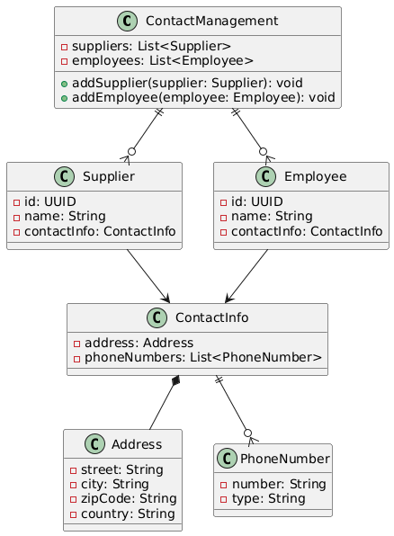

##### 2.6.1.6.2. Bounded Context Database Design Diagram

### 2.6.2. Bounded Context: Product

#### 2.6.2.1. Domain Layer

El bounded context Product se encarga de definir el estándar del dueño para cada producto del menú. Su objetivo es crear, actualizar, archivar o eliminar productos garantizando consistencia: nombre único por sucursal, componentes válidos y control de versionado para que otros contextos (p. ej., Sales) calculen consumos con el producto correcto.

| Tipo           | Clase / Nombre            | Descripción                                                                                                  | Atributos / Valores clave                                                                                                                                                                               |
| -------------- | ------------------------- | ------------------------------------------------------------------------------------------------------------ | ------------------------------------------------------------------------------------------------------------------------------------------------------------------------------------------------------- |
| Aggregate      | Product                   | Agregado raíz que modela un producto del menú, soportando modalidad SIMPLE o COMPOSED con control de versión | id, ownerId, sucursalId, name, category, type (SIMPLE, COMPOSED), portions, steps, version, directItem (DirectItemSpec?), components: List<RecipeItem>, createdAt, updatedAt |
| Root           | Product                   | Root del agregado; garantiza invariantes y emite eventos                                                     | —                                                                                                                                                                                                       |
| Value Object   | RecipeItem                | Ítem de la receta COMPOSED: insumo y cantidad por porción                                                    | itemId, qtyPerPortion (> 0), unit (g, ml, unidad)                                                                                                                                                       |
| Value Object   | DirectItemSpec            | Especificación para producto SIMPLE: vínculo al insumo de inventario y conversión a porción                  | itemId, portionFactor (> 0), unit (unidad por porción)                                                                                                                                                  |
| Domain Service | ProductPolicy             | Reglas transversales: unicidad de nombre, normalización de unidades, validación de referencias a Inventory   | ensureUniqueName(), normalizeUnits(), validateItemsExist()                                                                                                                                              |
| Domain Event   | ProductCreated            | Producto creado con receta inicial o referencia directa                                                      | productId, name, type, version, components\[]?, directItem?                                                                                                                                             |
| Domain Event   | ProductUpdated            | Cambios en datos generales y/o receta; si cambia COMPOSED o portions, version++                              | productId, changedFields, version, components\[]?, directItem?                                                                                                                                          |
| Domain Event   | ProductArchived           | Producto archivado                                                                                           | productId                                                                                                                                                                                               |
| Domain Event   | ProductActivated          | Producto reactivado                                                                                          | productId                                                                                                                                                                                               |
| Domain Event   | ProductDeleted (opcional) | Eliminación lógica/física según política                                                                     | productId                                                                                                                                                                                               |

#### 2.6.2.2. Interface Layer

En esta capa se modela el agregado Product (root) y sus value objects, junto con reglas de negocio e invariantes.

| Tipo       | Clase / Nombre                    | Descripción                                                     | Métodos / Endpoints principales                                                                                                                                 |
| ---------- | --------------------------------- | --------------------------------------------------------------- | --------------------------------------------------------------------------------------------------------------------------------------------------------------- |
| Controller | ProductController                 | CRUD de productos y lectura de receta vigente                   | POST /products · PUT /products/{id} · PATCH /products/{id}/archive · PATCH /products/{id}/activate · DELETE /products/{id} · GET /products/{id} · GET /products |
| Controller | RecipeExportController (opcional) | Solicita exportación de recetario PDF (delegado a Documents)    | POST /products/exports/recipes-pdf                                                                                                                              |
| DTO (in)   | ProductCommandResource            | Payload de creación/actualización con soporte SIMPLE o COMPOSED | name, category, type, portions, steps, directItem: {itemId, portionFactor, unit}?, components: \[{itemId, qtyPerPortion, unit}]?                                |
| DTO (out)  | ProductResource                   | Respuesta de producto normalizada                               | id, name, category, type, portions, steps, status, version, directItem?, components\[], createdAt, updatedAt                                                    |
| DTO (out)  | RecipeItemResource                | Ítem de receta para COMPOSED                                    | itemId, name, qtyPerPortion, unit                                                                                                                               |
| DTO (out)  | DirectItemResource                | Especificación de producto SIMPLE                               | itemId, name, portionFactor, unit                                                                                                                               |

#### 2.6.2.3. Application Layer

| Tipo            | Clase / Nombre                  | Descripción                                                                                                           | Métodos / Comandos manejados                                          |
| --------------- | ------------------------------- | --------------------------------------------------------------------------------------------------------------------- | --------------------------------------------------------------------- |
| Command Handler | CreateProductHandler            | Crea producto. Valida unicidad, existencia de itemId en Inventory (ACL) y coherencia entre type/directItem/components | handle(CreateProductCommand)                                          |
| Command Handler | UpdateProductHandler            | Actualiza datos; si cambia components o portions ⇒ version++                                                          | handle(UpdateProductCommand)                                          |
| Command Handler | ArchiveProductHandler           | Marca producto como ARCHIVED                                                                                          | handle(ArchiveProductCommand)                                         |
| Command Handler | ActivateProductHandler          | Reactiva producto                                                                                                     | handle(ActivateProductCommand)                                        |
| Command Handler | DeleteProductHandler (opcional) | Elimina o soft-delete según política                                                                                  | handle(DeleteProductCommand)                                          |
| Event Handler   | ProductChangedProjection        | Actualiza read models para listados y exportación                                                                     | on(ProductCreated, ProductUpdated, ProductArchived, ProductActivated) |
| Event Handler   | ProductChangedPublisher         | Publica cambios para invalidar cachés o actualizar catálogos en Sales                                                 | on(ProductCreated, ProductUpdated)                                    |

#### 2.6.2.4. Infrastructure Layer

| Tipo        | Clase / Nombre             | Descripción                                                      | Notas Técnicas                                                                                                                                |
| ----------- | -------------------------- | ---------------------------------------------------------------- | --------------------------------------------------------------------------------------------------------------------------------------------- |
| Repository  | ProductRepository          | Persistencia del agregado Product                                | JPA/Hibernate o equivalente; tablas products y product\_components; para SIMPLE, tabla product\_direct\_item; índices por owner+sucursal+name |
| Mapper      | ProductJpaMapper           | Mapear entidades JPA a dominio (VOs RecipeItem y DirectItemSpec) | Conversión de unidades consistente; collections embebidas versionadas                                                                         |
| Messaging   | DomainEventOutbox          | Publicación transaccional de eventos de dominio                  | Tabla outbox\_events + publicador asíncrono                                                                                                   |
| Integration | InventoryACLClient         | Validar existencia de itemId contra Inventory                    | REST/gRPC GET /inventory/items/{id} con timeout/retry/circuit breaker                                                                         |
| Projection  | ProductReadModelRepository | Proyección denormalizada para listados y exportación PDF         | Vistas materializadas con name, type, version, components/directItem                                                                          |

#### 2.6.2.5. Bounded Context Software Architecture Component Level Diagrams

#### 2.6.2.6. Bounded Context Software Architecture Code Level Diagrams

##### 2.6.2.6.1. Bounded Context Domain Layer Class Diagrams

##### 2.6.2.6.2. Bounded Context Database Design Diagram

### 2.6.3. Bounded Context: Inventory

El bounded context Inventory se encarga de la gestión de los insumos de la cafetería, como café, azúcar o leche. Su objetivo es registrar cada insumo disponible y controlar el flujo de entradas y salidas del stock, ya sea por compras, consumo en pedidos, desperdicio o ajustes de inventario. Además, permite generar alertas cuando un insumo alcanza niveles bajos para garantizar la continuidad en la preparación de productos.

#### 2.6.3.1. Domain Layer

En esta capa se definen los elementos principales del dominio del inventario. Aquí se modelan los agregados, entidades, value objects y servicios de dominio que representan la lógica central de cómo se gestionan los insumos y sus movimientos. El objetivo es mantener la consistencia del negocio y las reglas que garantizan el control del stock.

| Tipo            | Clase / Nombre             | Descripción                                                                 | Atributos / Valores                                         |
|-----------------|----------------------------|-----------------------------------------------------------------------------|-------------------------------------------------------------|
| Aggregate       | SupplyManagement           | Gestiona el inventario de insumos como una unidad de consistencia.           | supplyItems, transactions                                   |
| Aggregate Root  | SupplyItem                 | Representa cada insumo dentro del inventario.                               | id, nombre, unidadMedida, cantidadActual, puntoDeReorden    |
| Entity          | InventoryTransaction       | Registra un movimiento de inventario.                                       | id, tipoMovimiento, cantidad, fecha, referencia             |
| Value Object    | Quantity                   | Representa una cantidad con su medida, garantiza consistencia.               | valor, unidadMedida                                         |
| Value Object    | UnitOfMeasure              | Define la unidad de medida utilizada.                                       | gramos, kilogramos, litros, unidades, etc.                  |
| Value Object    | ReorderPoint               | Valor mínimo que dispara la alerta de reabastecimiento.                      | cantidadMinima                                              |
| Domain Service  | StockConsumptionService    | Encapsula la lógica de reducción de stock cuando se consumen insumos.       | consumirInsumo(supplyItem, quantity)                        |
| Domain Service  | StockReplenishmentService  | Encapsula la lógica de reabastecimiento al registrar nuevas entradas.       | reabastecer(supplyItem, quantity)                           |
| Enum            | TransactionType            | Define los tipos de movimientos en el inventario.                           | ENTRADA, SALIDA, AJUSTE                                     |
| Enum            | UnitMeasureType            | Define los tipos de unidades disponibles para medir insumos.                | GRAMOS, KILOGRAMOS, LITROS, UNIDADES                        |

#### 2.6.3.2. Interface Layer

En esta capa se encuentran los controladores y objetos de transferencia (DTOs) que sirven como punto de comunicación entre el sistema y los usuarios o clientes externos. Su función principal es exponer endpoints REST para la gestión de insumos y movimientos, facilitando la interacción con la aplicación de una forma clara y estructurada.

| Tipo        | Clase / Nombre            | Descripción                                                                 | Métodos / Endpoints principales                         |
|-------------|---------------------------|-----------------------------------------------------------------------------|---------------------------------------------------------|
| Controller  | InventoryController       | Expone endpoints REST para la gestión del inventario. Llama a la capa Application. | - GET /inventory/items → listar insumos   - GET /inventory/items/{id} → obtener detalle de un insumo   - POST /inventory/items → registrar un nuevo insumo   - PUT /inventory/items/{id} → actualizar datos de un insumo   - DELETE /inventory/items/{id} → eliminar insumo |
| Controller  | StockMovementController   | Maneja operaciones relacionadas con entradas y salidas de inventario.       | - POST /inventory/movements → registrar un movimiento (entrada, salida, ajuste)   - GET /inventory/movements → listar movimientos   - GET /inventory/movements/{id} → detalle de un movimiento |
| DTO         | InventoryTransactionResource | Objeto de transferencia para recibir datos de movimientos de inventario.    | tipoMovimiento, cantidad, referencia                     |
| DTO         | SupplyItemResource        | Objeto de transferencia que devuelve datos de insumos            | id, nombre, unidadMedida, cantidadActual, puntoDeReorden |

#### 2.6.3.3. Application Layer

Esta capa maneja los flujos de procesos del inventario mediante el uso de command handlers y event handlers. Su rol es coordinar las operaciones del negocio, orquestando las acciones que se solicitan desde la interfaz y delegando la lógica al dominio. Aquí se asegura que cada comando o evento dispare el proceso adecuado dentro del contexto de inventario.

| Tipo             | Clase / Nombre                   | Descripción                                                                 | Métodos / Comandos manejados                        |
|------------------|----------------------------------|-----------------------------------------------------------------------------|-----------------------------------------------------|
| Command Handler  | RegisterSupplyItemHandler        | Maneja el proceso de registrar un nuevo insumo en el inventario.            | - handle(RegisterSupplyItemCommand)                 |
| Command Handler  | UpdateSupplyItemHandler          | Maneja la actualización de datos de un insumo existente.                    | - handle(UpdateSupplyItemCommand)                   |
| Command Handler  | RemoveSupplyItemHandler          | Maneja la eliminación de un insumo del inventario.                          | - handle(RemoveSupplyItemCommand)                   |
| Command Handler  | RegisterInventoryTransactionHandler | Maneja el registro de movimientos de inventario (entrada, salida, ajuste).  | - handle(RegisterInventoryTransactionCommand)       |
| Event Handler    | LowStockEventHandler             | Escucha el evento de dominio `StockBajoDetectado` y dispara acciones como notificación o reabastecimiento. | - on(StockBajoDetectado) |
#### 2.6.3.4. Infrastructure Layer
En esta capa se implementa la conexión con servicios externos, principalmente la base de datos. Incluye los repositorios que persisten la información de los insumos y transacciones de inventario utilizando JPA/Hibernate. De esta manera, el dominio se mantiene independiente de la tecnología, mientras la infraestructura garantiza el acceso confiable a los datos.

| Tipo             | Clase / Nombre                         | Descripción                                                                 | Notas Técnicas |
|------------------|----------------------------------------|-----------------------------------------------------------------------------|----------------|
| Repository Impl  | SupplyItemRepository                | Implementación de `SupplyItemRepository` usando JPA/Hibernate para persistir insumos. | Mapea `SupplyItem` a tabla `supply_items`. |
| Repository Impl  | InventoryTransactionRepository      | Implementación de `InventoryTransactionRepository` usando JPA/Hibernate.    | Mapea `InventoryTransaction` a tabla `inventory_transactions`. |

#### 2.6.3.5. Bounded Context Software Architecture Component Level Diagrams

#### 2.6.3.6. Bounded Context Software Architecture Code Level Diagrams

##### 2.6.3.6.1. Bounded Context Domain Layer Class Diagrams

El diagrama de clases del bounded context Inventory representa los principales elementos del Domain Layer, incluyendo agregados, entidades, value objects, servicios de dominio, enumeraciones e interfaces de repositorios. Su objetivo es mostrar las relaciones y responsabilidades de cada componente dentro de la gestión de insumos y movimientos de inventario en la cafetería. Para su elaboración se utilizó PlantUML.

##### 2.6.3.6.2. Bounded Context Database Design Diagram 

En esta sección se diseño el diagrama de base de datos relacional de el bounded context inventory.
* **Category** : agrupa los insumos en familias o tipos
* **supplyItems**: insumo gestionado en el inventario
* **stocks**: disponibilidad de insumos
* **inventory_movements**: el moviento dentro del inventario.
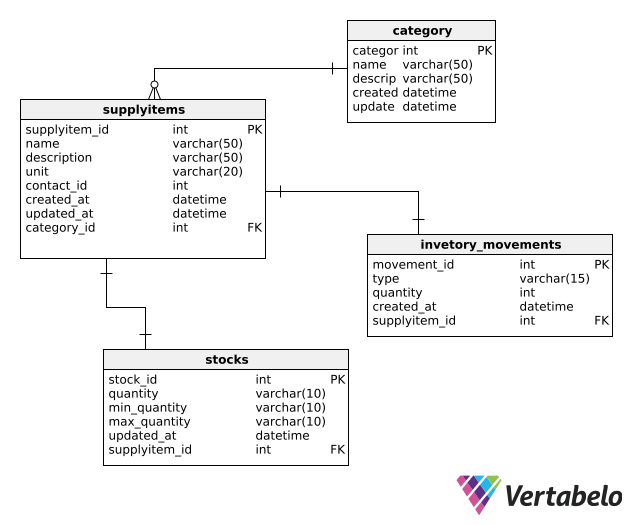

### 2.6.4. Bounded Context: Sales

#### 2.6.4.1. Domain Layer

En esta capa se definen los elementos principales del dominio de ventas. Aquí se modelan los agregados, entidades, value objects y servicios de dominio que representan la lógica central de cómo se gestionan las órdenes, pagos y transacciones comerciales.

| Tipo            | Clase / Nombre             | Descripción                                                                 | Atributos / Valores                                         |
|-----------------|----------------------------|-----------------------------------------------------------------------------|-------------------------------------------------------------|
| Aggregate       | OrderManagement            | Gestiona el ciclo de vida completo de una orden como unidad de consistencia. | orders, payments                                           |
| Aggregate Root  | Order                      | Representa una orden de venta con todos sus items.                         | id, fecha, estado, total, empleadoId, items                |
| Entity          | OrderItem                  | Representa un item dentro de una orden.                                    | id, productoId, cantidad, precioUnitario, subtotal         |
| Entity          | Payment                    | Registra el pago asociado a una orden.                                     | id, ordenId, monto, metodoPago, fecha, estado              |
| Value Object    | Money                      | Representa valores monetarios con currency.                                | monto, currency                                            |
| Value Object    | OrderStatus                | Define los estados posibles de una orden.                                  | CREADA, PAGADA, EN_PROCESO, COMPLETADA, CANCELADA          |
| Value Object    | PaymentMethod              | Define los métodos de pago aceptados.                                      | EFECTIVO, TARJETA, TRANSFERENCIA                           |
| Domain Service  | OrderCalculationService    | Calcula totales, impuestos y descuentos de una orden.                      | calcularTotal(order)                                       |
| Domain Service  | PaymentProcessingService   | Gestiona el procesamiento de pagos.                                        | procesarPago(order, paymentMethod)                         |
| Domain Event    | OrderCreatedEvent          | Evento disparado cuando se crea una nueva orden.                           | orderId, fecha, total                                      |
| Domain Event    | PaymentReceivedEvent       | Evento disparado cuando se recibe un pago.                                 | orderId, monto, metodoPago                                 |
| Enum            | OrderStatusType            | Define los tipos de estado de orden.                                       | CREATED, PAID, PROCESSING, COMPLETED, CANCELLED            |
| Enum            | PaymentMethodType          | Define los tipos de métodos de pago.                                       | CASH, CARD, TRANSFER                                       |

#### 2.6.4.2. Interface Layer

En esta capa se encuentran los controladores y DTOs que sirven como interfaz entre el sistema y los usuarios/clientes externos.

| Tipo        | Clase / Nombre            | Descripción                                                                 | Métodos / Endpoints principales                         |
|-------------|---------------------------|-----------------------------------------------------------------------------|---------------------------------------------------------|
| Controller  | SalesController           | Expone endpoints REST para la gestión de ventas.                           | - POST /sales/orders → crear nueva orden - GET /sales/orders → listar órdenes - GET /sales/orders/{id} → obtener orden específica - PUT /sales/orders/{id} → actualizar orden - DELETE /sales/orders/{id} → cancelar orden |
| Controller  | PaymentController         | Maneja operaciones relacionadas con pagos.                                 | - POST /sales/payments → procesar pago - GET /sales/payments → listar pagos - GET /sales/payments/{id} → detalle de pago |
| DTO         | OrderRequest              | Objeto para recibir datos de creación de orden.                            | items, empleadoId, metodoPago                           |
| DTO         | OrderResponse             | Objeto para devolver datos de orden.                                       | id, fecha, estado, total, items                         |
| DTO         | PaymentRequest            | Objeto para recibir datos de pago.                                         | ordenId, monto, metodoPago                              |
| DTO         | PaymentResponse           | Objeto para devolver datos de pago.                                        | id, ordenId, monto, estado, fecha                       |

#### 2.6.4.3. Application Layer

Esta capa maneja los flujos de procesos de ventas mediante command handlers y event handlers.

| Tipo             | Clase / Nombre                   | Descripción                                                                 | Métodos / Comandos manejados                        |
|------------------|----------------------------------|-----------------------------------------------------------------------------|-----------------------------------------------------|
| Command Handler  | CreateOrderHandler               | Maneja la creación de una nueva orden.                                     | - handle(CreateOrderCommand)                        |
| Command Handler  | ProcessPaymentHandler            | Maneja el procesamiento de pagos.                                          | - handle(ProcessPaymentCommand)                     |
| Command Handler  | UpdateOrderStatusHandler         | Maneja la actualización del estado de una orden.                           | - handle(UpdateOrderStatusCommand)                  |
| Command Handler  | CancelOrderHandler               | Maneja la cancelación de órdenes.                                          | - handle(CancelOrderCommand)                        |
| Event Handler    | InventoryUpdateEventHandler      | Escucha eventos de actualización de inventario.                            | - on(InventoryUpdatedEvent)                         |
| Event Handler    | PaymentConfirmedEventHandler     | Escucha eventos de confirmación de pago.                                   | - on(PaymentConfirmedEvent)                         |

#### 2.6.4.4. Infrastructure Layer

En esta capa se implementa la conexión con servicios externos y la persistencia de datos.

| Tipo             | Clase / Nombre                         | Descripción                                                                 | Notas Técnicas |
|------------------|----------------------------------------|-----------------------------------------------------------------------------|----------------|
| Repository Impl  | OrderRepositoryImpl                    | Implementación de OrderRepository usando JPA/Hibernate.                    | Mapea Order a tabla orders |
| Repository Impl  | PaymentRepositoryImpl                  | Implementación de PaymentRepository usando JPA/Hibernate.                  | Mapea Payment a tabla payments |
| External Service | InventoryServiceClient                 | Cliente para comunicación con servicio de inventario.                      | REST client para Inventory API |
| External Service | PaymentGatewayClient                   | Cliente para comunicación con pasarela de pagos.                           | Integración con Stripe/PayPal |

#### 2.6.4.5. Bounded Context Software Architecture Component Level Diagrams

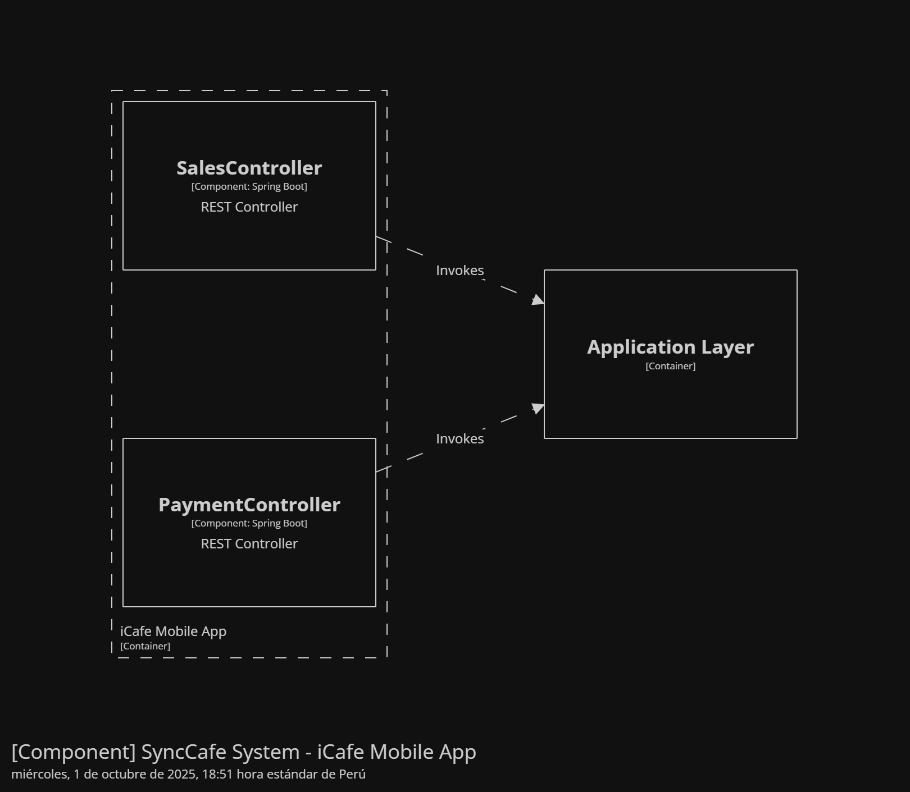

#### 2.6.4.6. Bounded Context Software Architecture Code Level Diagrams

##### 2.6.4.6.1. Bounded Context Domain Layer Class Diagrams

El diagrama de clases del bounded context Sales representa los principales elementos del Domain Layer, mostrando las relaciones entre órdenes, items de orden, pagos y servicios de dominio. El diagrama fue elaborado usando PlantUML.

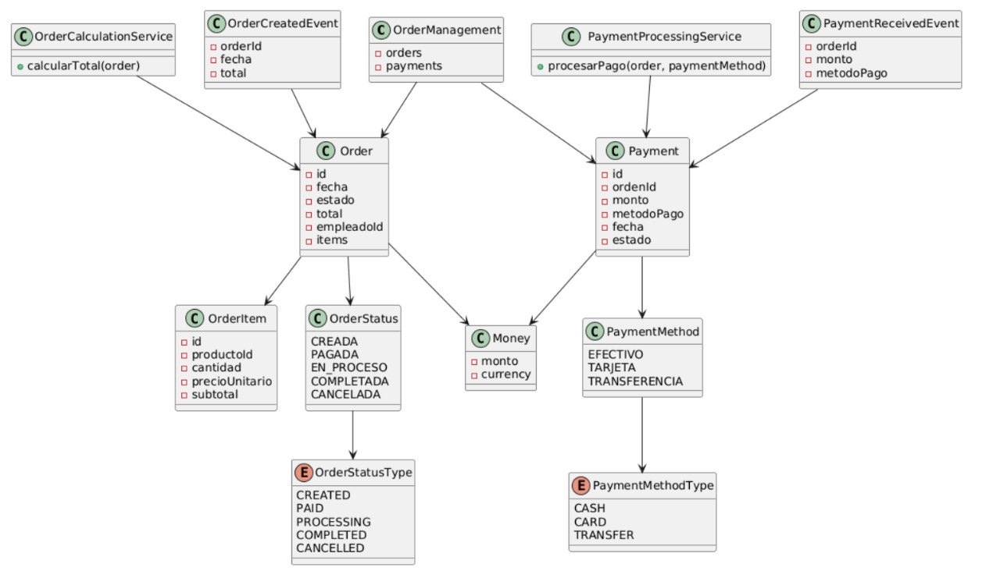

##### 2.6.4.6.2. Bounded Context Database Design Diagram

En esta sección se diseña el diagrama de base de datos relacional para el bounded context Sales.

* **orders**: almacena las órdenes de venta
* **order_items**: almacena los items de cada orden
* **payments**: registra los pagos asociados a las órdenes
* **employees**: información de empleados que realizan ventas

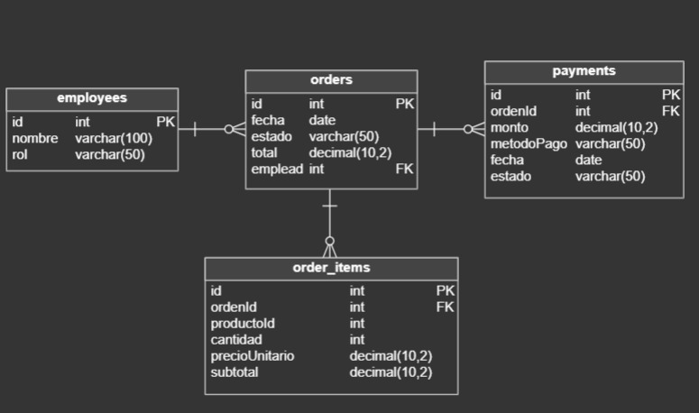

### 2.6.5. Bounded Context: Finances

El bounded context Finances se encarga de la gestión financiera de la cafetería, incluyendo el registro de ingresos, gastos, control de costos, generación de reportes financieros y análisis de rentabilidad.

#### 2.6.5.1. Domain Layer

En esta capa se definen los elementos principales del dominio financiero. Aquí se modelan los agregados, entidades, value objects y servicios de dominio que representan la lógica central.

| Tipo            | Clase / Nombre             | Descripción                                                                 | Atributos / Valores                                         |
|-----------------|----------------------------|-----------------------------------------------------------------------------|-------------------------------------------------------------|
| Aggregate       | FinancialManagement        | Gestiona las operaciones financieras como una unidad de consistencia.       | transactions, budgets, reports                              |
| Aggregate Root  | Transaction                | Representa una transacción financiera (ingreso o gasto).                    | id, tipo, monto, fecha, categoría, descripción, referencia  |
| Entity          | Budget                     | Define un presupuesto para un período y categoría específicos.              | id, categoría, montoAsignado, montoUtilizado, período       |
| Entity          | FinancialReport            | Representa un informe financiero generado para un período.                  | id, tipo, período, fechaGeneración, datos                   |
| Value Object    | Money                      | Representa valores monetarios con su moneda.                                | valor, moneda                                               |
| Value Object    | Period                     | Define un período de tiempo para análisis financiero.                       | fechaInicio, fechaFin                                       |
| Value Object    | Category                   | Categoría para clasificar transacciones financieras.                        | id, nombre, tipo                                            |
| Domain Service  | ProfitCalculationService   | Calcula la rentabilidad basada en ingresos y gastos.                        | calcularRentabilidad(period)                                |
| Domain Service  | BudgetAnalysisService      | Analiza el cumplimiento de presupuestos y desviaciones.                     | analizarPresupuesto(budget, period)                         |
| Domain Event    | TransactionRegisteredEvent | Evento disparado cuando se registra una nueva transacción.                  | transactionId, tipo, monto, fecha                           |
| Domain Event    | BudgetExceededEvent        | Evento disparado cuando un gasto supera el presupuesto asignado.            | budgetId, categoría, montoExcedido                          |
| Enum            | TransactionType            | Define los tipos de transacciones financieras.                              | INGRESO, GASTO                                              |
| Enum            | ReportType                 | Define los tipos de informes financieros disponibles.                       | BALANCE, FLUJO_CAJA, RENTABILIDAD, PRESUPUESTO              |

#### 2.6.5.2. Interface Layer

En esta capa se encuentran los controladores y DTOs que sirven como interfaz entre el sistema y los usuarios o clientes externos.

| Tipo        | Clase / Nombre            | Descripción                                                                 | Métodos / Endpoints principales                         |
|-------------|---------------------------|-----------------------------------------------------------------------------|---------------------------------------------------------|
| Controller  | TransactionController     | Expone endpoints REST para la gestión de transacciones financieras.         | - POST /finances/transactions → registrar transacción - GET /finances/transactions → listar transacciones - GET /finances/transactions/{id} → obtener detalle - PUT /finances/transactions/{id} → actualizar transacción - DELETE /finances/transactions/{id} → eliminar transacción |
| Controller  | BudgetController          | Maneja operaciones relacionadas con presupuestos.                           | - POST /finances/budgets → crear presupuesto - GET /finances/budgets → listar presupuestos - GET /finances/budgets/{id} → detalle de presupuesto - PUT /finances/budgets/{id} → actualizar presupuesto |
| Controller  | ReportController          | Gestiona la generación y consulta de informes financieros.                  | - POST /finances/reports → generar informe - GET /finances/reports → listar informes - GET /finances/reports/{id} → obtener informe específico |
| DTO         | TransactionRequest        | Objeto para recibir datos de creación de transacción.                       | tipo, monto, categoría, descripción, referencia         |
| DTO         | TransactionResponse       | Objeto para devolver datos de transacción.                                  | id, tipo, monto, fecha, categoría, descripción          |
| DTO         | BudgetRequest             | Objeto para recibir datos de creación de presupuesto.                       | categoría, montoAsignado, fechaInicio, fechaFin         |
| DTO         | ReportRequest             | Objeto para solicitar generación de informes.                               | tipo, fechaInicio, fechaFin                             |

#### 2.6.5.3. Application Layer

Esta capa maneja los flujos de procesos financieros mediante command handlers y event handlers.

| Tipo             | Clase / Nombre                   | Descripción                                                                 | Métodos / Comandos manejados                        |
|------------------|----------------------------------|-----------------------------------------------------------------------------|-----------------------------------------------------|
| Command Handler  | RegisterTransactionHandler       | Maneja el registro de nuevas transacciones financieras.                     | - handle(RegisterTransactionCommand)                |
| Command Handler  | CreateBudgetHandler              | Maneja la creación de nuevos presupuestos.                                  | - handle(CreateBudgetCommand)                       |
| Command Handler  | GenerateFinancialReportHandler   | Maneja la generación de informes financieros.                               | - handle(GenerateFinancialReportCommand)            |
| Command Handler  | UpdateBudgetHandler              | Maneja la actualización de presupuestos existentes.                         | - handle(UpdateBudgetCommand)                       |
| Event Handler    | SaleCompletedEventHandler        | Escucha eventos de ventas completadas para registrar ingresos.              | - on(SaleCompletedEvent)                            |
| Event Handler    | InventoryPurchaseEventHandler    | Escucha eventos de compras de inventario para registrar gastos.             | - on(InventoryPurchaseEvent)                        |
| Event Handler    | BudgetExceededEventHandler       | Maneja acciones cuando se excede un presupuesto.                            | - on(BudgetExceededEvent)                           |

#### 2.6.5.4. Infrastructure Layer

En esta capa se implementa la conexión con servicios externos, principalmente la base de datos. Incluye los repositorios que persisten la información financiera utilizando JPA/Hibernate.

| Tipo             | Clase / Nombre                         | Descripción                                                                 | Notas Técnicas |
|------------------|----------------------------------------|-----------------------------------------------------------------------------|----------------|
| Repository Impl  | TransactionRepositoryImpl              | Implementación de TransactionRepository usando JPA/Hibernate.               | Mapea Transaction a tabla transactions |
| Repository Impl  | BudgetRepositoryImpl                   | Implementación de BudgetRepository usando JPA/Hibernate.                    | Mapea Budget a tabla budgets |
| Repository Impl  | FinancialReportRepositoryImpl          | Implementación de FinancialReportRepository usando JPA/Hibernate.           | Mapea FinancialReport a tabla financial_reports |
| External Service | SalesServiceClient                     | Cliente para comunicación con servicio de ventas.                           | REST client para Sales API |
| External Service | InventoryServiceClient                 | Cliente para comunicación con servicio de inventario.                       | REST client para Inventory API |
| External Service | ReportGenerationService                | Servicio para generación de reportes en diferentes formatos (PDF, Excel).   | Utiliza bibliotecas como Apache POI, iText |

#### 2.6.5.5. Bounded Context Software Architecture Component Level Diagrams

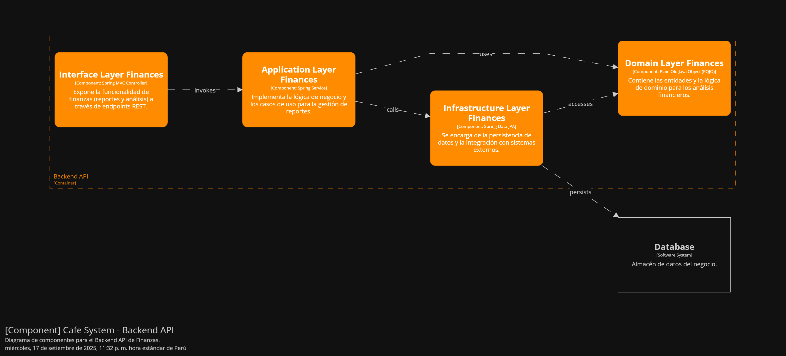

#### 2.6.5.6. Bounded Context Software Architecture Code Level Diagrams

##### 2.6.5.6.1. Bounded Context Domain Layer Class Diagrams

##### 2.6.5.6.2. Bounded Context Database Design Diagram

* **transactions**: almacena todas las transacciones financieras (ingresos y gastos)
* **categories**: categorías para clasificar transacciones
* **budgets**: presupuestos asignados por categoría y período
* **financial_reports**: informes financieros generados
* **report_data**: datos específicos incluidos en cada informe

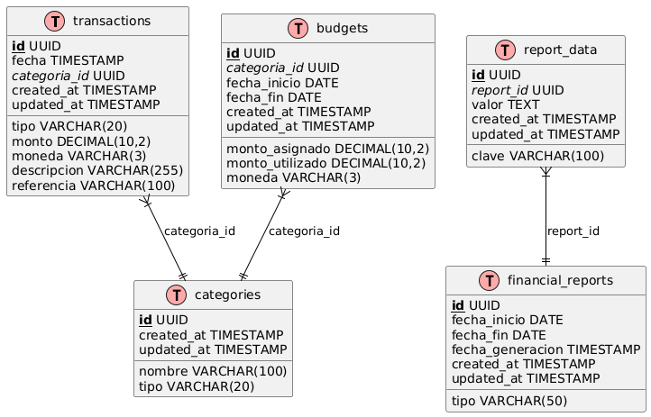

# Capítulo III: Solution UI/UX Design

## 3.1. Product design

Esta sección describe el diseño del producto para **iCafe**, una
plataforma digital creada para optimizar la gestión de cafeterías.
El enfoque principal es la simplicidad, eficiencia y accesibilidad,
pensada para propietarios y administradores sin necesidad de
conocimientos técnicos avanzados.

### 3.1.1. Style Guidelines

Las guías de estilo definen la identidad visual de **iCafe**, asegurando
consistencia en pantallas y componentes.
Se adopta un **enfoque minimalista** con colores inspirados en el café,
tipografías modernas e íconos discretos.
De esta manera, la interfaz es **profesional, amigable y accesible**,
alineada con la meta de simplificar operaciones.

#### 3.1.1.1. General Style Guidelines

Esta sección presenta las Directrices Generales de Estilo, que definen la identidad visual de la aplicación.

**Logo:**  
Se diseñó un logo que, a simple vista, se percibe como una taza de café, ya que nuestro público objetivo son personas con cafeterías.

**Paleta de Colores:**  
Transmiten una atmósfera cálida y acogedora:

-   Gris Oscuro: `#51514F` → textos y bordes.
-   Gris Medio: `#929190` → textos secundarios, íconos.
-   Gris Claro: `#D9D9D9` → fondos sutiles.
-   Marrón Oscuro: `#8F4C32` → botones principales, encabezados.
-   Marrón Medio: `#77574B` → navegación.
-   Verde Oliva: `#695E30` → indicadores de éxito, sostenibilidad.
-   Durazno Claro: `#FFDBCE` → tarjetas, secciones de
    ventas/inventario.
-   Rosa Suave: `#FFF8F6` → fondos claros, formularios.
-   Blanco: `#FFFFFF` → espacios principales, limpieza visual.

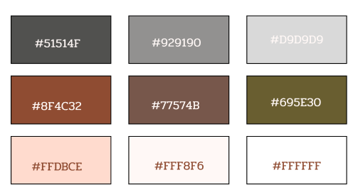

**Los botones:**  
- **Primarios**: marrón oscuro (#8F4C32).
- **Secundarios**: durazno claro (#FFDBCE).
- **Terciarios**: verde oliva (#695E30).
Todos con esquinas redondeadas y aspecto táctil.

**Tipografía:**  
- Fuente Principal: **Poppins** (sans-serif) → encabezados, cuerpo de
texto y botones.
- Fuente Secundaria: **Pridi** (serif) → subtítulos o textos
decorativos.

Directrices:
- Encabezados: Poppins bold (24--32 pt).
- Texto principal: Poppins regular (14--16 pt).
- Contraste sutil con Pridi en etiquetas o subtítulos.

**Íconos:**  
- Íconos minimalistas en gris medio (#929190) o colores de acento.
- Ejemplos: usuario, menú, editar, notificaciones, buscar.
- Logotipo: taza de café humeante en tonos marrones.
- Ilustraciones simples y planas, sin sobrecargar la interfaz.

**Diseño y Espaciado:**  
- Fondos claros (#FFF8F6 / #FFFFFF).
- Amplio espacio en blanco.
- Botones con forma de píldora.
- Campos con esquinas redondeadas y sombras suaves.
- Diseño **mobile**.

**Accesibilidad:**  
- Tema claro por defecto.
- Contraste alto según normas **WCAG**.
- Texto escalable.
- Compatible con daltonismo.
- Áreas de interacción mínimas: **48x48 dp**.

### 3.1.2. Information Architecture

La arquitectura de información organiza el contenido de manera lógica para facilitar acceso rápido a funciones esenciales: registro, inicio de sesión, panel de control y herramientas de operación.

Se prioriza la estructura jerárquica, optimizada para dispositivos móviles y orientada a flujos de tareas como registro de ventas o seguimiento de inventario.

#### 3.1.2.1. Organization Systems
La aplicación se estructura a través de diferentes sistemas de organización, según el tipo de información y la necesidad del usuario.

**Jerárquica:**
- **Inventario:** Los productos (café, insumos, utensilios) se listan según categorías definidas: Materias primas, Bebidas, Complementos.  
- **Personal:** Lista de empleados organizada por roles (barista, cajero, administrador).  
- **Transacciones:** Historial de ventas presentado cronológicamente, mostrando primero las más recientes.  
- **Panel de control:** Muestra indicadores clave (ventas diarias, stock bajo, desempeño del personal).  

**Secuencial:**
- **Registro de ventas:** Paso a paso para seleccionar producto, cantidad y medio de pago.  
- **Registro de empleados:** Proceso que guía desde datos personales hasta asignación de rol.  
- **Onboarding inicial:** Explicación guiada desde el inicio de sesión hasta la configuración básica de la cafetería.  

**Matricial:**
- **Gestión de sedes:** Cuando la cafetería posee más de un local, el sistema muestra un panel tipo cuadrícula con cada sede. Desde allí se puede acceder al inventario, ventas y personal de forma independiente.  
- **Calendario de turnos:** Agenda visual que organiza horarios de empleados según días y horas.  

#### 3.1.2.2. Labelling Systems
Se aplicará un etiquetado simple y claro, con el formato **verbo + sustantivo**, acompañado de íconos.  

- Ejemplos: *Registrar Ventas, Gestionar Inventario, Añadir Empleado*.  
- Campos de entrada con etiquetas breves: *Nombre de Cafetería, Correo electrónico, Contraseña*.  
- Jerarquía visual mediante tipografías diferenciadas para títulos, subtítulos y contenido.  
- Todo el contenido estará localizado en español, con planes de traducción futura al inglés.  

#### 3.1.2.3. SEO Tags and Meta Tags
**Para la Landing Page:**
- **Title:** iCafe – Gestión inteligente para tu cafetería  
- **Description:** Plataforma digital para administrar ventas, inventario y personal en tu cafetería de manera sencilla y eficiente.  
- **Keywords:** cafeterías, gestión de inventario, control de ventas, administración de café, dueños de cafeterías.  
- **Author:** Equipo iCafe  

**Para la Aplicación Móvil (ASO):**
- **App Title:** iCafe  
- **App Subtitle:** Administración de cafeterías en tu bolsillo  
- **App Keywords:** café, cafetería, ventas, inventario, gestión  
- **App Description:** iCafe es la app que ayuda a dueños de cafeterías a organizar su negocio de forma eficiente: controla ventas, inventario, personal y proveedores desde tu celular.  

#### 3.1.2.4. Searching Systems
El sistema de búsqueda permitirá localizar rápidamente información clave:  

- **Global:** búsqueda transversal de productos, empleados y transacciones.  
- **Facetada:** filtros por categorías de producto (café, insumos, postres), proveedores o costos.  
- **Autocompletado:** sugerencias al escribir precios, nombres de productos o empleados.  
- **Resultados:** presentados en listas con miniaturas (para productos) o tarjetas (para empleados).  
- **Offline:** búsqueda indexada para casos sin conexión a internet.  

#### 3.1.2.5. Navigation Systems
Se implementan diferentes formas de navegación, adaptadas a la web y la app móvil:  

- **Landing Page:** navegación superior con secciones: *Inicio, Servicios, Beneficios, Costos, Contacto*.  
- **Aplicación móvil:** navegación principal mediante pestañas inferiores: *Panel, Inventario, Personal, Gestion de Costos , Registro de compra y venta*.  
- **Secundaria:** menús desplegables y tarjetas para acceder a funciones dentro de cada módulo (ejemplo: *Inventario → Materias Primas*).  
- **Gestos:** *swipe lateral* para cambiar entre listas de ventas o turnos de empleados.  

### 3.1.3. Landing Page UI Design

#### 3.1.3.1. Landing Page Wireframe
En esta sección se presentan los wireframes de la landing page, los cuales representan la estructura básica de la interfaz. El objetivo es definir la distribución de los elementos principales que comunicarán de manera clara los servicios de la aplicación y facilitarán la navegación a los usuarios.
| Landing Page Wireframe | Landing Page Wireframe Responsive |
|-------------------------|-----------------------------------|
| 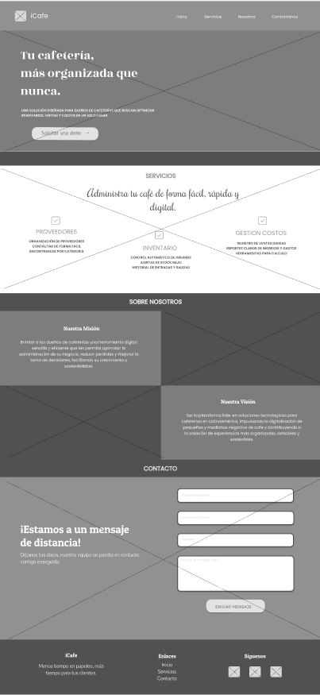 | 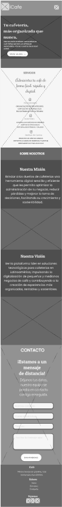 |

 
-Link: https://www.figma.com/design/c61JnVMaZZcReGqcVzwikH/Untitled?node-id=0-1&t=gB15ysIlrLllfRAw-1 

#### 3.1.3.2. Landing Page Mock-up
Aquí se muestran los mock-ups de la landing page, donde se integran aspectos visuales como colores, tipografía e imágenes. Estos diseños permiten visualizar con mayor fidelidad cómo se verá la página final y cómo transmitirá la identidad de la marca enfocada en cafeterías.
| LandingPage Mock-up | LandingPage Mock-up Responsive |
|-------------------------|-----------------------------------|
||| 

 
-Link: https://www.figma.com/design/c61JnVMaZZcReGqcVzwikH/Untitled?node-id=0-1&t=gB15ysIlrLllfRAw-1 

### 3.1.4. Mobile Applications UX/UI Design

Esta sección aborda el diseño de la experiencia de usuario (UX) y la interfaz gráfica (UI) de la aplicación móvil. Se busca crear una plataforma intuitiva, atractiva y funcional que permita a los administradores de cafeterías gestionar sus negocios de forma sencilla y eficiente.
#### 3.1.4.1. Mobile Applications Wireframes
Se presentan los wireframes de la aplicación móvil, que representan la base estructural de cada pantalla. Estos bocetos iniciales permiten definir la jerarquía de información y la organización de los elementos.
| Wirefranes de iCafe|
|----------------------------------|
| Se muestran las pantallas en baja fidelidad |
|  |
|Link: https://www.figma.com/design/c61JnVMaZZcReGqcVzwikH/Untitled?node-id=0-1&t=gB15ysIlrLllfRAw-1 |

#### 3.1.4.2. Mobile Applications Wireflow Diagrams
En este apartado se incluyen los wireflow diagrams, los cuales combinan los wireframes con el flujo de navegación. Esto permite visualizar cómo interactúa el usuario al desplazarse por las distintas pantallas de la aplicación.

| User Persona: Dueños de cafeterias. |
|----------------------------------|
| User Goal: Como usuario, deseo registrarme e iniciar sesion antes de visualizar el panel principal. |
| 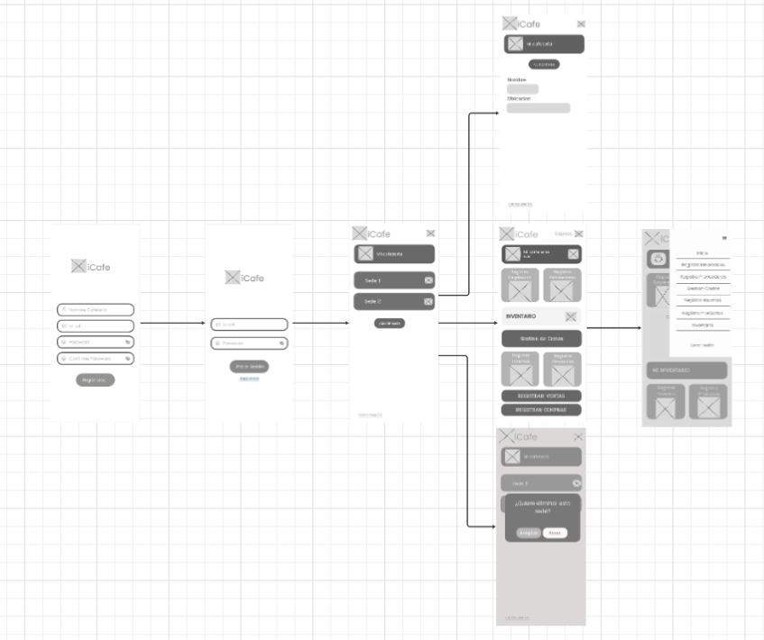 |

| User Persona: Dueños de cafeterias. |
|----------------------------------|
| User Goal: Como usuario, deseo agregar, editar y eliminar empleados cuando yo quiera. |
| 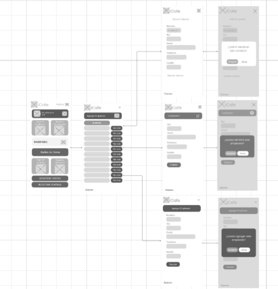 |

| User Persona: Dueños de cafeterias. |
|----------------------------------|
| User Goal: Como usuario, deseo agregar, editar y eliminar Insumos cuando yo quiera. |
| 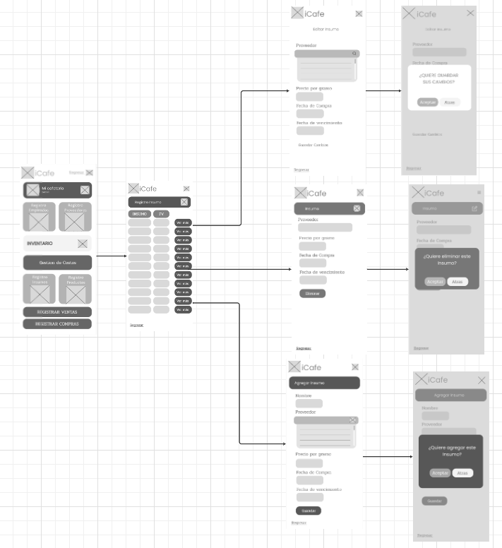 |

| User Persona: Dueños de cafeterias. |
|----------------------------------|
| User Goal: Como usuario, deseo agregar, editar y eliminar proveedor cuando yo quiera. |
|  |

| User Persona: Dueños de cafeterias. |
|----------------------------------|
| User Goal: Como usuario, deseo agregar, editar y eliminar Producto cuando yo quiera. |
|  |

| User Persona: Dueños de cafeterias. |
|----------------------------------|
| User Goal: Como usuario, deseo registrar compras para llevar un recuento de mis inversiones. |
|  |

| User Persona: Dueños de cafeterias. |
|----------------------------------|
| User Goal: Como usuario, deseo registrar ventas para llevar un recuento de mis ganancias. |
|  |

| User Persona: Dueños de cafeterias. |
|----------------------------------|
| User Goal: Como usuario, deseo una seccion de inventario tonde tenga el recuento de movimientos. |
| 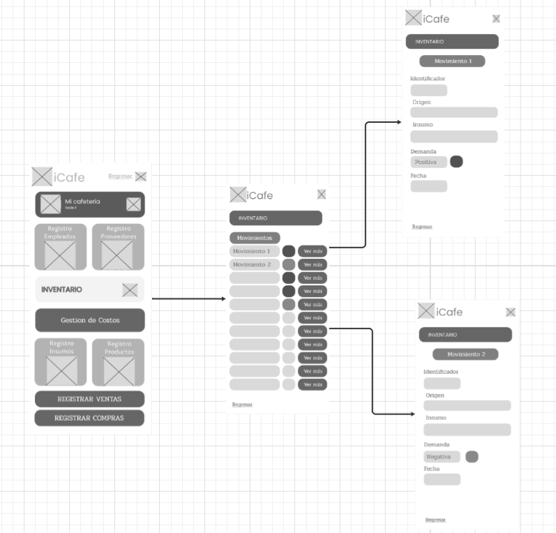 |

| User Persona: Dueños de cafeterias. |
|----------------------------------|
| User Goal: Como usuario, deseo una seccion de Gestion de costos donde vea estadisticas en graficos. |
| 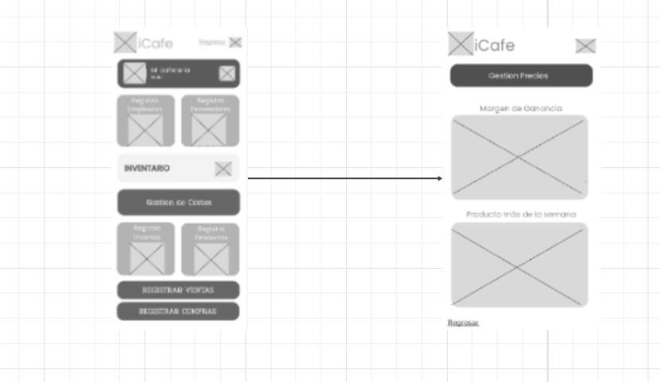 |

 
- Link:  https://lucid.app/lucidchart/22f7abe1-aca2-4970-9925-f24fdd1c166f/edit?viewport_loc=-18984%2C-19367%2C24587%2C35020%2CHWEp-vi-RSFO&invitationId=inv_72f97110-024a-4131-a9e3-c460ec619fa9

---

#### 3.1.4.3. Mobile Applications Mock-ups
Aquí se presentan los mock-ups de la aplicación móvil, en los que se incorporan los elementos visuales definitivos. Estos diseños muestran cómo se verán las pantallas finales, alineadas con la identidad gráfica de la marca. 

| Registro e Inicio de Sesión |
|----------------------------------|
| Muestra las pantallas de registro e inicio sesion y el panel principal |
| 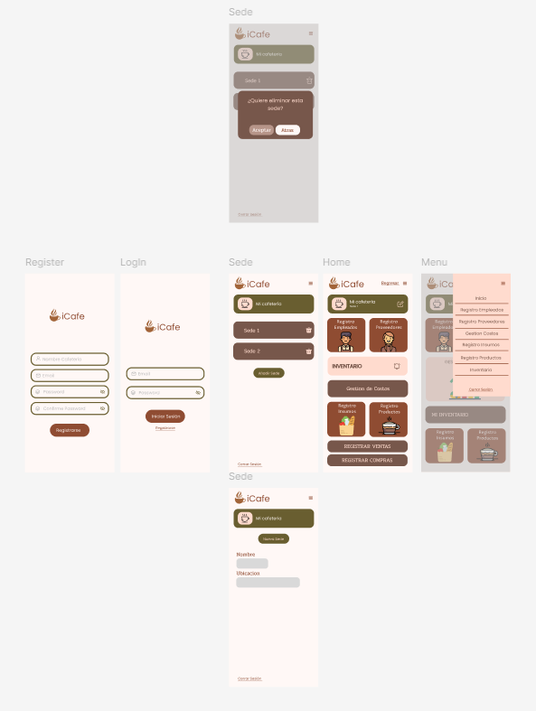 |

| Agregar Empleados |
|----------------------------------|
| Muestra las pantallas donde se realiza el registro de empleados |
|  |

| Agregar Proveedores |
|----------------------------------|
| Muestra las pantallas donde se realiza el registro de proveedores |
|  |

| Agregar Insumos |
|----------------------------------|
| Muestra las pantallas donde se realiza el registro de insumos |
|  |

| Agregar Producto |
|----------------------------------|
| Muestra las pantallas donde se realiza el registro de productos |
| 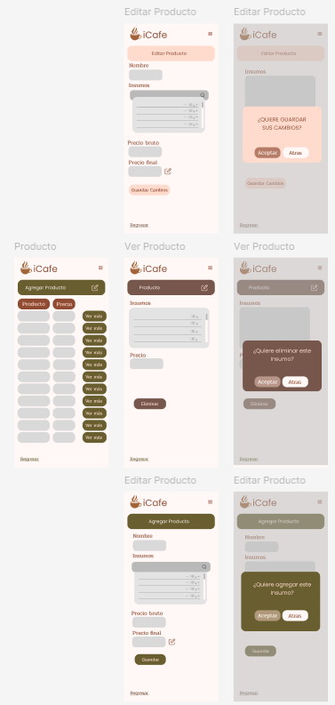 |

| Registrar Compra |
|----------------------------------|
| Muestra las pantallas donde se realiza el registro de compra de insumos a proveedores |
|  |

| Registrar Venta |
|----------------------------------|
| Muestra las pantallas donde se realiza el registro de venta de productos a clientes |
| 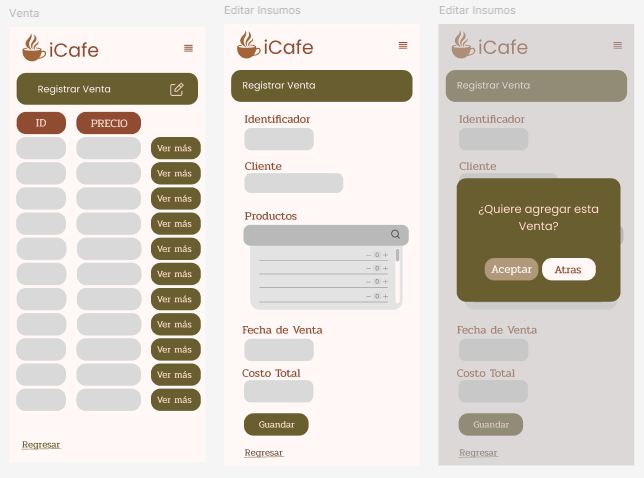 |

| Inventario y Gestion de Costos |
|----------------------------------|
| Muestra las pantallas donde se ven los movimientos y analiticas|
|  |

 
Link: https://www.figma.com/design/c61JnVMaZZcReGqcVzwikH/Untitled?node-id=0-1&t=gB15ysIlrLllfRAw-1 

---

#### 3.1.4.4. Mobile Applications User Flow Diagrams
Este apartado expone los user flow diagrams, que ilustran los caminos que puede seguir un usuario dentro de la aplicación. Su objetivo es asegurar una experiencia de uso fluida y coherente en cada interacción.

| User Persona: Dueños de cafeterias. |
|----------------------------------|
| User Goal: Como usuario, deseo registrarme e iniciar sesion antes de visualizar el panel principal. |
|  |

| User Persona: Dueños de cafeterias. |
|----------------------------------|
| User Goal: Como usuario, deseo agregar, editar y eliminar empleados cuando yo quiera. |
|  |

| User Persona: Dueños de cafeterias. |
|----------------------------------|
| User Goal: Como usuario, deseo agregar, editar y eliminar Insumos cuando yo quiera. |
| 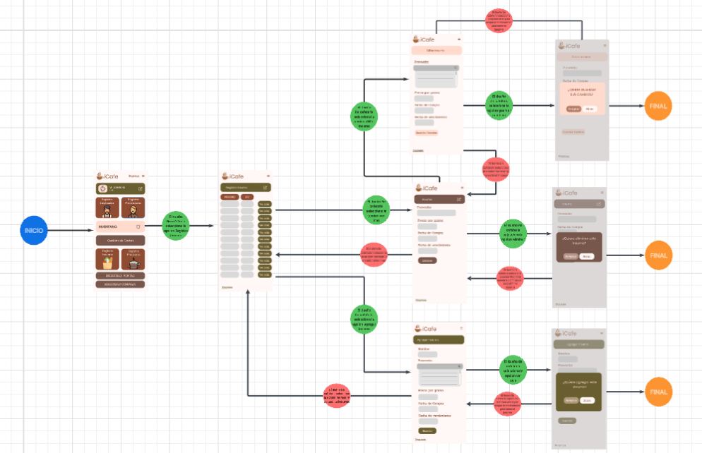 |

| User Persona: Dueños de cafeterias. |
|----------------------------------|
| User Goal: Como usuario, deseo agregar, editar y eliminar proveedor cuando yo quiera. |
|  |

| User Persona: Dueños de cafeterias. |
|----------------------------------|
| User Goal: Como usuario, deseo agregar, editar y eliminar Producto cuando yo quiera. |
|  |

| User Persona: Dueños de cafeterias. |
|----------------------------------|
| User Goal: Como usuario, deseo registrar compras para llevar un recuento de mis inversiones. |
|  |

| User Persona: Dueños de cafeterias. |
|----------------------------------|
| User Goal: Como usuario, deseo registrar ventas para llevar un recuento de mis ganancias. |
|  |

| User Persona: Dueños de cafeterias. |
|----------------------------------|
| User Goal: Como usuario, deseo una seccion de inventario tonde tenga el recuento de movimientos. |
| 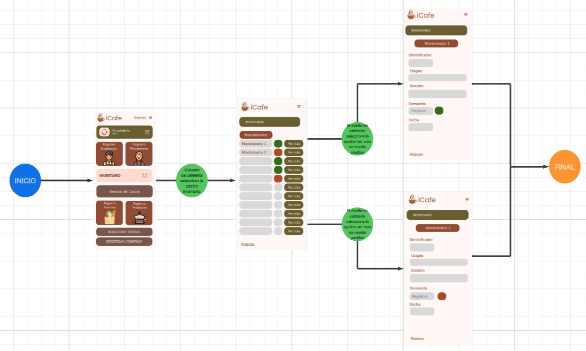 |

| User Persona: Dueños de cafeterias. |
|----------------------------------|
| User Goal: Como usuario, deseo una seccion de Gestion de costos donde vea estadisticas en graficos. |
| 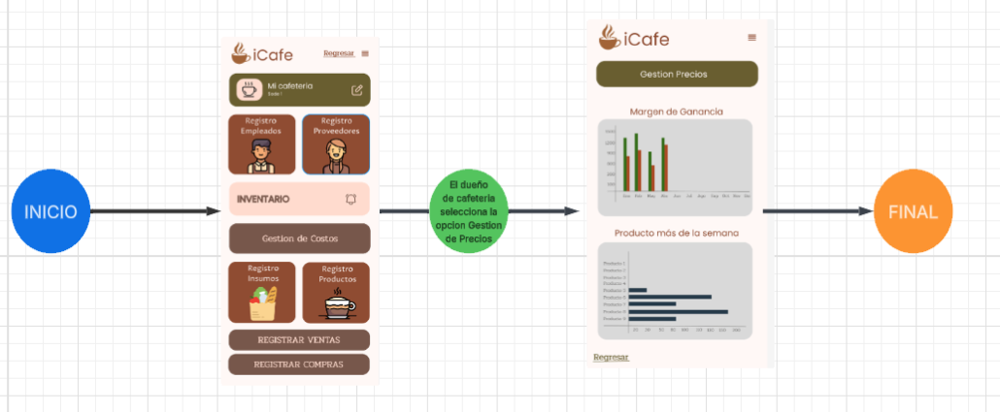 |

 
- Link:  https://lucid.app/lucidchart/98d23ad7-1af5-4a5f-b91e-c6a9cfe2c04c/edit?viewport_loc=-7294%2C-7059%2C35610%2C16552%2C0_0&invitationId=inv_cf223d6e-96b8-480b-9205-aeb8095ac5fb

#### 3.1.4.5. Mobile Applications Prototyping
Finalmente, se presentan los prototipos interactivos de la aplicación móvil, los cuales permiten simular la navegación real. Esto facilita la validación temprana de la experiencia de usuario y permite realizar mejoras antes del desarrollo final.

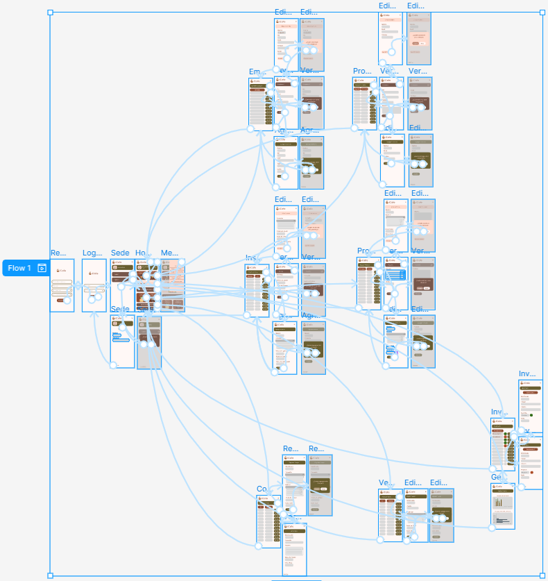

Link: https://youtu.be/Hd8nV5grxeg
Link Figma: https://www.figma.com/design/54NyDHkxxRtBDyw7VWojNK/Untitled?node-id=0-1&t=V2Z4lR3eL3gC4gol-1
# Capítulo IV: Product Implementation & Validation

## 4.1. Software Configuration Management

La gestión de configuración de software en el proyecto iCafe se ha diseñado para asegurar la trazabilidad, consistencia y calidad en cada etapa del desarrollo. Se han definido entornos, herramientas y convenciones que permiten al equipo colaborar de forma eficiente, mantener control sobre el código fuente y facilitar el despliegue continuo.

### 4.1.1. Software Development Environment Configuration

Para garantizar un entorno de desarrollo homogéneo entre los integrantes del equipo, se establecieron las siguientes configuraciones:

- **Lenguajes principales:**
  - Backend: Java y Dockerfile.
  - Aplicación móvil: Kotlin.
- **Frameworks y librerías:**
  - Spring Boot para servicios backend.
  - Firebase para autenticación y base de datos en tiempo real.
  - Android Jetpack para arquitectura móvil.
- **IDE recomendados:**
  - IntelliJ IDEA (Java backend).
  - Android Studio (Kotlin móvil).
- **Gestores de paquetes:**
  - `Maven` para backend Java.
  - `Gradle` para Android.
- **Control de versiones:** Git con GitHub como repositorio central.
- **Configuración local:** Se documentó en el archivo `README.md` los pasos para instalar dependencias, configurar variables de entorno y ejecutar el proyecto en modo desarrollo.

### 4.1.2. Source Code Management

El código fuente se gestiona bajo un esquema de ramas que permite trabajo paralelo y control de calidad:

- **Repositorio principal:** [GitHub SyncCafe Organization](https://github.com/orgs/1ACC0238-2520-1807/dashboard)
- **Estrategia de ramas:**
  - `main`: versión estable para producción.
  - `develop`: integración de nuevas funcionalidades.
  - `feature/*`: desarrollo de módulos específicos (ej. `feature/inventory-tracking`).
  - `hotfix/*`: correcciones urgentes en producción.
- **Pull Requests:** Todo cambio debe pasar por revisión de código (code review) antes de ser fusionado.
- **Commits:** Se siguen convenciones semánticas (`feat:`, `fix:`, `docs:`, `refactor:`) para facilitar la trazabilidad.
- **Integración continua:** Se configuró GitHub Actions para ejecutar pruebas unitarias y validaciones de estilo en cada push.

### 4.1.3. Source Code Style Guide & Conventions

Para mantener la calidad y legibilidad del código, se definieron guías de estilo por tecnología:

- **Java (Backend):**
  - Convenciones estándar de Java y Spring Boot.
  - Uso de anotaciones `@Service`, `@Repository`, `@RestController`.
  - Separación por paquetes: `controller`, `service`, `model`, `repository`.
- **Kotlin (App móvil):**
  - Convenciones de Android Jetpack.
  - Uso de ViewModel y LiveData para arquitectura MVVM.
  - Separación por capas: `ui`, `data`, `domain`.
- **Documentación:** Cada módulo incluye comentarios Javadoc/KDoc y archivos `README.md` explicativos.

### 4.1.4. Software Deployment Configuration

El despliegue de iCafe se ha planificado para facilitar pruebas piloto y escalabilidad futura:

- **Landing Page:**
  - Desplegada en GitHub Pages desde rama `gh-pages`.
  - Optimizada con etiquetas SEO y diseño responsive.
- **Aplicación móvil:**
  - Compilada en modo debug para pruebas internas.
  - Se utilizará Firebase App Distribution para compartir builds con cafeterías piloto.
- **Backend:**
  - Desplegado en Render.com con base de datos PostgreSQL.
  - Contenerizado con Docker para facilitar el despliegue.
  - Variables de entorno gestionadas desde el panel de Render.
- **Próximos pasos:**
  - Automatización del despliegue con CI/CD.
  - Configuración de monitoreo con herramientas como Sentry o LogRocket.

## 4.2. Landing Page & Mobile Application Implementation
### 4.2.1. Sprint 1
#### 4.2.1.1. Sprint Planning 1

Para el primer spint el equipo establecio que el desarrollo de las tareas serian aproximadamente 22 horas.

<table>
    <thead>
        <tr>
            <th>Sprint #</th>
            <th>Sprint 1</th>
        </tr>
    </thead>
    <tbody>
        <tr>
            <td colspan="2"><b>Sprint Planning Background</b></td>
        </tr>
        <tr>
            <td>Date</td>
            <td>2025-010-06</td>
        </tr>
        <tr>
            <td>Time</td>
            <td>10:30 PM</td>
        </tr>
        <tr>
            <td>Location</td>
            <td>Discord</td>
        </tr>
        <tr>
            <td>Prepared by</td>
            <td>Urrutia Peña Jasmin Adriana</td>
        </tr>
        <tr>
            <td>Atendees (to planning meeting)</td>
            <td>
                <li>Velaquez Chambi Ruben Genaro</li>
                <li>Christian Fabrizio inga Orihuela</li>
                <li>Hallasi Saravia Miguel Angel</li>
                <li>Sebastian Alexander Ramos Calagua</li>
            </td>
        </tr>
        <tr>
            <td>Sprint 1 Review Summary</td>
            <td>
                Este es el primer sprint a realizar por el equipo
            </td>
        </tr>
        <tr>
            <td>Sprint 1 Retrospective Summary</td>
            <td>
                El equipo estuvo de acuerdo con empezar con el desarrollo de la landing page, aplicación movil y el backend
            </td>
        </tr>
        <tr>
            <td colspan="2"><b>Sprint Goal & User Stories</b></td>
        </tr>
        <tr>
            <td>Sprint 1 Goal</td>
            <td>
                <li>Nuestro enfoque está en desarrollar una landing page moderna y adaptable, conectada con el módulo de contactos del backend.
Creemos que esto brindará una mayor visibilidad y participación de usuarios, atrayendo a más personas interesadas en la aplicación móvil.
Esto se confirmará cuando al menos 30 usuarios envíen formularios de contacto</li>
                <li>Nuestro enfoque está en construir la arquitectura central del backend siguiendo los principios de Domain-Driven Design (DDD) e implementar los bounded contexts de contacts, product e inventory.
Creemos que esto brindará una base escalable y mantenible, que facilitará la extensión de la lógica de negocio y futuras integraciones.
Esto se confirmará cuando todos los módulos de dominio estén operativos, pasen las pruebas unitarias y expongan correctamente sus endpoints RESTful documentados en Swagger/OpenAPI.</li>
                  <li>Nuestro enfoque está en diseñar e implementar la aplicación móvil utilizando Jetpack Compose, MVVM y Arquitectura Limpia, totalmente integrada con el backend.
Creemos que esto brindará una experiencia de usuario fluida e intuitiva.Esto se confirmará cuando la aplicación pueda obtener, mostrar y enviar datos correctamente hacia y desde el backend durante las pruebas.</li>
            </td>
        </tr>
        <tr>
            <td>Sprint 1 Velocity</td>
            <td>
                30
            </td>
        </tr>
        <tr>
            <td>Sum of story points</td>
            <td>
                37
            </td>
        </tr>
    </tbody>
</table>

#### 4.2.1.2. Sprint Backlog 1
<table>
  <tr>
    <td> <strong>Sprint #</strong></td>
    <td align="center" colspan="7"> <strong>Sprint 1</strong> </td>
  </tr>

   <tr>
    <td align="center" colspan="2"> <strong>User Story</strong></td>
    <td align="center" colspan="6"> <strong>Work-item/Task</strong></td>
  </tr>
  <tr>
    <td align="center"> <strong>ID</strong> </td>
    <td align="center"> <strong>Title<strong></td>
    <td align="center"> <strong>ID</strong> </td>
    <td align="center"> <strong>Title<strong></td>
    <td align="center"> <strong>Description<strong></td>
    <td align="center"> <strong>Estimation (Hours)<strong></td>
    <td align="center"> <strong>Assigned To<strong></td>
    <td align="center"> <strong> Status (To-do/In-Process/To-Review/Done)  <strong></td>
  </tr>
  <!---------------------------------------------------------------------- -->
  <tr>
    <td rowspan="1" align="center"> ID </td>
    <td rowspan="1" align="center"> US020 Seccion Home</td>
    <td align="center"> TA01 </td>
     <td align="center">Diseñar el Home </td>
    <td align="center">Diseñar la seccion home de la lading page en html y css </td>
    <td align="center"> 0.5 </td>
    <td align="center"> Urrutia Peña Jasmin Adriana</td>
    <td align="center">Done</td>
  </tr>
    <!---------------------------------------------------------------------- -->
  <tr>
    <td rowspan="1" align="center"> ID </td>
    <td rowspan="1" align="center"> US021 Seccion About</td>
    <td align="center"> TA01 </td>
     <td align="center">Diseñar el About </td>
    <td align="center">Diseñar la seccion About de la lading page en html y css </td>
    <td align="center"> 0.5 </td>
    <td align="center"> Urrutia Peña Jasmin Adriana</td>
    <td align="center">Done</td>
  </tr>
    <!---------------------------------------------------------------------- -->
  <tr>
    <td rowspan="1" align="center"> ID </td>
    <td rowspan="1" align="center"> US022 Seccion Features</td>
    <td align="center"> TA01 </td>
     <td align="center">Diseñar el features </td>
    <td align="center">Diseñar la seccion feature de la lading page en html y css </td>
    <td align="center"> 0.5 </td>
    <td align="center"> Urrutia Peña Jasmin Adriana</td>
    <td align="center">Done</td>
  </tr>
    <!---------------------------------------------------------------------- -->
  <tr>
    <td rowspan="1" align="center"> ID </td>
    <td rowspan="1" align="center"> US024 seccion contact </td>
    <td align="center"> TA01 </td>
     <td align="center">Formulario </td>
    <td align="center">Diseñar un formulario de contacto en html y css</td>
    <td align="center"> 0.5 </td>
    <td align="center"> Urrutia Peña Jasmin Adriana</td>
    <td align="center">Done</td>
  </tr>

<!----------------------------------------------->
  <tr>
    <td rowspan="2" align="center"> ID </td>
    <td rowspan="2" align="center"> US012  Registrar entrada inventario</td>
    <td align="center"> TA01 </td>
    <td align="center"> Endpoint para el registro de entrada de un insumo </td>
    <td align="center"> Se debe registrar la entrada de un insumo en el inventario </td>
    <td align="center"> 2 </td>
    <td align="center"> Hallasi Saravia Miguel Angel</td>
    <td align="center">Done</td>
  </tr>

  <tr>
    <td align="center"> TA02 </td>
    <td align="center"> Diseño en la aplicacion movil de inventario</td>
    <td align="center"> Se debe de crear la actividad de registro de entrada de un insumo en el inventario</td>
    <td align="center"> 1</td>
    <td align="center"> Hallasi Saravia Miguel Angel</td>
    <td align="center"> Done</td>
  </tr>
<!-------------------------------------------------->
  <tr>
    <td rowspan="2" align="center"> ID </td>
    <td rowspan="2" align="center"> US013 Actualizar inventario </td>
    <td align="center"> TA01 </td>
    <td align="center"> Endpoint para actualizar datos del inventario</td>
    <td align="center"> Se debe crear un endpoint para actualizar datos del inventario</td>
    <td align="center"> 1</td>
    <td align="center"> Hallasi Saravia Miguel Angel</td>
    <td align="center"> Done</td>
  </tr>

  <tr>
    <td align="center"> TA02 </td>
    <td align="center"> Vista para actualizar inventario</td>
    <td align="center">Se debe crear la actividad para actualizar datos del inventario</td>
    <td align="center"> 1</td>
    <td align="center"> Hallasi Saravia Miguel Angel</td>
    <td align="center"> In-process</td>
  </tr>
<!---------------------------------------------------->
  <tr>
    <td rowspan="2" align="center"> ID </td>
    <td rowspan="2" align="center"> US009 Crear receta</td>
      <td align="center"> TA01 </td>
    <td align="center"> endpoint para crear una receta </td>
    <td align="center"> Se debe crear un endpoint para crear una receta </td>
    <td align="center"> 1</td>
    <td align="center"> Ruben Velasquez Chambi</td>
    <td align="center"> To-do</td>
  </tr>

  <tr>
    <td align="center"> TA02 </td>
    <td align="center"> Vista para crear receta</td>
    <td align="center"> Se debe crear la actividad para crear una receta</td>
    <td align="center"> 1</td>
    <td align="center">Ruben Velasquez Chambi</td>
    <td align="center"> To-do</td>
  </tr>
<!------------------------------------------------>
   <tr>
    <td rowspan="2" align="center"> ID </td>
    <td rowspan="2" align="center">US006 Crear proveedor</td>
      <td align="center"> TA01 </td>
    <td align="center"> enpoint para registar proveedores </td>
    <td align="center"> Se debe de  crear un portafolio de proveedores que para acada usuario</td>
    <td align="center"> 2</td>
    <td align="center"> Ruben Velasquez Chambi</td>
    <td align="center"> Done</td>
  </tr>

  <tr>
    <td align="center"> TA02 </td>
    <td align="center"> Vista para registro de proveedores</td>
    <td align="center"> Se debe de crear la actividad para registrar proveedores</td>
    <td align="center"> 1</td>
    <td align="center">Ruben Velasquez Chambi</td>
    <td align="center"> Done</td>
  </tr>

  <!------------------------------------------------>
   <tr>
    <td rowspan="2" align="center"> ID </td>
    <td rowspan="2" align="center">US008 Actualizar proveedor</td>
      <td align="center"> TA01 </td>
    <td align="center"> enpoint para actualizar proveedores </td>
    <td align="center"> Se debe de poder modificar los datos de los proveedores</td>
    <td align="center"> 1</td>
    <td align="center"> Ruben Velasquez Chambi</td>
    <td align="center"> Done</td>
  </tr>

  <tr>
    <td align="center"> TA02 </td>
    <td align="center"> Vista para actualizar de proveedores</td>
    <td align="center"> Se debe de crear la actividad para actualizar proveedores</td>
    <td align="center"> 1</td>
    <td align="center">Ruben Velasquez Chambi</td>
    <td align="center"> Done</td>
  </tr>
   <!------------------------------------------------>
   <tr>
    <td rowspan="2" align="center"> ID </td>
    <td rowspan="2" align="center">US004 Actualizar empleados</td>
      <td align="center"> TA01 </td>
    <td align="center"> enpoint para actualizar empleados </td>
    <td align="center"> Se debe de poder modificar los datos de los empleados</td>
    <td align="center"> 1</td>
    <td align="center"> Ruben Velasquez Chambi</td>
    <td align="center"> Done</td>
  </tr>

  <tr>
    <td align="center"> TA02 </td>
    <td align="center"> Vista para actualizar de empleados</td>
    <td align="center"> Se debe de crear la actividad para actualizar empleados</td>
    <td align="center"> 1</td>
    <td align="center">Ruben Velasquez Chambi</td>
    <td align="center"> Done</td>
  </tr>
  <!------------------------------------------------>
   <tr>
    <td rowspan="1" align="center"> ID </td>
    <td rowspan="1" align="center">US005 Eliminar empleados</td>
      <td align="center"> TA01 </td>
    <td align="center"> enpoint para actualizar empleados </td>
    <td align="center"> Se debe de poder eliminar los empleados</td>
    <td align="center"> 0.5</td>
    <td align="center"> Ruben Velasquez Chambi</td>
    <td align="center"> Done</td>
  </tr>
  <!------------------------------------------------>
   <tr>
    <td rowspan="3" align="center"> ID </td>
    <td rowspan="3" align="center">US003 Listar empleados</td>
      <td align="center"> TA01 </td>
    <td align="center"> enpoint para listar empleados </td>
    <td align="center"> Se debe poder consultar la lista de los empleados</td>
    <td align="center"> 1</td>
    <td align="center"> Ruben Velasquez Chambi</td>
    <td align="center"> Done</td>
  </tr>

  <tr>
    <td align="center"> TA02 </td>
    <td align="center"> Vista de lista de empleados</td>
    <td align="center"> Se debe de crear la actividad para visualizar la lista de empleados</td>
    <td align="center"> 1</td>
    <td align="center">Ruben Velasquez Chambi</td>
    <td align="center"> Done</td>
  </tr>

  <tr>
    <td align="center"> TA03 </td>
    <td align="center"> Implementar el backend en la aplicacion movil</td>
    <td align="center"> Se debe de consumir el endpoint correspondiente </td>
    <td align="center"> 1</td>
    <td align="center">Ruben Velasquez Chambi</td>
    <td align="center"> To-do</td>
  </tr>
   <!------------------------------------------------>
   <tr>
    <td rowspan="3" align="center"> ID </td>
    <td rowspan="3" align="center">US007 Listar proveedores</td>
      <td align="center"> TA01 </td>
    <td align="center"> enpoint para listar proveedores </td>
    <td align="center"> Se debe poder consultar la lista de los proveedores</td>
    <td align="center"> 1</td>
    <td align="center"> Ruben Velasquez Chambi</td>
    <td align="center"> Done</td>
  </tr>

  <tr>
    <td align="center"> TA02 </td>
    <td align="center"> Vista de lista de proveedores</td>
    <td align="center"> Se debe de crear la actividad para visualizar la lista de proveedores</td>
    <td align="center"> 1</td>
    <td align="center">Ruben Velasquez Chambi</td>
    <td align="center"> Done</td>
  </tr>

  <tr>
    <td align="center"> TA03 </td>
    <td align="center"> Implementar el backend en la aplicacion movil</td>
    <td align="center"> Se debe de consumir el endpoint correspondiente </td>
    <td align="center"> 1</td>
    <td align="center">Ruben Velasquez Chambi</td>
    <td align="center"> To-do</td>
  </tr>
 
</table>

#### 4.2.1.3. Development Evidence for Sprint Review

<table>
  <tr>
    <td align ="center" > <strong>Repository</strong></td>
    <td  align ="center" > <strong>Branch</strong></td>
    <td  align ="center" > <strong>Commit ID</strong></td>
    <td  align ="center" > <strong>Commit message</strong></td>
    <td  align ="center" > <strong>Commit Masagge body</strong></td>
    <td  align ="center" > <strong>Commit on (date)</strong></td>
  </tr>

  <tr>
    <td rowspan="5" align="center">https://github.com/1ACC0238-2520-1807/LandingPage-iCafe</td>
    <td align="center"> main</td>
    <td align="center"> 303e4706fb23d21bfb860ae99bdd672c01ea919c</td>
    <td align="center"> chore: initial commit</td>
    <td align="center"> ---</td>
    <td align="center"> 30/09/2025</td>
  </tr>

  <tr>
    <td align="center">main</td>
    <td align="center" > 0ae643b60a5e5096960a618b8310a35448a95147</td>
    <td align="center"> feat: Add files via upload</td>
    <td align="center"> ---</td>
    <td align="center"> 30/09/2025</td>
  </tr>

  <tr>
    <td align="center"> main</td>
    <td align="center">6e46bb204654992384f5364f437f8cae16f940ee</td>
    <td align="center"> feat: Create CNAME</td>
    <td align="center"> ---</td>
    <td align="center"> 30/09/2025</td>
  </tr>

  <tr>
    <td align="center"> main</td>
    <td align="center"> 95e03a811f89e7d8de20692d5b78ffc441ade31c</td>
    <td align="center"> feat: Update index.html</td>
    <td align="center"> ---</td>
    <td align="center">06/10/2025</td>
  </tr>

  <tr>
    <td align="center"> main</td>
    <td align="center"> 0faf3074244b70240578d560275c40d47f1ba254</td>
    <td align="center">Update script.js</td>
    <td align="center"> ---</td>
    <td align="center"> 06/10/2025</td>
  </tr>
  <!---------------------------------------------------->
   <tr>
    <td rowspan="8" align="center">https://github.com/1ACC0238-2520-1807/backend-icafe</td>
    <td align="center"> main</td>
    <td align="center"> 737c8c177cffc724783a3c4ab9199ea14f098022</td>
    <td align="center"> feat(iam): bound context terminado y base del proyecto</td>
    <td align="center"> ---</td>
    <td align="center"> 30/09/2025</td>
  </tr>
  <tr>
    <td align="center">main</td>
    <td align="center" > fe33dccc92221d7354f8b1aebcf3e2c04811667f</td>
    <td align="center">feat(contacts): se agrego la capa domain y infrastructure</td>
    <td align="center"> ---</td>
    <td align="center"> 30/09/2025</td>
  </tr>
   <tr>
    <td align="center">develop</td>
    <td align="center" >a48c5c6998e8f2b19fbb42e435c232d4c64ca133</td>
    <td align="center">feat(porfolio): cuando se crea una nueva cuenta, se crea un nuevo porfolio que tiene como referncia el userID </td>
    <td align="center"> ---</td>
    <td align="center"> 01/10/2025</td>
  </tr>
    <tr>
    <td align="center">feature/contacts</td>
    <td align="center" >a48c5c6998e8f2b19fbb42e435c232d4c64ca133</td>
    <td align="center">feat(contacs): se implemento update y delete para provider </td>
    <td align="center"> ---</td>
    <td align="center"> 02/10/2025</td>
  </tr>
<tr>
    <td align="center">feature/contacts</td>
    <td align="center" >a48c5c6998e8f2b19fbb42e435c232d4c64ca133</td>
    <td align="center">feat(contacs): se implemento todo contacts, pero falta limpieza de codigo</td>
    <td align="center"> ---</td>
    <td align="center"> 02/10/2025</td>
  </tr>

  <tr>
    <td align="center">feature/products</td>
    <td align="center" >a48c5c6998e8f2b19fbb42e435c232d4c64ca133</td>
    <td align="center">feat: product</td>
    <td align="center"> ---</td>
    <td align="center"> 06/10/2025</td>
  </tr>
   <tr>
    <td align="center">develop/td>
    <td align="center" >625041b48d14e4441d960cbb8d4eee1e5f66bf0d</td>
    <td align="center">feat(docker): add docker configuration</td>
    <td align="center"> ---</td>
    <td align="center"> 07/10/2025</td>
  </tr>
  
   <tr>
    <td align="center">develop/td>
    <td align="center" >d34cace9052543fe8285432699bd6ef35d85ba03</td>
    <td align="center">Merge pull request #2 from 1ACC0238-2520-1807/develop</td>
    <td align="center"> ---</td>
    <td align="center"> 07/10/2025</td>
  </tr>
  <!--------------------->
  <tr>
    <td rowspan="8" align="center">https://github.com/1ACC0238-2520-1807/Android-icafe</td>
    <td align="center"> main</td>
    <td align="center"> 2a5a7cd5098ed3171233e769cb5e34de03bba9bd</td>
    <td align="center"> first commit</td>
    <td align="center"> ---</td>
    <td align="center"> 05/10/2025</td>
  </tr>
  <tr>
    <td align="center">develop</td>
    <td align="center" > 238ad865911d8882dd6cd79d53813f81f622a9b0</td>
    <td align="center">feat(auth): se creo la presentacion de login y register</td>
    <td align="center"> ---</td>
    <td align="center"> 05/10/2025</td>
  </tr>
   <tr>
    <td align="center">develop</td>
    <td align="center" > 2d2e039a27f854fbe67fd3ac32f49bed6e2bb27b0</td>
    <td align="center">feat(AppNav): Se creo la navegacion base</td>
    <td align="center"> ---</td>
    <td align="center"> 06/10/2025</td>
  </tr>
    <tr>
    <td align="center">feature/contacs</td>
    <td align="center" > 1e048bc5ef06f70d52b01ccb52b5d592c89d2c46</td>
    <td align="center">Delete app/src/main/java/com/example/icafe/core directory</td>
    <td align="center"> ---</td>
    <td align="center"> 08/10/2025</td>
  </tr>
  <tr>
    <td align="center">feature/contacs</td>
    <td align="center" > 47daa00738f52ef28a9a5e865c4ca38d2648137d</td>
    <td align="center"> Delete app/src/main/java/com/example/icafe/ui/theme directory</td>
    <td align="center"> ---</td>
    <td align="center"> 08/10/2025</td>
  </tr>
   <tr>
    <td align="center">feature/contacs</td>
    <td align="center" > 86804944b385927c8e16dd0db8be1a904507789c</td>
    <td align="center">Update AndroidManifest.xml</td>
    <td align="center"> ---</td>
    <td align="center"> 08/10/2025</td>
  </tr>
   <tr>
    <td align="center">feature/contacs</td>
    <td align="center" >bf5818fbce0e9f3d9dc82017ef4940bb9f86f4c4</td>
    <td align="center">Update libs.versions.toml</td>
    <td align="center"> ---</td>
    <td align="center"> 08/10/2025</td>
  </tr>
    <tr>
    <td align="center">develop</td>
    <td align="center" >ffbc7c8e409c137f5d4368535c9a7b148292f815</td>
    <td align="center">Merge pull request #1 from 1ACC0238-2520-1807/contacts</td>
    <td align="center"> ---</td>
    <td align="center"> 08/10/2025</td>
  </tr>

</table>

#### 4.2.1.4. Testing Suite Evidence for Sprint Review

### Objetivo
Demostrar que las funcionalidades desarrolladas durante el sprint han sido validadas mediante pruebas automatizadas y/o manuales, garantizando su correcto funcionamiento y cumplimiento de criterios de aceptación.

---

### Evidencia de pruebas realizadas

| Tipo de prueba       | Herramienta utilizada     | Cobertura | Resultado | Historias cubiertas |
|----------------------|---------------------------|-----------|-----------|----------------------|
| Unit Testing         | JUnit                     | 85%       | Passed | US012, US014, US019  |
| API Testing          | Swagger                   | 100%      | Passed | US006, US012, US017, US018 |
| Manual Testing       | Checklist funcional       | —         | Passed | US001–US024          |

---

### Evidencia técnica adjunta

- Capturas de pantalla de pruebas exitosas.
- Logs de ejecución de test suite.
- Video corto de pruebas UI automatizadas.
- Enlace al repositorio con carpeta `/tests` documentada: [GitHub SyncCafe](https://github.com/orgs/1ACC0238-2520-1807/dashboard)

---

### Alineación con criterios de aceptación

Las pruebas fueron diseñadas para validar los criterios de aceptación definidos en las historias de usuario, siguiendo el formato **Dado–Cuando–Entonces**.

---

### Conclusión

La suite de pruebas ejecutada durante el sprint valida las funcionalidades entregadas, cubre los criterios de aceptación definidos y permite avanzar con confianza hacia el despliegue. Se recomienda mejorar la cobertura de pruebas UI en el próximo sprint.

#### 4.2.1.5. Execution Evidence for Sprint Review
En esta sección describiré las actividades desarrolladas durante el Sprint 1, las cuales abarcan el trabajo realizado en los tres componentes principales del proyecto: la Landing Page, el Backend y la Aplicación Móvil. Se presentarán los avances obtenidos en cada uno de estos módulos, acompañados de capturas de pantalla que evidencian las vistas implementadas y su funcionamiento. Además, se incluirá un enlace a un video demostrativo donde se podrá observar la visualización y navegación logradas durante este Sprint.

**Landing Page**

  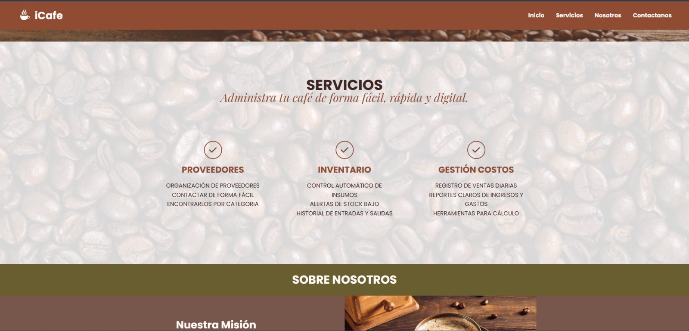 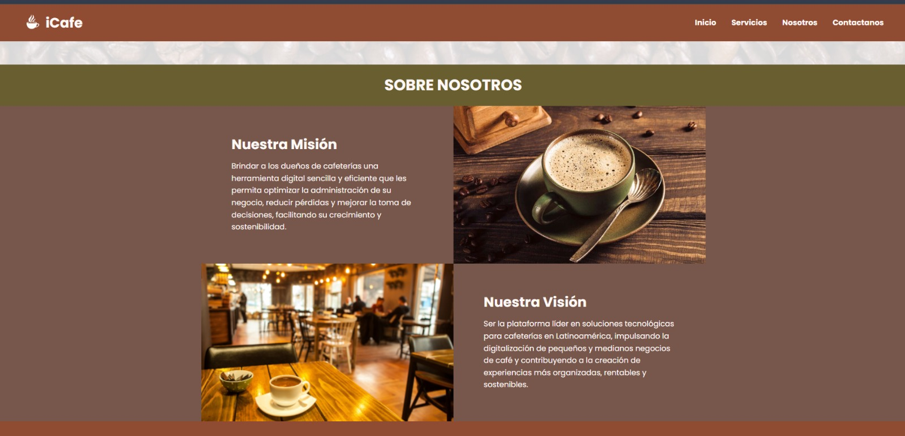 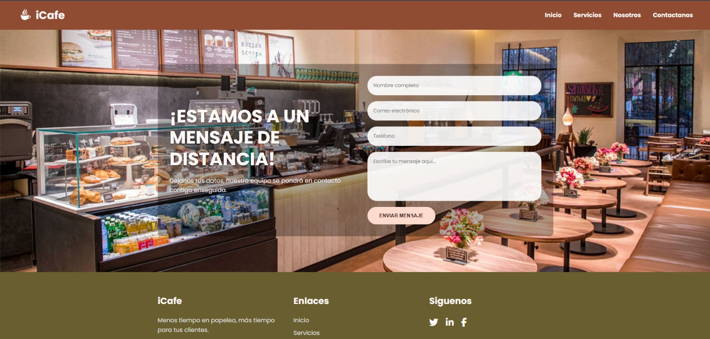 
 
 La Landing Page fue diseñada para presentar la aplicación móvil a los dueños de cafeterías, destacando sus beneficios principales y motivando la descarga mediante un botón de “Call to Action”. Se priorizó un diseño limpio, moderno y adaptable a distintos dispositivos. 
 
 <b>Link:</b> <a href="https://1acc0238-2520-1807.github.io/LandingPage-iCafe/" target="_blank">https://1acc0238-2520-1807.github.io/LandingPage-iCafe/</a> 

**Backend:**

  Desarrollada con <b>Kotlin</b> y <b>Jetpack Compose</b>, la aplicación móvil permite a los dueños de cafeterías gestionar empleados, proveedores e inventario desde su dispositivo.
  Se implementó arquitectura <b>MVVM</b> y principios de <b>Clean Architecture</b> para asegurar mantenibilidad y escalabilidad.
  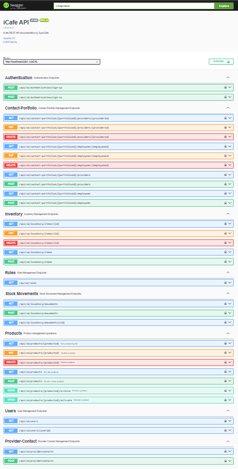

Link: https://drive.google.com/file/d/11aM-DKEcy-WijTvHAGVb-tzOcH0vTmTB/view?usp=drive_link

**Aplicacion Movile:**

  Desarrollada con <b>Kotlin</b> y <b>Jetpack Compose</b>, la aplicación móvil permite a los dueños de cafeterías gestionar empleados, proveedores e inventario desde su dispositivo.
  Se implementó arquitectura <b>MVVM</b> y principios de <b>Clean Architecture</b> para asegurar mantenibilidad y escalabilidad.

  

    <b>Pantalla de inicio de sesión</b> 
    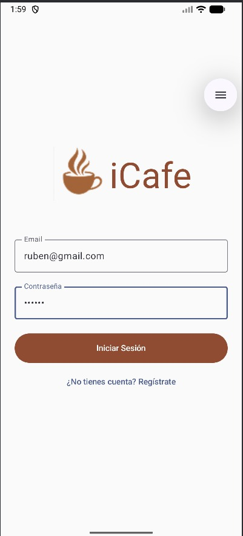
  

  

    <b>Pantalla principal</b> 
    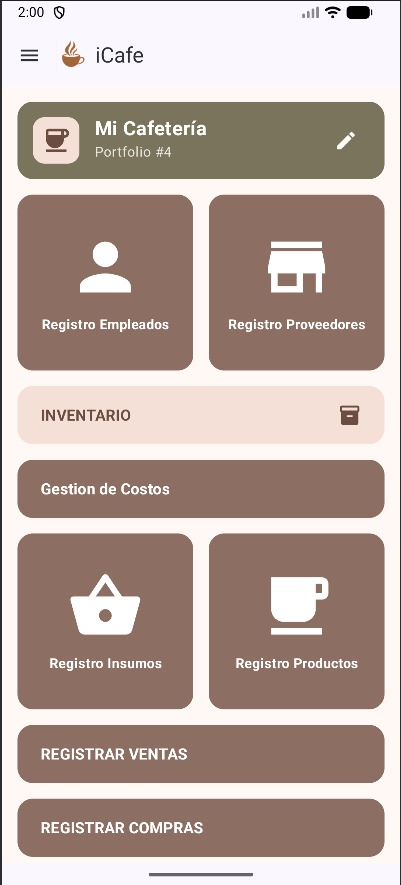
  

  

    <b>Menú de navegación</b> 
    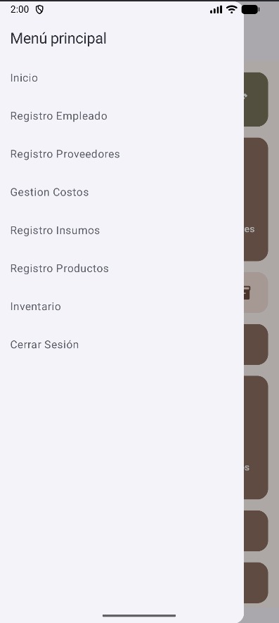
  

  

    <b>Lista de empleados</b> 
    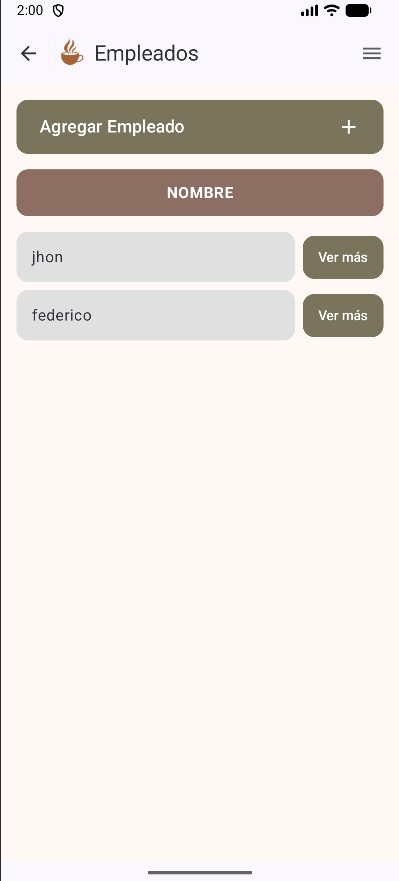
  

  

    <b>Registrar nuevo empleado</b> 
    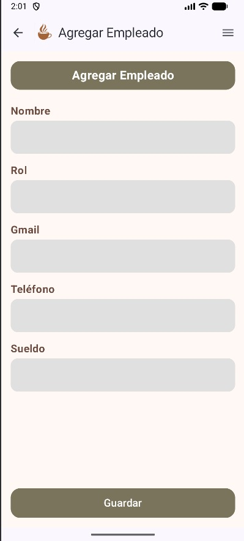
  

  

    <b>Editar información de empleado</b> 
    
  

  

    <b>Lista de proveedores</b> 
    
  

  

    <b>Registrar nuevo proveedor</b> 
    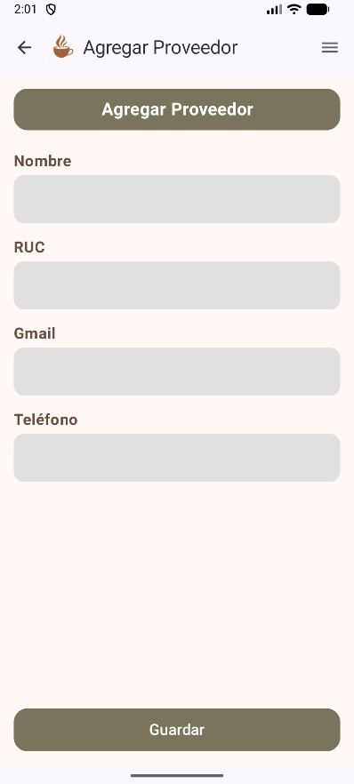
  

  

    <b>Editar información de proveedor</b> 
    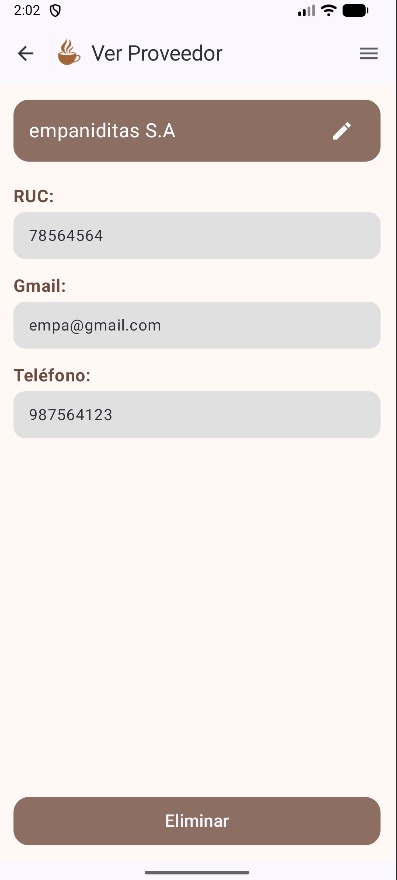
  

  

    <b>Registrar nuevos insumos al inventario</b> 
    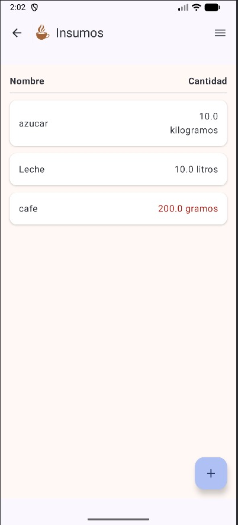
  

  <b>Video demostrativo:</b>
  <a href="https://drive.google.com/file/d/1FjrpWygjRiYmw7yVLpyuLXEac2Lg016r/view?usp=sharing" target="_blank">Ver en Google Drive</a>

Link: https://drive.google.com/file/d/1FjrpWygjRiYmw7yVLpyuLXEac2Lg016r/view?usp=sharing 

#### 4.2.1.6. Services Documentation Evidence for Sprint Review

En esta sección se incluye la relación de Endpoints documentados con OpenAPI, relacionados con el alcance del Sprint. Durante este Sprint se logró implementar y documentar completamente la API RESTful del backend de iCafe, utilizando Spring Boot y Swagger/OpenAPI para generar documentación interactiva y detallada de todos los endpoints disponibles.

**Logros Alcanzados en Documentación de Web Services:**

- Implementación completa de documentación OpenAPI 3.0 para todos los bounded contexts desarrollados
- Configuración de Swagger UI para interacción en tiempo real con la API
- Documentación detallada de esquemas de request/response para cada endpoint
- Especificación de códigos de estado HTTP y manejo de errores
- Ejemplos de uso y datos de muestra para facilitar la integración

**Tabla de Endpoints Documentados:**

| Bounded Context | Endpoint | HTTP Verb | Sintaxis de Llamada | Parámetros | Descripción | Response Example |
|-----------------|----------|-----------|---------------------|------------|-------------|------------------|
| **Contact-Portfolio** | `/api/v1/contact-portfolios/{portfolioId}/providers` | GET | `GET /api/v1/contact-portfolios/1/providers` | `portfolioId` (path) | Listar proveedores por portfolio | `[{"id": 1, "nameCompany": "Café Premium S.A.", "email": "contacto@cafepremium.com"}]` |
| **Contact-Portfolio** | `/api/v1/contact-portfolios/{portfolioId}/providers` | POST | `POST /api/v1/contact-portfolios/1/providers` | `portfolioId` (path), Body: CreateProviderContactResource | Agregar proveedor al portfolio | `{"id": 1, "nameCompany": "Café Premium S.A.", "ruc": "20123456789"}` |

| **Inventory** | `/api/v1/inventory/movements` | POST | `POST /api/v1/inventory/movements` | Body: RegisterStockMovementResource | Registrar movimiento de stock | `---` |
| **Inventory** | `/api/v1/inventory/movements/{branchId}` | GET | `GET /api/v1/inventory/movements/1` | `branchId` (path) | Listar movimientos de stock por sede | `---` |
| **Inventory** | `/api/v1/inventory/stock/{branchId}/{supplyItemId}` | GET | `GET /api/v1/inventory/stock/1/10` | `branchId`, `supplyItemId` (path) | Obtener stock actual | `---` |

| **Products** | `/api/v1/products` | GET | `GET /api/v1/products` | — | Listar productos | `---` |
| **Products** | `/api/v1/products` | POST | `POST /api/v1/products` | Body: CreateProductResource | Crear producto | `---` |
| **Products** | `/api/v1/products/{productId}` | GET | `GET /api/v1/products/1` | `productId` (path) | Obtener producto por id | `---` |
| **Products** | `/api/v1/products/{productId}` | PUT | `PUT /api/v1/products/1` | `productId` (path), Body: UpdateProductResource | Actualizar producto | `---` |
| **Products** | `/api/v1/products/{productId}/activate` | POST | `POST /api/v1/products/1/activate` | `productId` (path) | Activar producto | `---` |
| **Products** | `/api/v1/products/{productId}/archive` | POST | `POST /api/v1/products/1/archive` | `productId` (path) | Archivar producto | `---` |
| **Products** | `/api/v1/products/{productId}/ingredients` | POST | `POST /api/v1/products/1/ingredients` | `productId` (path), Body: AddIngredientsResource | Agregar ingredientes a producto | `---` |
| **Products** | `/api/v1/products/{productId}/ingredients/{supplyItemId}` | DELETE | `DELETE /api/v1/products/1/ingredients/10` | `productId`, `supplyItemId` (path) | Eliminar ingrediente | `---` |
| **Products** | `/api/v1/products/branch/{branchId}` | GET | `GET /api/v1/products/branch/1` | `branchId` (path) | Listar productos por sede | `---` |

| **Purchase Orders** | `/api/v1/purchase-orders` | POST | `POST /api/v1/purchase-orders` | Body: CreatePurchaseOrderResource | Crear orden de compra | `---` |
| **Purchase Orders** | `/api/v1/purchase-orders/branch/{branchId}` | GET | `GET /api/v1/purchase-orders/branch/1` | `branchId` (path) | Listar órdenes de compra por sede | `---` |

| **Sales** | `/api/v1/sales` | GET | `GET /api/v1/sales` | — | Listar ventas | `---` |
| **Sales** | `/api/v1/sales` | POST | `POST /api/v1/sales` | Body: CreateSaleResource | Crear venta | `---` |
| **Sales** | `/api/v1/sales/{saleId}` | GET | `GET /api/v1/sales/1` | `saleId` (path) | Obtener venta por id | `---` |
| **Sales** | `/api/v1/sales/{saleId}/cancel` | PUT | `PUT /api/v1/sales/1/cancel` | `saleId` (path) | Cancelar venta | `---` |
| **Sales** | `/api/v1/sales/{saleId}/complete` | PUT | `PUT /api/v1/sales/1/complete` | `saleId` (path) | Completar venta | `---` |
| **Sales** | `/api/v1/sales/branch/{branchId}` | GET | `GET /api/v1/sales/branch/1` | `branchId` (path) | Listar ventas por sede | `---` |

| **SupplyIem** | `/api/v1/supply-items` | GET | `GET /api/v1/supply-items` | — | Listar insumos | `---` |
| **SupplyIem** | `/api/v1/supply-items` | POST | `POST /api/v1/supply-items` | Body: CreateSupplyItemResource | Crear insumo | `---` |
| **SupplyIem** | `/api/v1/supply-items/{branchId}/branch` | GET | `GET /api/v1/supply-items/1/branch` | `branchId` (path) | Listar insumos por sede | `---` |
| **SupplyIem** | `/api/v1/supply-items/{id}` | DELETE | `DELETE /api/v1/supply-items/1` | `id` (path) | Eliminar insumo | `---` |
| **SupplyIem** | `/api/v1/supply-items/{id}` | GET | `GET /api/v1/supply-items/1` | `id` (path) | Obtener insumo por id | `---` |
| **SupplyIem** | `/api/v1/supply-items/{id}` | PUT | `PUT /api/v1/supply-items/1` | `id` (path), Body: UpdateSupplyItemResource | Actualizar insumo | `---` |

| **SupplyIem** | `/api/v1/supply-items/{id}` | GET | `GET /api/v1/supply-items/1` | `id` (path) | Obtener insumo por id | `{"id": 1, "name": "Azúcar", "unit": "kg"}` |
| **SupplyIem** | `/api/v1/supply-items/{id}` | PUT | `PUT /api/v1/supply-items/1` | `id` (path), Body: UpdateSupplyItemResource | Actualización de insumo | `{"id": 1, "name": "Azúcar refinada"}` |
| **Sales** | `/api/v1/sales` | POST | `POST /api/v1/sales` | Body: CreateSaleResource | Crear una venta | `{"id": 1, "total": 100.0, "status": "COMPLETED"}` |
| **Sales** | `/api/v1/sales/{id}` | GET | `GET /api/v1/sales/1` | `id` (path) | Obtener venta por id | `{"id": 1, "status": "COMPLETED"}` |

| **Inventory** | `/api/v1/inventories/{id}` | GET | `GET /api/v1/inventories/1` | `id` (path) | Obtener inventario por id | `{"id": 1, "branchId": 1, "stock": 50}` |
| **Inventory** | `/api/v1/inventories/{id}` | PUT | `PUT /api/v1/inventories/1` | `id` (path), Body: UpdateInventoryResource | Actualizar inventario | `{"id": 1, "stock": 60}` |

| **Products** | `/api/v1/products/{id}` | GET | `GET /api/v1/products/1` | `id` (path) | Obtener producto por id | `{"id": 1, "name": "Café Premium", "price": 25.0}` |
| **Products** | `/api/v1/products/{id}` | PUT | `PUT /api/v1/products/1` | `id` (path), Body: UpdateProductResource | Actualización de producto | `{"id": 1, "name": "Café Premium", "price": 27.0}` |

| **Purchase Orders** | `/api/v1/purchase-orders` | POST | `POST /api/v1/purchase-orders` | Body: CreatePurchaseOrderResource | Crear orden de compra | `{"id": 1, "status": "CREATED"}` |
| **SupplyItem** | `/api/v1/supply-items/{id}` | GET | `GET /api/v1/supply-items/1` | `id` (path) | Obtener insumo por id | `{"id": 1, "name": "Azúcar", "unit": "kg"}` |
| **SupplyItem** | `/api/v1/supply-items/{id}` | PUT | `PUT /api/v1/supply-items/1` | `id` (path), Body: UpdateSupplyItemResource | Actualización de insumo | `{"id": 1, "name": "Azúcar refinada"}` |
| **Contact-Portfolio** | `/api/v1/contact-portfolios/{portfolioId}/providers/{providerId}` | GET | `GET /api/v1/contact-portfolios/1/providers/1` | `portfolioId`, `providerId` (path) | Obtener proveedor específico | `{"id": 1, "nameCompany": "Café Premium S.A.", "phoneNumber": "+51987654321"}` |
| **Contact-Portfolio** | `/api/v1/contact-portfolios/{portfolioId}/providers/{providerId}` | PUT | `PUT /api/v1/contact-portfolios/1/providers/1` | `portfolioId`, `providerId` (path), Body: UpdateProviderContactResource | Actualizar proveedor en portfolio | `{"id": 1, "nameCompany": "Café Premium S.A.", "email": "nuevo@email.com"}` |
| **Contact-Portfolio** | `/api/v1/contact-portfolios/{portfolioId}/providers/{providerId}` | DELETE | `DELETE /api/v1/contact-portfolios/1/providers/1` | `portfolioId`, `providerId` (path) | Eliminar proveedor del portfolio | `{"message": "Provider removed successfully"}` |
| **Contact-Portfolio** | `/api/v1/contact-portfolios/{portfolioId}/employees` | GET | `GET /api/v1/contact-portfolios/1/employees` | `portfolioId` (path) | Listar empleados por portfolio | `[{"id": 1, "name": "Juan Pérez", "role": "Barista", "salary": "1500"}]` |
| **Contact-Portfolio** | `/api/v1/contact-portfolios/{portfolioId}/employees` | POST | `POST /api/v1/contact-portfolios/1/employees` | `portfolioId` (path), Body: CreateEmployeeContactResource | Agregar empleado al portfolio | `{"id": 1, "name": "Juan Pérez", "email": "juan@icafe.com"}` |
| **Contact-Portfolio** | `/api/v1/contact-portfolios/{portfolioId}/employees/{employeeId}` | GET | `GET /api/v1/contact-portfolios/1/employees/1` | `portfolioId`, `employeeId` (path) | Obtener empleado específico | `{"id": 1, "name": "Juan Pérez", "branchId": 1}` |
| **Contact-Portfolio** | `/api/v1/contact-portfolios/{portfolioId}/employees/{employeeId}` | PUT | `PUT /api/v1/contact-portfolios/1/employees/1` | `portfolioId`, `employeeId` (path), Body: CreateEmployeeContactResource | Actualizar empleado en portfolio | `{"id": 1, "name": "Juan Pérez", "role": "Supervisor"}` |
| **Contact-Portfolio** | `/api/v1/contact-portfolios/{portfolioId}/employees/{employeeId}` | DELETE | `DELETE /api/v1/contact-portfolios/1/employees/1` | `portfolioId`, `employeeId` (path) | Eliminar empleado del portfolio | `{"message": "Employee removed successfully"}` |
| **Provider-Contact** | `/api/v1/providercontacts` | GET | `GET /api/v1/providercontacts` | - | Listar todos los contactos de proveedores | `[{"id": 1, "nameCompany": "Distribuidora Café", "ruc": "20987654321"}]` |
| **Provider-Contact** | `/api/v1/providercontacts` | POST | `POST /api/v1/providercontacts` | Body: CreateProviderContactResource | Crear nuevo contacto de proveedor | `{"id": 1, "nameCompany": "Distribuidora Café", "email": "ventas@distribuidora.com"}` |
| **Products** | `/api/v1/products` | GET | `GET /api/v1/products?ownerId=1&branchId=1` | `ownerId`, `branchId` (query) | Listar productos por propietario y sucursal | `[{"id": 1, "name": "Café Americano", "category": "Bebidas", "type": "SIMPLE"}]` |
| **Products** | `/api/v1/products` | POST | `POST /api/v1/products` | Body: CreateProductResource | Crear nuevo producto | `{"id": 1, "name": "Café Americano", "status": "ACTIVE", "portions": 1}` |
| **Products** | `/api/v1/products/{productId}` | GET | `GET /api/v1/products/1` | `productId` (path) | Obtener producto por ID | `{"id": 1, "name": "Café Americano", "createdAt": "2024-01-15T10:30:00"}` |
| **Products** | `/api/v1/products/{productId}` | PUT | `PUT /api/v1/products/1` | `productId` (path), Body: UpdateProductResource | Actualizar producto existente | `{"id": 1, "name": "Café Americano Premium", "updatedAt": "2024-01-15T11:00:00"}` |
| **Products** | `/api/v1/products/{productId}` | DELETE | `DELETE /api/v1/products/1` | `productId` (path) | Eliminar producto permanentemente | `204 No Content` |
| **Products** | `/api/v1/products/{productId}/archive` | PATCH | `PATCH /api/v1/products/1/archive` | `productId` (path) | Archivar producto (inactivar) | `{"id": 1, "status": "ARCHIVED", "name": "Café Americano"}` |
| **Products** | `/api/v1/products/{productId}/activate` | PATCH | `PATCH /api/v1/products/1/activate` | `productId` (path) | Activar producto archivado | `{"id": 1, "status": "ACTIVE", "name": "Café Americano"}` |
| **Inventory** | `/api/v1/inventory/items` | GET | `GET /api/v1/inventory/items` | - | Listar todos los items de inventario | `[{"id": 1, "nombre": "Café en grano", "cantidadActual": 50.5, "unidadMedida": "kg"}]` |
| **Inventory** | `/api/v1/inventory/items` | POST | `POST /api/v1/inventory/items` | Body: CreateSupplyItemResource | Crear nuevo item de inventario | `{"id": 1, "nombre": "Café en grano", "puntoDeReorden": 10.0}` |
| **Inventory** | `/api/v1/inventory/items/{id}` | GET | `GET /api/v1/inventory/items/1` | `id` (path) | Obtener item de inventario por ID | `{"id": 1, "nombre": "Café en grano", "requiereReabastecimiento": false}` |
| **Inventory** | `/api/v1/inventory/items/{id}` | PUT | `PUT /api/v1/inventory/items/1` | `id` (path), Body: UpdateSupplyItemResource | Actualizar item de inventario | `{"id": 1, "nombre": "Café en grano Premium", "puntoDeReorden": 15.0}` |
| **Inventory** | `/api/v1/inventory/items/{id}` | DELETE | `DELETE /api/v1/inventory/items/1` | `id` (path) | Eliminar item de inventario | `200 OK` |
| **Stock Movements** | `/api/v1/inventory/movements` | GET | `GET /api/v1/inventory/movements` | - | Listar todos los movimientos de stock | `[{"id": 1, "tipoMovimiento": "ENTRADA", "cantidad": 25.0, "fechaTransaccion": "2024-01-15T09:00:00"}]` |
| **Stock Movements** | `/api/v1/inventory/movements` | POST | `POST /api/v1/inventory/movements` | Body: CreateInventoryTransactionResource | Registrar nuevo movimiento de stock | `{"id": 1, "tipoMovimiento": "ENTRADA", "referencia": "Compra #001"}` |
| **Stock Movements** | `/api/v1/inventory/movements/{id}` | GET | `GET /api/v1/inventory/movements/1` | `id` (path) | Obtener movimiento específico por ID | `{"id": 1, "cantidad": 25.0, "unidadMedida": "kg", "referencia": "Compra #001"}` |
| **Authentication** | `/api/v1/authentication/sign-up` | POST | `POST /api/v1/authentication/sign-up` | Body: SignUpResource | Registrar nuevo usuario | `{"id": 1, "email": "usuario@icafe.com", "roles": ["USER"]}` |
| **Authentication** | `/api/v1/authentication/sign-in` | POST | `POST /api/v1/authentication/sign-in` | Body: SignInResource | Iniciar sesión de usuario | `{"id": 1, "email": "usuario@icafe.com", "token": "eyJhbGciOiJIUzI1NiIs..."}` |
| **Users** | `/api/v1/users` | GET | `GET /api/v1/users` | - | Listar todos los usuarios | `[{"id": 1, "email": "admin@icafe.com", "roles": ["ADMIN", "USER"]}]` |
| **Users** | `/api/v1/users/{userId}` | GET | `GET /api/v1/users/1` | `userId` (path) | Obtener usuario por ID | `{"id": 1, "email": "admin@icafe.com", "roles": ["ADMIN"]}` |
| **Roles** | `/ap/v1/roles` | GET | `GET /ap/v1/roles` | - | Listar todos los roles disponibles | `[{"id": 1, "name": "ADMIN"}, {"id": 2, "name": "USER"}]` |

**Documentación Interactiva Desplegada:**

La documentación completa de la API está disponible en: [http://upc-icafebackend-3sger0-aa823d-31-97-13-234.traefik.me/swagger-ui/index.html](http://upc-icafebackend-3sger0-aa823d-31-97-13-234.traefik.me/swagger-ui/index.html)

**Capturas de Interacción con la Documentación:**
 
  
*Figura 1: Vista general de la documentación Swagger UI mostrando todos los bounded contexts disponibles*  

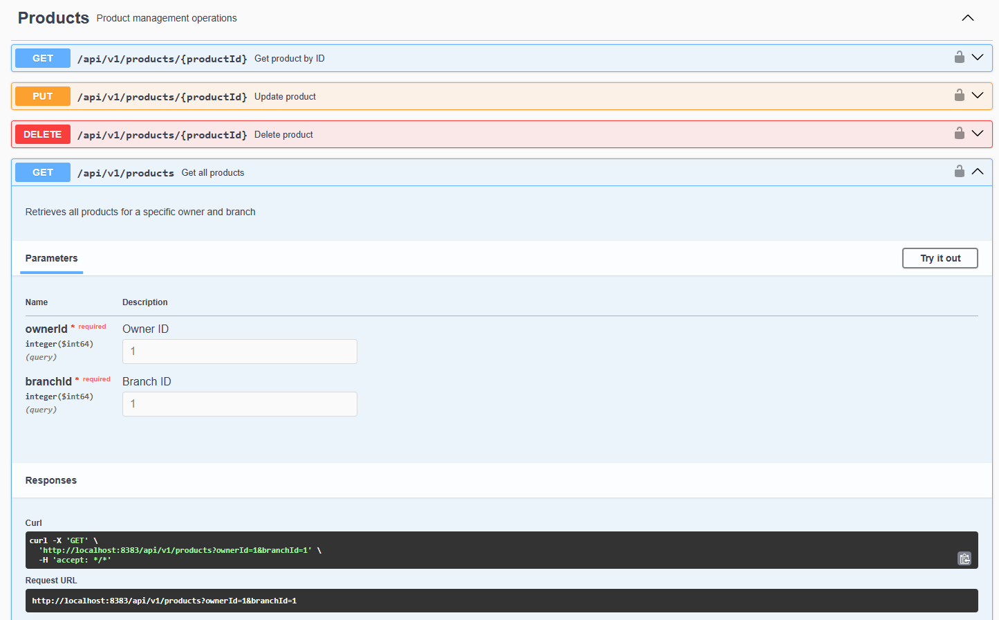  
*Figura 2: Documentación detallada de endpoints del bounded context Contacts con ejemplos de request/response*  

- **URL del Repositorio:** [https://github.com/1ACC0238-2520-1807/iCafe-Backend](https://github.com/1ACC0238-2520-1807/iCafe-Backend)

#### 4.2.1.7. Software Deployment Evidence for Sprint Review

**Configuración del Despliegue del Backend (Web Services)**

Para el despliegue del backend de iCafe, se implementó una estrategia de contenerización utilizando Docker Compose, lo que permite una gestión eficiente y escalable de los servicios. El proceso de despliegue se realizó mediante las siguientes tecnologías y configuraciones:

**Tecnologías Utilizadas:**
- **Docker Compose**: Para la orquestación de contenedores y gestión de servicios
- **Dokploy**: Como plataforma de despliegue y gestión de aplicaciones contenerizadas
- **OpenJDK 17 (openjdk:17-jdk-slim)**: Imagen base optimizada para ejecutar aplicaciones Java
- **Spring Boot**: Framework principal para el desarrollo del backend

**Proceso de Despliegue:**

1. **Contenerización**: El backend fue empaquetado en contenedores Docker utilizando la imagen `openjdk:17-jdk-slim`, que proporciona un entorno ligero y optimizado para aplicaciones Java con Spring Boot.

2. **Configuración con Docker Compose**: Se configuró un archivo `docker-compose.yml` que define el servicio de la aplicación backend.

3. **Despliegue con Dokploy**: Se utilizó Dokploy como plataforma de despliegue, que actúa como una solución de Platform-as-a-Service (PaaS) simplificando la gestión de contenedores y proporcionando funcionalidades de monitoreo, escalado automático y gestión de recursos.

**Evidencia Visual del Despliegue:**

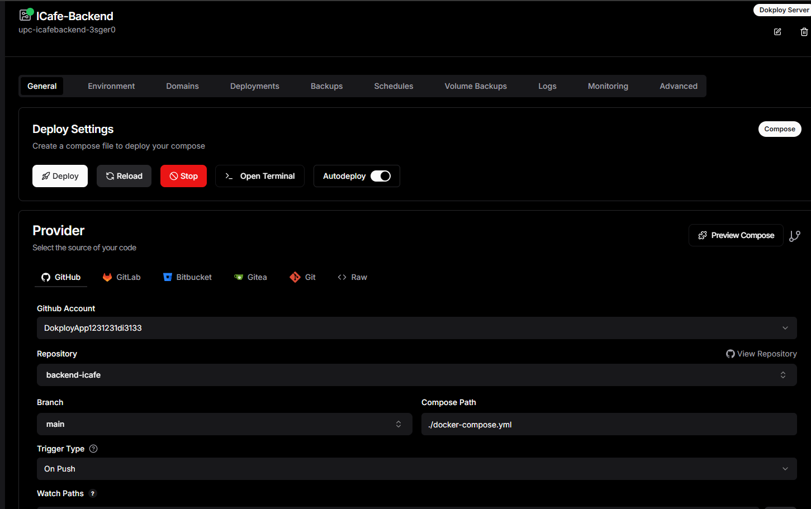 
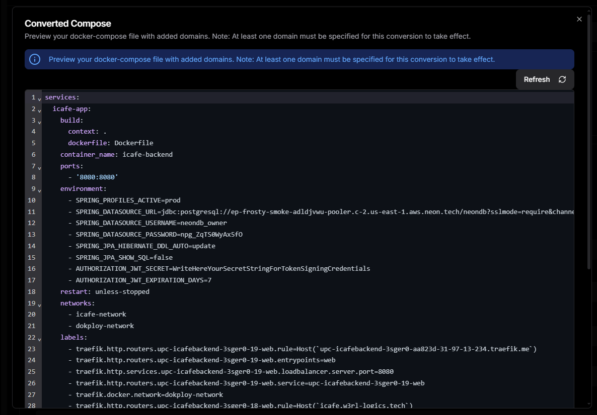 
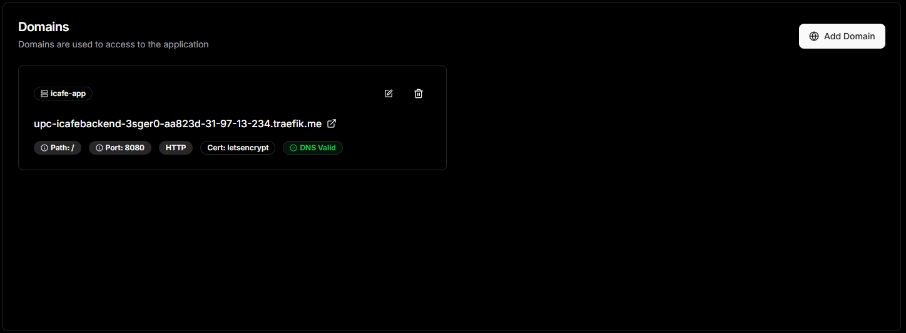 
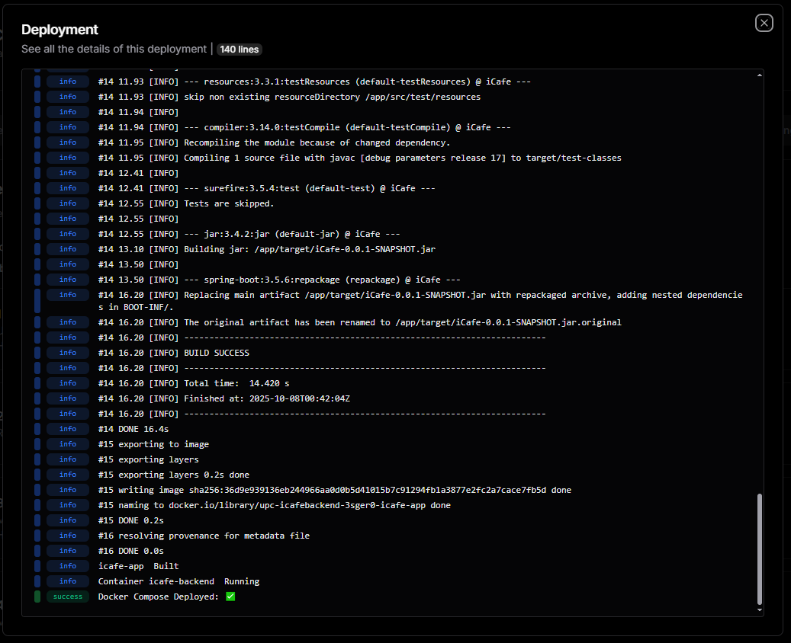

**Configuración del Despliegue de la Landing Page**

Para el despliegue de la Landing Page de iCafe, se implementó una solución web estática utilizando tecnologías fundamentales del desarrollo web y una plataforma de hosting gratuita.

**Tecnologías Utilizadas:**
- **HTML**: Para la estructura y contenido de la página web
- **CSS**: Para el diseño visual, estilos y responsive design
- **GitHub Pages**: Como plataforma de despliegue para sitios web estáticos

**Proceso de Despliegue:**

1. **Desarrollo**: La Landing Page fue desarrollada utilizando HTML semántico y CSS moderno, implementando un diseño responsive que se adapta a diferentes dispositivos.

2. **Repositorio**: El código fuente se almacenó en un repositorio de GitHub, manteniendo un control de versiones adecuado.

3. **Despliegue con GitHub Pages**: Se configuró GitHub Pages para servir automáticamente la Landing Page desde el repositorio, proporcionando una URL pública accesible para los usuarios.

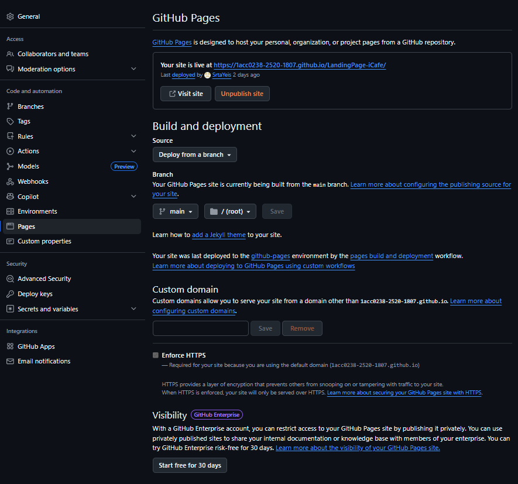 
 

Diagrama C4:  

#### 4.2.1.8. Team Collaboration Insights during Sprint
En esta sección se presentarán las analíticas de colaboración del equipo dentro de la plataforma GitHub, donde se evidenciará el trabajo realizado en los tres repositorios principales del proyecto: Landing Page, Backend y Aplicación Móvil. A través de métricas como commits, ramas creadas, pull requests, revisiones y contribuciones por integrante, se busca demostrar la participación activa, la división de responsabilidades y la coordinación continua del equipo durante el desarrollo de cada componente del sistema.
 
**Organizacion:** Nuestra organizacion para el curso cuenta con 4 repositorios, donde 3 de estos son para el desarrollo del sistema propuesto.
 
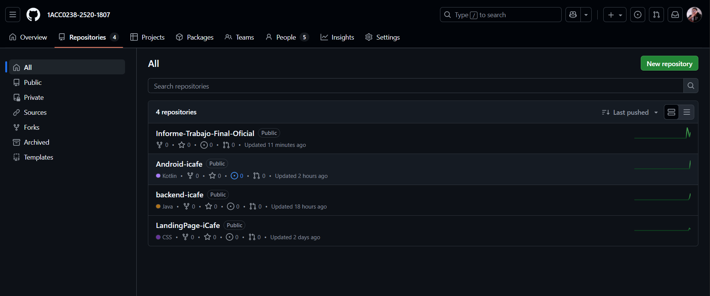
 
**Colaboradores:**  
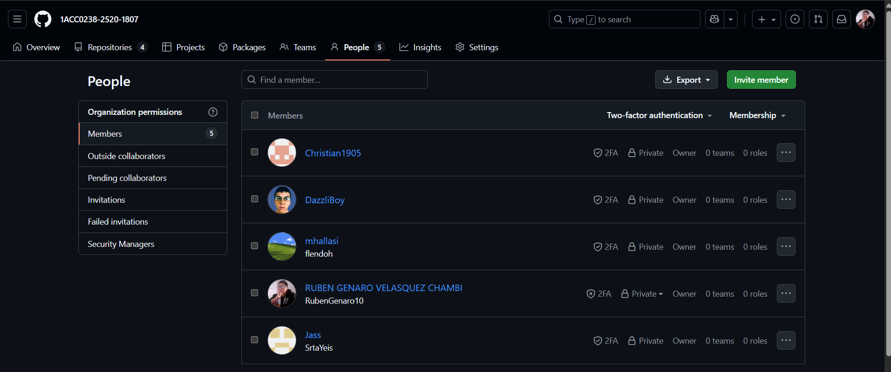  

**Landing Page:**
En el repositorio de la Landing Page, el trabajo fue desarrollado principalmente por un solo integrante del equipo, quien asumió la responsabilidad completa del diseño, desarrollo e implementación de esta parte del proyecto.

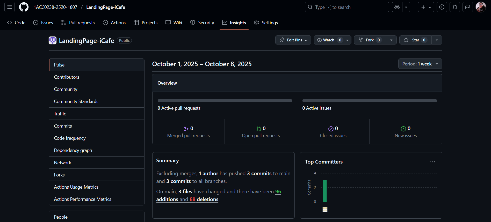  

**Backend:**
En el repositorio del backend, se evidenció una colaboración activa entre varios miembros del equipo, aplicando correctamente la metodología GitFlow para mantener un flujo de trabajo ordenado y controlado. Cada desarrollador trabajó en ramas específicas (feature, develop, main), lo que permitió integrar cambios de forma segura y realizar revisiones antes de las fusiones finales. Durante este sprint se implementaron los bounded contexts principales: IAM, Products, Contact e Inventory, los cuales constituyen la base funcional del sistema y servirán como infraestructura esencial para los próximos sprints.

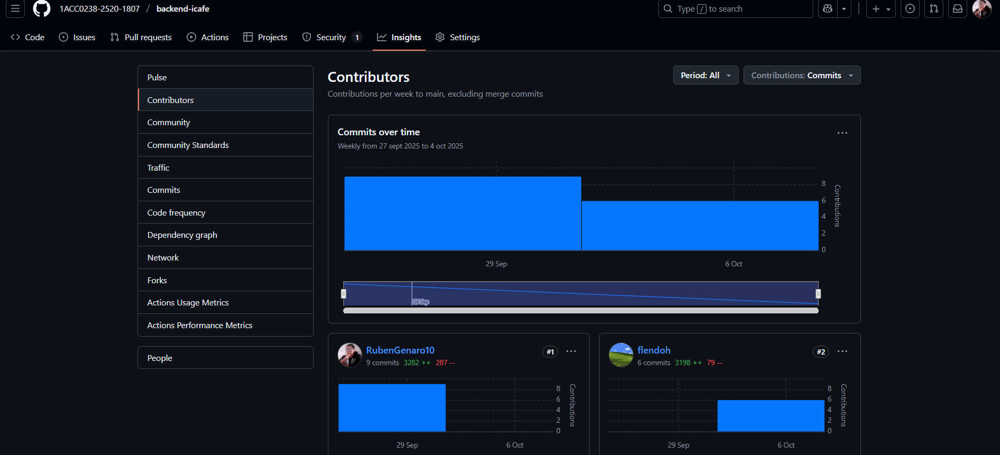  

En el siguiente gráfico se describe las ramas del repositorio backend donde se muestra una estructura ramificada y bien organizada, propia del uso de GitFlow.

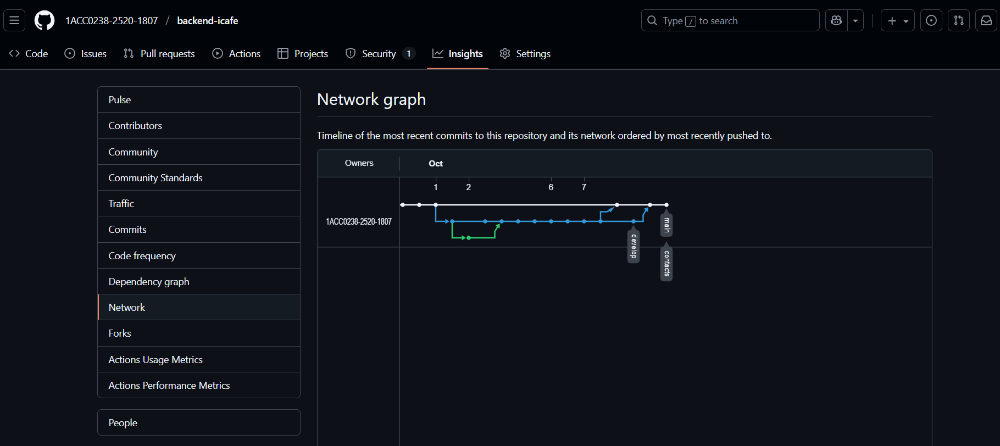  

**Aplicación Móvil:**
El gráfico de colaboración del repositorio correspondiente a la aplicación móvil, desarrollada con Kotlin y Jetpack Compose, muestra una participación continua de los miembros encargados del desarrollo del front-end móvil. Se evidencia una actividad constante en commits y pushes, principalmente en ramas de tipo feature/ orientadas al diseño de interfaces, integración con el backend y configuración inicial del proyecto siguiendo la arquitectura MVVM y principios de arquitectura limpia.
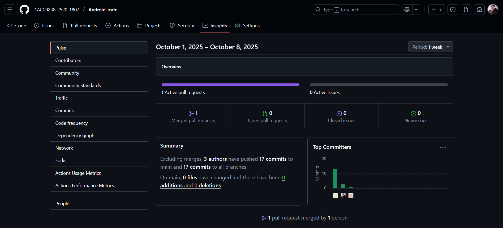  

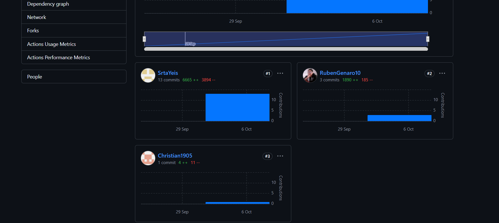  

### 4.2.2. Sprint 2

Durante el Sprint 2, el equipo de desarrollo de iCafe se enfocará en completar al 100% la implementación del backend, asegurando la correcta integración de todos los módulos y servicios necesarios. Además, se trabajará en finalizar la aplicación móvil para Android, optimizando su funcionalidad y diseño. Paralelamente, se desarrollará una versión inicial de la aplicación en Flutter.

#### 4.2.2.1. Sprint Planning 2

<table>
    <thead>
        <tr>
            <th>Sprint #</th>
            <th>Sprint 2</th>
        </tr>
    </thead>
    <tbody>
        <tr>
            <td colspan="2"><b>Sprint Planning Background</b></td>
        </tr>
        <tr>
            <td>Date</td>
            <td>2025-11-05</td>
        </tr>
        <tr>
            <td>Time</td>
            <td>10:30 PM</td>
        </tr>
        <tr>
            <td>Location</td>
            <td>Discord</td>
        </tr>
        <tr>
            <td>Prepared by</td>
            <td>Urrutia Peña Jasmin Adriana</td>
        </tr>
        <tr>
            <td>Atendees (to planning meeting)</td>
            <td>
                <li>Velaquez Chambi Ruben Genaro</li>
                <li>Christian Fabrizio inga Orihuela</li>
                <li>Hallasi Saravia Miguel Angel</li>
                <li>Sebastian Alexander Ramos Calagua</li>
            </td>
        </tr>
        <tr>
            <td>Sprint 1 Review Summary</td>
            <td>
                <li>Se desarrollo una lading page moderna donde se describen nuestros servicios</li>
                <li>Se construyó la arquitectura central del backend bajo principios de Domain-Driven Design (DDD), implementando los bounded contexts de contacts,iam.</li>
                <li>Se diseñó e implementó la base de la aplicación móvil usando Jetpack Compose, MVVM y Arquitectura Limpia, logrando la comunicación efectiva con el backend para obtener y enviar datos correctamente</li>
            </td>
        </tr>
        <tr>
            <td>Sprint 1 Retrospective Summary</td>
            <td>
                Durante la retrospectiva del Sprint 1, el equipo coincidió en que la planificación técnica fue acertada, especialmente en la organización por bounded contexts, lo cual facilitó la integración entre módulos.
            </td>
        </tr>
        <tr>
            <td colspan="2"><b>Sprint Goal & User Stories</b></td>
        </tr>
        <tr>
            <td>Sprint 2 Goal</td>
            <td>
              <li>Implementación final de los bounded contexts de Inventory, Product y Sales, asegurando su integración total dentro del backend.</li>
              <li>Finalizar la aplicación móvil en Android, consolidando todas sus funcionalidades y conexión con los servicios del backend.</li>
              <li>inicio al desarrollo de una versión inicial en Flutter</li>
            </td>
        </tr>
        <tr>
            <td>Sprint 2 Velocity</td>
            <td>
                30
            </td>
        </tr>
        <tr>
            <td>Sum of story points</td>
            <td>
                45
            </td>
        </tr>
    </tbody>
</table>

#### 4.2.2.2. Sprint Backlog 2
<table>
  <tr>
    <td> <strong>Sprint #</strong></td>
    <td align="center" colspan="7"> <strong>Sprint 2</strong> </td>
  </tr>

   <tr>
    <td align="center" colspan="2"> <strong>User Story</strong></td>
    <td align="center" colspan="6"> <strong>Work-item/Task</strong></td>
  </tr>
  <tr>
    <td align="center"> <strong>ID</strong> </td>
    <td align="center"> <strong>Title<strong></td>
    <td align="center"> <strong>ID</strong> </td>
    <td align="center"> <strong>Title<strong></td>
    <td align="center"> <strong>Description<strong></td>
    <td align="center"> <strong>Estimation (Hours)<strong></td>
    <td align="center"> <strong>Assigned To<strong></td>
    <td align="center"> <strong> Status (To-do/In-Process/To-Review/Done)  <strong></td>
  </tr>
  <!---------------------------------------------------------------------- -->
  

<!----------------------------------------------->
  <tr>
    <td rowspan="2" align="center"> ID </td>
    <td rowspan="2" align="center"> US012  Registrar entrada inventario</td>
    <td align="center"> TA01 </td>
    <td align="center"> Endpoint para el registro de entrada de un insumo </td>
    <td align="center"> Se debe registrar la entrada de un insumo en el inventario </td>
    <td align="center"> 2 </td>
    <td align="center"> Hallasi Saravia Miguel Angel</td>
    <td align="center">Done</td>
  </tr>

  <tr>
    <td align="center"> TA02 </td>
    <td align="center"> Diseño en la aplicacion movil de inventario</td>
    <td align="center"> Se debe de crear la actividad de registro de entrada de un insumo en el inventario</td>
    <td align="center"> 1</td>
    <td align="center"> Hallasi Saravia Miguel Angel</td>
    <td align="center"> Done</td>
  </tr>
<!-------------------------------------------------->
  <tr>
    <td rowspan="2" align="center"> ID </td>
    <td rowspan="2" align="center"> US013 Actualizar inventario </td>
    <td align="center"> TA01 </td>
    <td align="center"> Endpoint para actualizar datos del inventario</td>
    <td align="center"> Se debe crear un endpoint para actualizar datos del inventario</td>
    <td align="center"> 1</td>
    <td align="center"> Hallasi Saravia Miguel Angel</td>
    <td align="center"> Done</td>
  </tr>

  <tr>
    <td align="center"> TA02 </td>
    <td align="center"> Vista para actualizar inventario</td>
    <td align="center">Se debe crear la actividad para actualizar datos del inventario</td>
    <td align="center"> 1</td>
    <td align="center"> Hallasi Saravia Miguel Angel</td>
    <td align="center"> In-process</td>
  </tr>
<!---------------------------------------------------->
  <tr>
    <td rowspan="2" align="center"> ID </td>
    <td rowspan="2" align="center"> US009 Crear receta</td>
      <td align="center"> TA01 </td>
    <td align="center"> endpoint para crear una receta </td>
    <td align="center"> Se debe crear un endpoint para crear una receta </td>
    <td align="center"> 1</td>
    <td align="center"> Ruben Velasquez Chambi</td>
    <td align="center"> To-do</td>
  </tr>

  <tr>
    <td align="center"> TA02 </td>
    <td align="center"> Vista para crear receta</td>
    <td align="center"> Se debe crear la actividad para crear una receta</td>
    <td align="center"> 1</td>
    <td align="center">Ruben Velasquez Chambi</td>
    <td align="center"> To-do</td>
  </tr>
   <!------------------------------------------------>
   <tr>
    <td rowspan="3" align="center"> ID </td>
    <td rowspan="3" align="center">US007 Listar proveedores</td>
      <td align="center"> TA01 </td>
    <td align="center"> enpoint para listar proveedores </td>
    <td align="center"> Se debe poder consultar la lista de los proveedores</td>
    <td align="center"> 1</td>
    <td align="center"> Ruben Velasquez Chambi</td>
    <td align="center"> Done</td>
  </tr>

  <tr>
    <td align="center"> TA02 </td>
    <td align="center"> Vista de lista de proveedores</td>
    <td align="center"> Se debe de crear la actividad para visualizar la lista de proveedores</td>
    <td align="center"> 1</td>
    <td align="center">Ruben Velasquez Chambi</td>
    <td align="center"> Done</td>
  </tr>

  <tr>
    <td align="center"> TA03 </td>
    <td align="center"> Implementar el backend en la aplicacion movil</td>
    <td align="center"> Se debe de consumir el endpoint correspondiente </td>
    <td align="center"> 1</td>
    <td align="center">Ruben Velasquez Chambi</td>
    <td align="center"> To-do</td>
  </tr>
 
</table>

#### 4.2.2.3. Development Evidence for Sprint Review

<table>
  <tr>
    <td align ="center" > <strong>Repository</strong></td>
    <td  align ="center" > <strong>Branch</strong></td>
    <td  align ="center" > <strong>Commit ID</strong></td>
    <td  align ="center" > <strong>Commit message</strong></td>
    <td  align ="center" > <strong>Commit Masagge body</strong></td>
    <td  align ="center" > <strong>Commit on (date)</strong></td>
  </tr>

  <tr>
    <td rowspan="5" align="center">https://github.com/1ACC0238-2520-1807/LandingPage-iCafe</td>
    <td align="center"> main</td>
    <td align="center"> </td>
    <td align="center"> </td>
    <td align="center"> ---</td>
    <td align="center"> 30/09/2025</td>
  </tr>

  <tr>
    <td align="center">main</td>
    <td align="center" ></td>
    <td align="center"> </td>
    <td align="center"> ---</td>
    <td align="center"> 30/09/2025</td>
  </tr>

  <tr>
    <td align="center"> main</td>
    <td align="center"></td>
    <td align="center"> </td>
    <td align="center"> ---</td>
    <td align="center"> 30/09/2025</td>
  </tr>

  <tr>
    <td align="center"> main</td>
    <td align="center"> </td>
    <td align="center"></td>
    <td align="center"> ---</td>
    <td align="center">06/10/2025</td>
  </tr>

  <tr>
    <td align="center"> main</td>
    <td align="center"> </td>
    <td align="center"></td>
    <td align="center"> ---</td>
    <td align="center"> 06/10/2025</td>
  </tr>
  <!---------------------------------------------------->
   <tr>
    <td rowspan="8" align="center">https://github.com/1ACC0238-2520-1807/backend-icafe</td>
    <td align="center"> main</td>
    <td align="center"> </td>
    <td align="center"> </td>
    <td align="center"> ---</td>
    <td align="center"> 30/09/2025</td>
  </tr>
  <tr>
    <td align="center">main</td>
    <td align="center" > </td>
    <td align="center"></td>
    <td align="center"> ---</td>
    <td align="center"> 30/09/2025</td>
  </tr>
   <tr>
    <td align="center">develop</td>
    <td align="center" ></td>
    <td align="center"> </td>
    <td align="center"> ---</td>
    <td align="center"> 01/10/2025</td>
  </tr>
    <tr>
    <td align="center"></td>
    <td align="center" ></td>
    <td align="center"> </td>
    <td align="center"> ---</td>
    <td align="center"> 02/10/2025</td>
  </tr>
<tr>
    <td align="center">feature/contacts</td>
    <td align="center" ></td>
    <td align="center"></td>
    <td align="center"> ---</td>
    <td align="center"> 02/10/2025</td>
  </tr>

  <tr>
    <td align="center">feature/products</td>
    <td align="center" ></td>
    <td align="center"></td>
    <td align="center"> ---</td>
    <td align="center"> 06/10/2025</td>
  </tr>
   <tr>
    <td align="center">develop/td>
    <td align="center" ></td>
    <td align="center"></td>
    <td align="center"> ---</td>
    <td align="center"> 07/10/2025</td>
  </tr>
  
   <tr>
    <td align="center">develop/td>
    <td align="center" ></td>
    <td align="center"></td>
    <td align="center"> ---</td>
    <td align="center"> 07/10/2025</td>
  </tr>
  <!--------------------->
  <tr>
    <td rowspan="8" align="center">https://github.com/1ACC0238-2520-1807/Android-icafe</td>
    <td align="center"> main</td>
    <td align="center"> </td>
    <td align="center"> </td>
    <td align="center"> ---</td>
    <td align="center"> 05/10/2025</td>
  </tr>
  <tr>
    <td align="center">develop</td>
    <td align="center" > </td>
    <td align="center"></td>
    <td align="center"> ---</td>
    <td align="center"> 05/10/2025</td>
  </tr>
   <tr>
    <td align="center">develop</td>
    <td align="center" > </td>
    <td align="center"></td>
    <td align="center"> ---</td>
    <td align="center"> 06/10/2025</td>
  </tr>
    <tr>
    <td align="center">feature/contacs</td>
    <td align="center" > </td>
    <td align="center"></td>
    <td align="center"> ---</td>
    <td align="center"> 08/10/2025</td>
  </tr>
  <tr>
    <td align="center">feature/contacs</td>
    <td align="center" > </td>
    <td align="center"> </td>
    <td align="center"> ---</td>
    <td align="center"> 08/10/2025</td>
  </tr>
   <tr>
    <td align="center">feature/contacs</td>
    <td align="center" > </td>
    <td align="center"></td>
    <td align="center"> ---</td>
    <td align="center"> 08/10/2025</td>
  </tr>
   <tr>
    <td align="center">feature/contacs</td>
    <td align="center" > </td>
    <td align="center"></td>
    <td align="center"> ---</td>
    <td align="center"> 08/10/2025</td>
  </tr>
    <tr>
    <td align="center">develop</td>
    <td align="center" ></td>
    <td align="center"></td>
    <td align="center"> ---</td>
    <td align="center"> 08/10/2025</td>
  </tr>

</table>

#### 4.2.2.4. Testing Suite Evidence for Sprint Review

En el Sprint 2, se implementaron las pruebas de aceptación para las historias de usuario y tareas que fueron creadas en el flujo Android.

| Repository | Commit ID | Commit Message | Date |
|-----------|-----------|----------------|------|
| Informe-Trabajo-Final-Oficial | 04466ad | feat: add feature files for US019-US024 landing pages | 12/11/2025 |
| Informe-Trabajo-Final-Oficial | f272d69 | feat: add feature files for inventory, suppliers, pricing and reports | 12/11/2025 |
| Informe-Trabajo-Final-Oficial | a52507e | feat: add feature files for US007-US012 | 12/11/2025 |
| Informe-Trabajo-Final-Oficial | 4736d37 | feat: add feature files for user stories US001-US006 | 12/11/2025 |

Repositorio https://github.com/1ACC0238-2520-1807/test

#### 4.2.2.5. Execution Evidence for Sprint Review

Vista de la implementación de las sedes dentro de la aplicación Android.

Vista de estadísticas y métricas dentro de la aplicación Android.

Vista de compras y ventas integradas en la aplicación Android.

Vista de movimientos y transacciones registradas en la aplicación Android.

#### 4.2.2.6. Services Documentation Evidence for Sprint Review

**Tabla de Endpoints Documentados:**

| Bounded Context | Endpoint | HTTP Verb | Sintaxis de Llamada | Parámetros | Descripción | Response Example |
|-----------------|----------|-----------|---------------------|------------|-------------|------------------|
| **Inventory** | `/api/v1/inventory/movements` | POST | `POST /api/v1/inventory/movements` | Body: RegisterStockMovementResource | Registrar movimiento de stock | `---` |
| **Inventory** | `/api/v1/inventory/movements/{branchId}` | GET | `GET /api/v1/inventory/movements/1` | `branchId` (path) | Listar movimientos de stock por sede | `---` |
| **Inventory** | `/api/v1/inventory/stock/{branchId}/{supplyItemId}` | GET | `GET /api/v1/inventory/stock/1/10` | `branchId`, `supplyItemId` (path) | Obtener stock actual | `---` |

| **Products** | `/api/v1/products` | GET | `GET /api/v1/products` | — | Listar productos | `---` |
| **Products** | `/api/v1/products` | POST | `POST /api/v1/products` | Body: CreateProductResource | Crear producto | `---` |
| **Products** | `/api/v1/products/{productId}` | GET | `GET /api/v1/products/1` | `productId` (path) | Obtener producto por id | `---` |
| **Products** | `/api/v1/products/{productId}` | PUT | `PUT /api/v1/products/1` | `productId` (path), Body: UpdateProductResource | Actualizar producto | `---` |
| **Products** | `/api/v1/products/{productId}/activate` | POST | `POST /api/v1/products/1/activate` | `productId` (path) | Activar producto | `---` |
| **Products** | `/api/v1/products/{productId}/archive` | POST | `POST /api/v1/products/1/archive` | `productId` (path) | Archivar producto | `---` |
| **Products** | `/api/v1/products/{productId}/ingredients` | POST | `POST /api/v1/products/1/ingredients` | `productId` (path), Body: AddIngredientsResource | Agregar ingredientes a producto | `---` |
| **Products** | `/api/v1/products/{productId}/ingredients/{supplyItemId}` | DELETE | `DELETE /api/v1/products/1/ingredients/10` | `productId`, `supplyItemId` (path) | Eliminar ingrediente | `---` |
| **Products** | `/api/v1/products/branch/{branchId}` | GET | `GET /api/v1/products/branch/1` | `branchId` (path) | Listar productos por sede | `---` |

| **Purchase Orders** | `/api/v1/purchase-orders` | POST | `POST /api/v1/purchase-orders` | Body: CreatePurchaseOrderResource | Crear orden de compra | `---` |
| **Purchase Orders** | `/api/v1/purchase-orders/branch/{branchId}` | GET | `GET /api/v1/purchase-orders/branch/1` | `branchId` (path) | Listar órdenes de compra por sede | `---` |

| **Sales** | `/api/v1/sales` | GET | `GET /api/v1/sales` | — | Listar ventas | `---` |
| **Sales** | `/api/v1/sales` | POST | `POST /api/v1/sales` | Body: CreateSaleResource | Crear venta | `---` |
| **Sales** | `/api/v1/sales/{saleId}` | GET | `GET /api/v1/sales/1` | `saleId` (path) | Obtener venta por id | `---` |
| **Sales** | `/api/v1/sales/{saleId}/cancel` | PUT | `PUT /api/v1/sales/1/cancel` | `saleId` (path) | Cancelar venta | `---` |
| **Sales** | `/api/v1/sales/{saleId}/complete` | PUT | `PUT /api/v1/sales/1/complete` | `saleId` (path) | Completar venta | `---` |
| **Sales** | `/api/v1/sales/branch/{branchId}` | GET | `GET /api/v1/sales/branch/1` | `branchId` (path) | Listar ventas por sede | `---` |

| **SupplyIem** | `/api/v1/supply-items` | GET | `GET /api/v1/supply-items` | — | Listar insumos | `---` |
| **SupplyIem** | `/api/v1/supply-items` | POST | `POST /api/v1/supply-items` | Body: CreateSupplyItemResource | Crear insumo | `---` |
| **SupplyIem** | `/api/v1/supply-items/{branchId}/branch` | GET | `GET /api/v1/supply-items/1/branch` | `branchId` (path) | Listar insumos por sede | `---` |
| **SupplyIem** | `/api/v1/supply-items/{id}` | DELETE | `DELETE /api/v1/supply-items/1` | `id` (path) | Eliminar insumo | `---` |
| **SupplyIem** | `/api/v1/supply-items/{id}` | GET | `GET /api/v1/supply-items/1` | `id` (path) | Obtener insumo por id | `---` |
| **SupplyIem** | `/api/v1/supply-items/{id}` | PUT | `PUT /api/v1/supply-items/1` | `id` (path), Body: UpdateSupplyItemResource | Actualizar insumo | `---` |

Swagger del backend desplegado: http://upc-icafebackend-3sger0-aa823d-31-97-13-234.traefik.me/swagger-ui/index.html

- **URL del Repositorio:** [https://github.com/1ACC0238-2520-1807/iCafe-Backend](https://github.com/1ACC0238-2520-1807/iCafe-Backend)

#### 4.2.2.7. Software Deployment Evidence for Sprint Review

**Configuración del Despliegue del Backend (Web Services)**

Para el despliegue del backend de iCafe, se implementó una estrategia de contenerización utilizando Docker Compose, lo que permite una gestión eficiente y escalable de los servicios. El proceso de despliegue se realizó mediante las siguientes tecnologías y configuraciones:

**Tecnologías Utilizadas:**
- **Docker Compose**: Para la orquestación de contenedores y gestión de servicios
- **Dokploy**: Como plataforma de despliegue y gestión de aplicaciones contenerizadas
- **OpenJDK 17 (openjdk:17-jdk-slim)**: Imagen base optimizada para ejecutar aplicaciones Java
- **Spring Boot**: Framework principal para el desarrollo del backend

**Proceso de Despliegue:**

1. **Contenerización**: El backend fue empaquetado en contenedores Docker utilizando la imagen `openjdk:17-jdk-slim`, que proporciona un entorno ligero y optimizado para aplicaciones Java con Spring Boot.

2. **Configuración con Docker Compose**: Se configuró un archivo `docker-compose.yml` que define el servicio de la aplicación backend.

3. **Despliegue con Dokploy**: Se utilizó Dokploy como plataforma de despliegue, que actúa como una solución de Platform-as-a-Service (PaaS) simplificando la gestión de contenedores y proporcionando funcionalidades de monitoreo, escalado automático y gestión de recursos.

**Evidencia Visual del Despliegue:**

 
 
 

**Configuración del Despliegue de la Landing Page**

Para el despliegue de la Landing Page de iCafe, se implementó una solución web estática utilizando tecnologías fundamentales del desarrollo web y una plataforma de hosting gratuita.

**Tecnologías Utilizadas:**
- **HTML**: Para la estructura y contenido de la página web
- **CSS**: Para el diseño visual, estilos y responsive design
- **GitHub Pages**: Como plataforma de despliegue para sitios web estáticos

**Proceso de Despliegue:**

1. **Desarrollo**: La Landing Page fue desarrollada utilizando HTML semántico y CSS moderno, implementando un diseño responsive que se adapta a diferentes dispositivos.

2. **Repositorio**: El código fuente se almacenó en un repositorio de GitHub, manteniendo un control de versiones adecuado.

3. **Despliegue con GitHub Pages**: Se configuró GitHub Pages para servir automáticamente la Landing Page desde el repositorio, proporcionando una URL pública accesible para los usuarios.

 
 

Diagrama C4:  

#### 4.2.2.8. Team Collaboration Insights during Sprint

## 4.3. Validation Interviews
### 4.3.1. Diseño de Entrevistas

### 4.3.2. Registro de Entrevistas

### 4.3.3. Evaluaciones según heurísticas

# Conclusiones
## Conclusiones y recomendaciones

# Video App Validation

# Video About the product

# Video About the team

# Glosario

# Bibliografía

Cuéllar, J. (2016). *Domain-Driven Design: Context Maps*. Jose Cuéllar .net. https://josecuellar.net/domain-driven-design-episodio-ii-context-maps/

Huang, Z. (2023). A comparative analysis between chain coffee shops and independent coffee shops from consumer satisfaction perspective. In Proceedings of the 2022 3rd International Conference on E-commerce and Internet Technology (ECIT 2022) (pp. 1438-1444). Atlantis Press. https://doi.org/10.2991/978-94-6463-005-3_148

Lee, K.-S., & Ruck, K. J. (2022). Barista diary: An autoethnography studying the operational experience of third-wave coffee shop baristas. International Journal of Hospitality Management, 102, Article 103182. https://doi.org/10.1016/j.ijhm.2022.103182

Molina, S. A. C. (2023). Desarrollar una aplicación web responsiva para la gestión de reservas y administración de restaurante [Tesis de pregrado, Pontificia Universidad Católica del Ecuador]. Repositorio PUCE. https://repositorio.puce.edu.ec/handle/123456789/41306

Sidabutar, G. D. G. E., Seah, J. A., & Singgalen, Y. A. (2023). Analysis and design of web-based information system for coffeeshop management using design thinking methodology: Case of Kopi KurangLebih. Journal of Information Systems and Informatics, 5(1), 217-231. https://doi.org/10.51519/journalisi.v5i1.455

# Anexos

# Anexos
